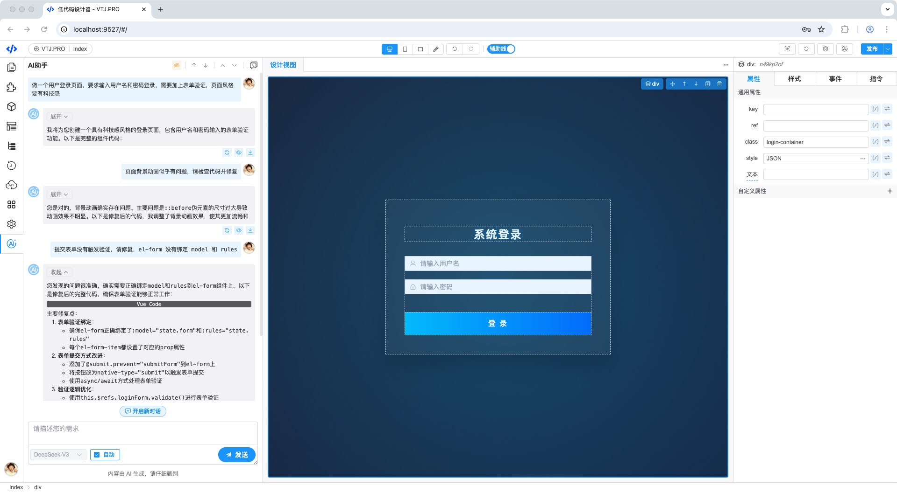
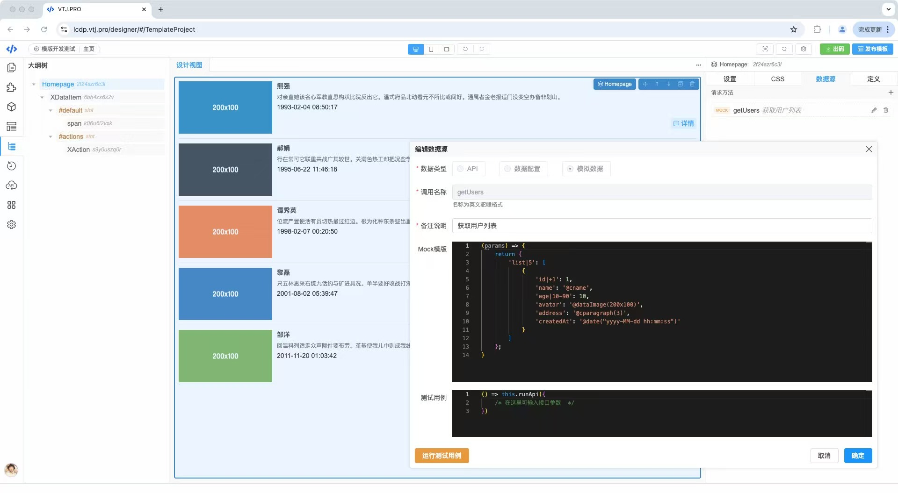
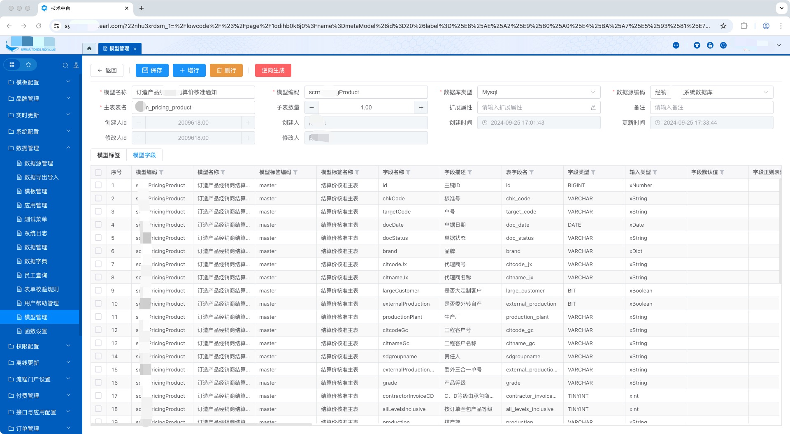
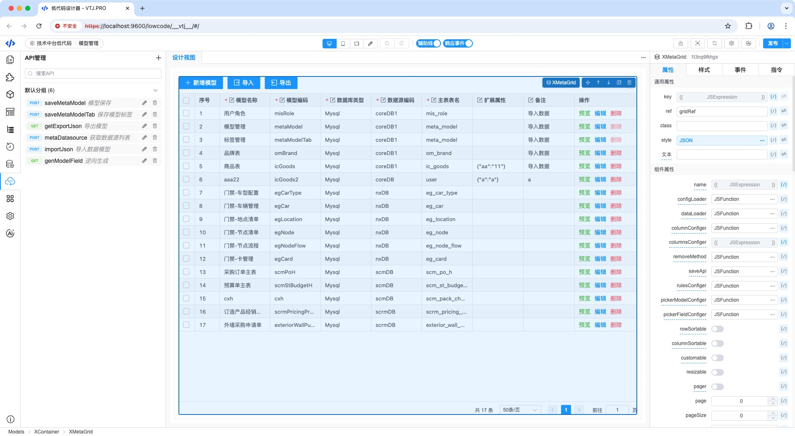
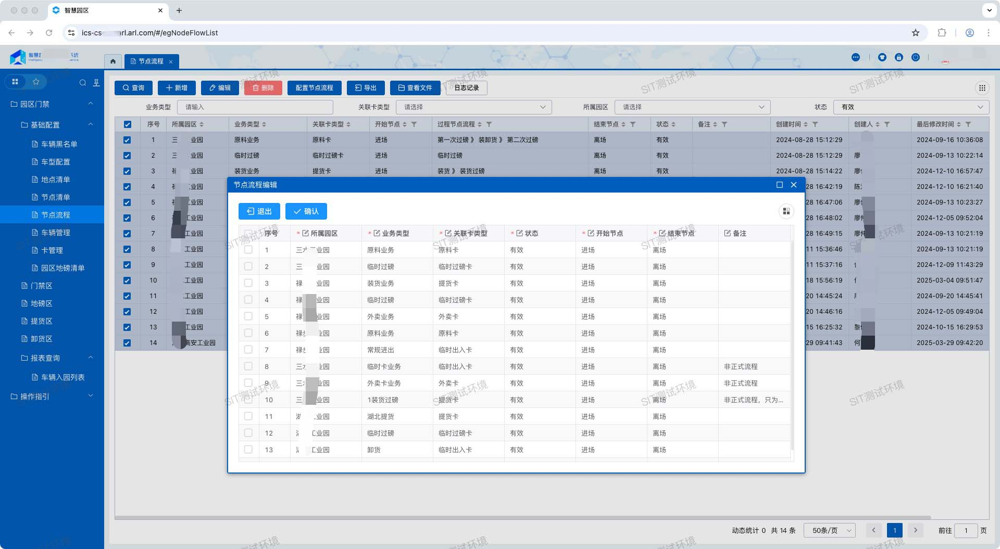
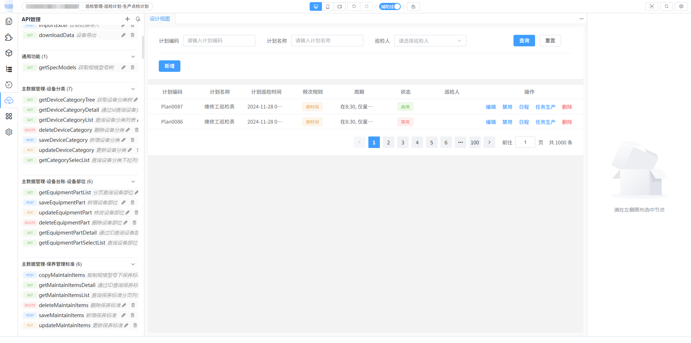
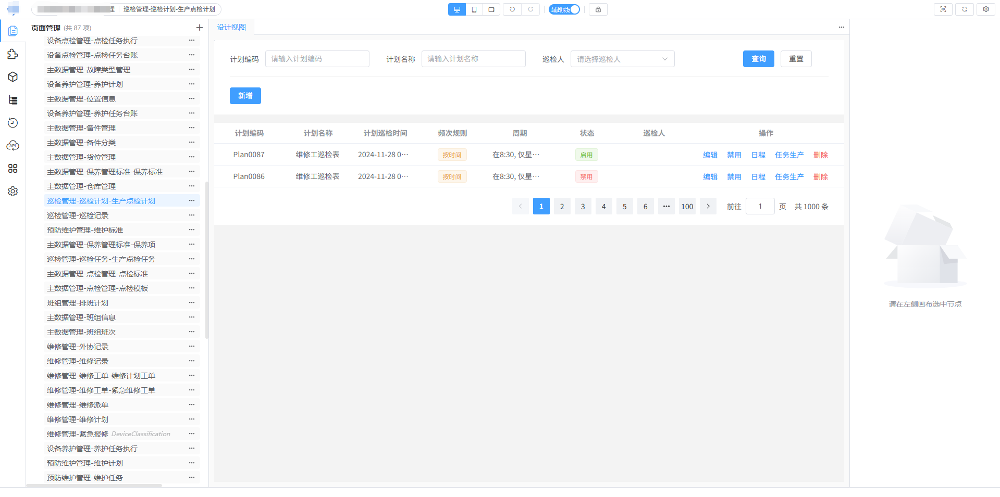
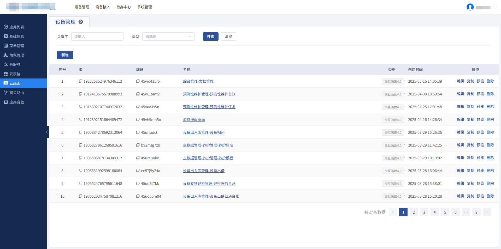

<div align="center"> <a href="https://gitee.com/newgateway/vtj">  </a> <br> <br>

[](https://gitee.com/newgateway/vtj)
[](https://www.npmjs.com/package/@vtj/pro)
[](https://npm-stat.com/charts.html?package=@vtj/core)
[](LICENSE)

</div>

# VTJ.PRO （ AI + 低代码 ）

VTJ 是一款以AI驱动的Vue3前端低代码开发工具。内置低代码引擎、渲染器和代码生成器，支持Vue源码与低代码DSL双向转换，面向前端开发者，开箱即用。 无缝嵌入本地开发工程，不改变前端开发流程和编码习惯。

- **官方文档**：[https://vtj.pro](https://vtj.pro)
- **在线应用开发平台**：[https://lcdp.vtj.pro](https://lcdp.vtj.pro)

## 特性

- 🔥 **流行的技术栈**： Vue3、Typescript、Vite、EelementPlus、VueUse、Axios、ECharts、Lodash、Monaco Editor、Prettier 等。

- 🛠️ **自由个性化**： 低代码设计器支持源码级别的自定义，可轻松适配个性化需求，理论上写代码开发能实现的在设计器上都能完成。

- 🚩 **低学习成本**： 专为前端开发者设计，无需改变您熟悉的前端开发流程和编码习惯。只需了解Vue，即可轻松上手，实现无缝对接，真正做到零学习成本。

- 🚀️ **高扩展性**： 配备了先进的内置低代码引擎，通过配置化构建方式，赋予您对所有部件的完全自定义能力。您可以单独运用此引擎，自主打造专属的低代码平台。

- 📦 **无污染，可二开**： 设计器无缝嵌入本地项目开发环境，既安全又便捷，轻松接入。同时，采用创新的设计器和渲染器分离模式，确保项目代码保持纯净，不受任何污染，并且产物支持二次开发。

- ✨ **物料丰富**： 此外，还内置了多款常用、功能强大的组件库以及丰富的页面模板，不仅支持高度定制，还提供了可复用的区块组件，助您高效构建出色的应用。

## 设计器预览

<table border="0">
  <tr>
    <td></td>
    <td></td>
  </tr>
  <tr>
    <td></td>
    <td></td>
  </tr>
  <tr>
    <td></td>
    <td></td>
  </tr>
</table>

## 试用体验

### 一、在线体验

- [https://lcdp.vtj.pro](https://lcdp.vtj.pro)

访问VTJ专属低代码开发平台，创建应用可以体验设计器和出码功能。

### 二、本地体验 <span style="color:red">（强烈推荐：功能全， 性能最佳）</span>

VTJ支持开发多种平台应用开发，可以使用脚手架搭建响应平台的项目工程。命令：

1. Web应用(PC端)

   ```sh
   npm create vtj@latest --registry=https://registry.npmmirror.com -- -t app
   ```

1. H5应用(移动端)

   ```sh
   npm create vtj@latest --registry=https://registry.npmmirror.com -- -t h5
   ```

1. uni-app(跨端应用)

   ```sh
   npm create vtj@latest --registry=https://registry.npmmirror.com -- -t uniapp
   ```

1. 物料开发项目

   ```sh
   npm create vtj@latest --registry=https://registry.npmmirror.com -- -t material
   ```

## 贡献指南

VTJ支持多种方式对设计器进行扩展，通常情况下你不需要用到源码，如果需要深度定制或与业务捆绑时才有可能需要用源码进行二开，欢迎各位喜欢VTJ的开发者贡献代码。

### 开发环境要求

VTJ 使用了最新的 Vue3 生态技术栈，要求 Node 版本必须是 v20+， 建议使用 nvm 切换 Node 版本。
开发项目工程采用`lerna` 和 `pnpm` 包管理工具，需要全局安装。

```sh
npm install -g lerna@latest pnpm@latest --registry=https://registry.npmmirror.com
```

如果需要二开或贡献代码，可以拉取仓库master分支。

### 快速开始

```sh
git clone https://gitee.com/newgateway/vtj.git
cd vtj
npm run setup && npm run build && npm run app:dev
```

- 首次启动需要执行初始化：`npm run setup && npm run build`
- 重启开发环境：`npm run app:dev`
- 清理项目：`npm run clean` 清理后需要重新执行初始化

## 技术交流

钉钉群、 微信群(加好友，拉进群，备注：vtj)

<table border="0">
<tr><td></td><td></td></tr></table>

## ⭐ 优秀案例

### 新明珠集团低代码开发平台

<table>
<tr>
<td>

</td>
<td>
新明珠集团全面深度接入<code>VTJ</code>，采用本地开发模式配搭自建业务模型，存量系统通过wujie微前端集成，已在多个项目投入应用。
</td>
</tr>
</table>
<table border="0">
<tr>
<td>业务数据模型</td>
<td>模型管理设计器</td>
<td>业务应用系统</td>
</tr>
  <tr>
    <td>
    
    </td>
    <td>
    </td>
   <td>
   </td>
  </tr>
</table>

### 悦码低代码平台

<table>
<tr>
<td>

</td>
<td>
悦码是<strong>诗悦网络</strong>采用<code>VTJ</code>搭建低代码平台，已上线投产。
</td>
</tr>
</table>

特点：

1. 通过无界渲染器可跨技术栈引入低代码页面，实现低代码页面跨技术栈复用，包括：`react` `next.js` `vue` `svelte`
2. 多应用独立设计器

<table border="0">
<tr>
<td>多应用独立设计器</td>
<td>用户生命周期</td>
<td>静态资源管理</td>
</tr>
  <tr>
    <td>
    
    </td>
    <td>
    </td>
   <td>
   </td>
  </tr>
</table>

### 寄云科技低代码开发平台

<table>
<tr>
<td>

</td>
<td>
已接入VTJ作为云画面的交互画面设计器之一，实现与平台深度融合，快速响应业务需求，构建应用，已成功服务于多家世界500强工业企业。

产品主页地址：<a href="https://www.neucloud.cn/product/lcdp">https://www.neucloud.cn/product/lcdp</a>

</td>
</tr>
</table>

<table border="0">
  <tr>
    <td>
    
    </td>
    <td>
    </td>
   <td>
   </td>
  </tr>
</table>

## 媒体报道

- [解锁低码高效新篇章：VTJ，让开发“飞”起来！](https://mp.weixin.qq.com/s/2bOX6p3mBG1ys_HivCMHhA)
- [开箱即用，一款基于Vue3 + TypeScript的低代码开发神器！](https://mp.weixin.qq.com/s/mwD0dgeCl_GX_yDBwBsNtA)
- [一款以AI驱动的Vue3前端低代码开发工具](https://mp.weixin.qq.com/s/RDzHUZENIOpDuY9G98M2uw)
- [Vue3+TS 低代码神器 VTJ.PRO，0 学习成本玩转页面可视化设计](https://mp.weixin.qq.com/s/3QxgCenYT4KKdg1idhd06A)
- [[开源]一款低代码开发工具，内置设计器引擎、渲染器和代码生成器](https://mp.weixin.qq.com/s/I3KSeeKadoirY4Xo42sdlA)
- [基于 Vue3 + TypeScript 的低代码页面可视化设计器，开箱即用](https://mp.weixin.qq.com/s/Te84P6J-JXaU7mRLXVJ_-g)
- [5.4K Star 【VTJ.PRO】：重新定义前端开发的低代码神器](https://mp.weixin.qq.com/s/ySWojJ1DKMSYes_CeYk9qw)
- [低代码开发工具推荐，VTJ.PRO，一款基于Vue3和TypeScript打造的低代码开发工具，值得一试！](https://mp.weixin.qq.com/s/wIw7XWOJ4xQ8f7OOhqAyzQ)
- [开源|一个基于Vue3 + TypeScript的低代码开发工具平台，内置了设计器引擎、渲染器和代码生成器](https://mp.weixin.qq.com/s/JTfqmIfmbBcBUbCORCUHkA)
