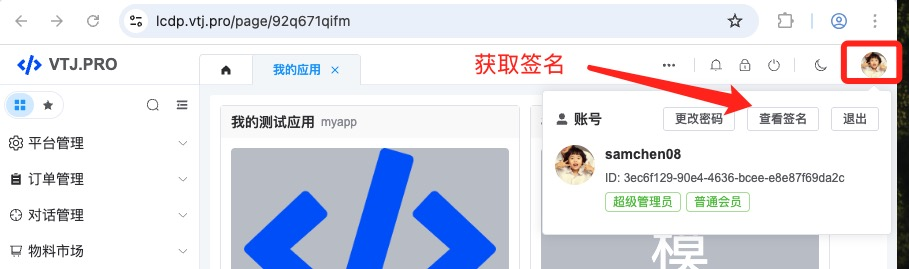

# 设计器接入指南

本文介绍VTJ的低代码设计器使用方式以及如何实现服务定制。

## 设计器的使用方式

使用VTJ设计器有以下种三种方式：

1. 本地开发工程
1. 在线演示体验
1. 自建应用/平台

如果您需要使用设计器的来开发应用，推荐使用本地开发的方式。通过官方脚手架可以快速搭建本地开发项目工程

```sh
npm create vtj@latest --registry=https://registry.npmmirror.com -- -t app
```

`-t` 参数可以是 app、h5、uniapp， 对应是PC端、移动端、UniApp的项目模版。

### 本地开发

本地开发的流程跟原本开发流程是一致的， 设计器只是一个辅助工具，嵌入到本地开发环境，让开发者可以使用低代码的方式去开发应用，设计器不是应用的一部分。项目编译打包后是不带有设计器的。

### 在线体验

如果您只是想快速体验设计器的功能，或开发较小型的应用或原型示例，你可以使用在线的方式。 在线体验可以访问： [https://vtj.pro](https://vtj.pro)

在线是运行时的渲染，需要加载较多资源，代码也没有经过编译优化，会存在性能问题。 你依然可以通过出码的功能，把应用项目整体导出变成本地的单体项目工程。

### 自建应用或平台

如果需要深度定制设计器或自建平台，你需要使用VTJ相关的依赖包进行扩展和项目集成。

::: warning 注意
不要使用在线版本提供的服务用于生产环境，在线仅供演示测试，对服务的稳定和数据安全不作任何保证
:::

## 设计器依赖的服务

设计器依赖的服务有两种类型，一种是设计器的核心功能，必须要有的，如：项目、文件、历史记录、出码。缺少这些API, 设计器就不能正常工作。 另一种是可选功能的API，例如：模版、AI。 这些功能可通过配置关闭，缺少这些API，设计器还能正常运行，只是依赖的功能不可用。为了区分两种API，核心功能的API称为 Service， 而可选功能的API称为 OpenApi

在本地版本中，Service是通过vite插件启动http服务依附到本地开发服务中，因此本地版本是可以离线运行。 而OpenApi的服务是由 [https://lcdp.vtj.pro/](https://lcdp.vtj.pro/) 提供，需要网络支持。

本地版本的项目数据是以json文件存储到当前项目工程里面，默认的存储路径是项目根目录下的 `.vtj` 文件夹。开发实践中，您应该把这个文件夹也要提交git作版本控制。

如果需更改数据存储方式，例如需要把项目数据保存到数据库，又或者你需要做在线的开发平台，即可以通过自定义Service的方式来实现。如果您的需要搭建自己的OpenApi服务，VTJ引擎也提供了支持。

### Service

:::warning 提示
本地版本自定义Service是需要通过扩展来实现，本文仅介绍自定义Service的方式，扩展的写法另起文章简介。如果是自搭平台的就可以参考以下的实现方式。
:::

VTJ 的 Service 协议中是一个抽象类来定义， 定义文件在 `@vtj/core` 包中。

在 `@vtj/renderer` 这个包中 内置了几个Service的实现：

- `BaseService` 基础服务
- `MemoryService` 存储方式为内存的服务
- `StorageService` 存储方式为浏览器 LocalStorage 的服务
- `LocalService` 存储方式为本地JSON文件的服务

本地开发工程就是使用 `LocalService` 这个Service。 自定义Service的方式是通过定义一个继承`BaseService`的类，实现类的方法。把这类的实例以service参数传递给低代码引擎即可。 示例：

```vue
<template>
  <div ref="container" class="container"></div>
</template>

<script lang="ts" setup>
  import { ref } from 'vue';
  import { BaseService, Engine, type ProjectSchema } from '@vtj/pro';

  const container = ref();

  // 实现自定义服务类
  class CustomService extends BaseService {
    // 实现项目初始化请求
    async init(project: ProjectSchema) {
      // 在这里可以发起请求，从后端获取项目信息
      return {
        ...project,
        name: '项目名称'
      };
    }
    // 在这里实现类的其他方法，
    // 类的其他方法，请看抽象类的定义：https://gitee.com/newgateway/vtj/blob/master/packages/core/src/protocols/service.ts
  }

  const engine = new Engine({
    container,
    service: new CustomService(),
    project: {
      // 如果是做平台，你可能需要从其他方获取当前的项目信息，例如从路由获取项目标识
      id: 'my-project-id'
    }
  });

  engine.ready(() => {
    console.log('engine ready');
  });
</script>
```

:::info 提示
设计器与渲染器是分离的，因此在设计器是不包含页面预览的功能，需要预览功能可以用`@vtj/renderer`实现后与设计器对接，本文仅介绍设计器，渲染器部分后续另外补充。
:::

### OpenApi

官方在线平台[https://lcdp.vtj.pro/](https://lcdp.vtj.pro/) 提供了可用的在线服务，如您没有特殊的需求可以直接使用官方的提供的服务即可。

目前提供的在线服务包括： `模版`、`AI` 两个模块。

#### remote

如果您不需要这些模块的功能，可以通过设置引擎的 `remote` 参数禁用这些功能。例如：

```ts
const engine = new Engine({
  container,
  service: new CustomService(),
  project: {
    id: 'my-project-id'
  },
  // 设置null禁用OpenApi， 默认值是： https://lcdp.vtj.pro
  remote: null
});
```

本地版本可以通过配置项目 `package.json` 的 `vtj` 节点实现。 如：

```json
{
  "vtj": {
    "remote": null
  }
}
```

#### auth

由于官方提供的服务是需要注册账号和登录，有些场景可能不希望显示官方的账号、用户这些标志。可以通过配置引擎的 `auth` 参数实现静默登录，同时也不会在界面显示任何官方相关的用户信息。

`auth` 参数支持传递字符串或函数，类型是： `string | (() => Promise<any>);` 。字符串是传递您的官方账号的登录授权签名，签名在 `https://lcdp.vtj.pro/` 获取：



```ts
const engine = new Engine({
  container,
  service: new CustomService(),
  project: {
    id: 'my-project-id'
  },
  // 设置auth实现静默登录
  auth: 'M2VjNmYxMjktOTBlNC00N******************YjgxNjBkNzlmYTFkMGU4ODAxN2IyNTNm'
});
```

本地版本可以通过配置项目 `package.json` 的 `vtj` 节点实现。 如：

```json
{
  "vtj": {
    "auth": "M2VjNmYxMjktOTBlNC00N******************YjgxNjBkNzlmYTFkMGU4ODAxN2IyNTNm"
  }
}
```

:::warning 安全警告
如果你的设计器是对外开放的，设置字符串的方式会泄露你的用户签名， 存在安全隐患。 强烈建议你改为以下方式。
:::

`auth` 也可以设置为函数，通过调用您的后端接口，又你的后端去调用 `https://lcdp.vtj.pro` 的登录接口，避免用户签名的泄露。

```ts
const engine = new Engine({
  container,
  service: new CustomService(),
  project: {
    id: 'my-project-id'
  },
  auth: async () => {
    return fetch('你的后端服务接口').then((res) => res.json());
  }
});
```

后端实现调 `https://lcdp.vtj.pro` 的登录接口, 以下是node的实现示例代码

```ts
return axios
  .get(
    'https://lcdp.vtj.pro/api/open/auth/M2VjNmYxMjktOTBlNC00N******************YjgxNjBkNzlmYTFkMGU4ODAxN2IyNTNm'
  )
  .then((res) => res.json());
```

:::info 提示
本地版本不支持 auth 设置为函数
:::

#### openApi

如果您要自建这些模块的服务，可以通过设置引擎的openApi参数，实现更换官方提供的服务。

OpenApi 是一个抽象类， 你需要实现这个类并把这个类的实例传递给引擎，例如：

```ts
import { Engine, OpenApi } from '@vtj/engine';

// 实现OpenApi类
class CustomOpenApi implements OpenApi {
  // 实现判断用户是登录
  async isLogined() {
    return true;
  }
}

const engine = new Engine({
  container,
  openApi: new CustomService(),
  project: {
    id: 'my-project-id'
  }
});
```

OpenApi的定义，请查阅： https://gitee.com/newgateway/vtj/blob/master/packages/designer/src/framework/openapi.ts
