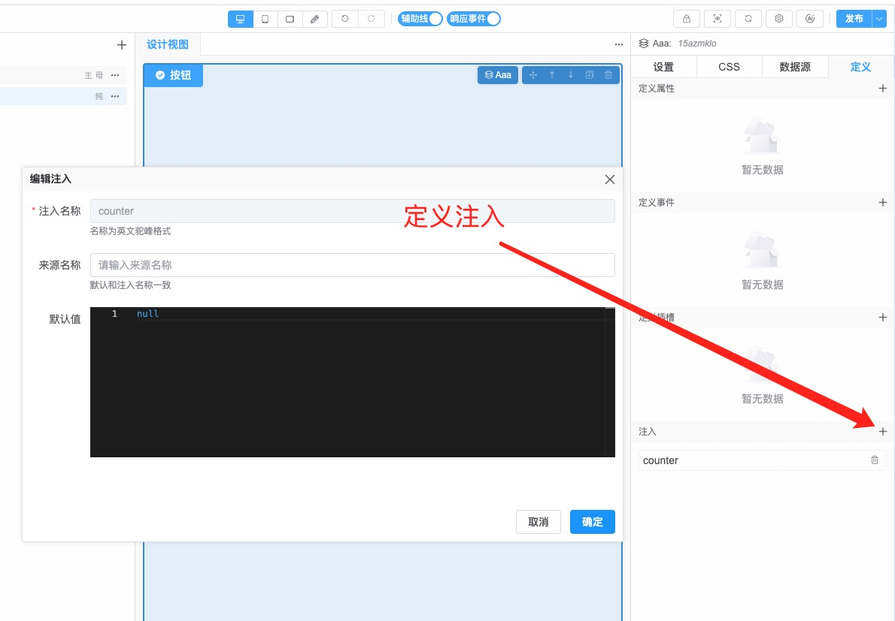

# 应用增强

应用增强是指给低代码的应用扩展功能。如增加全局的状态、样式、配置等应用级的功能。

:::warning 注意
该功能仅支持通过官方脚手架(npm create vtj@latest)创建的本地开发项目，在线方式不支持。
:::

## 开启应用增强

开启该功能需要完成以下三个步骤：

1. 在项目src目录下创建文件 `enhance.ts`。 这是应用增强插件的默认入口文件，可以配置为其他名称或路径，无特殊需求建议采用配置。 文件的代码需要导出 Vue Plugin。

   ```ts
   import type { App } from 'vue';
   import type { Provider } from '@vtj/renderer';

   // 可以在此引用scss文件，需要用到的工具库，依赖等

   export default function (app: App, provider: Provider) {
     // 应用增强代码
   }
   ```

1. 在 `main.ts` 文件导入 `enhance`, 并传递给 `createProvider` 方法。

   ```ts
   // 省略了其他代码
   import enhance from './enhance';

   const { provider, onReady } = createProvider({
     // 省略了其他参数
     enhance
   });
   ```

1. 配置 `vite.config.ts` 开启设计器支持

   ```ts
   import { createViteConfig } from '@vtj/cli';
   import { createDevTools } from '@vtj/local';
   export default createViteConfig({
     proxy,
     plugins: [
       createDevTools({
         // 开启增强
         enhance: true
       })
     ]
   });
   ```

通过以上配置， 启动开发环境 `npm run dev` 后，在源码运行、设计器视图、预览视图都加载了增强的代码。同时支持热更新。可以利用增强的代码对应用进行个性化的全局配置。

## 应用示例

### 给应用增加全局样式

需要给应用添加全局样式，只需在 `enhance.ts` 引入 `.scss` 文件即可。如

```ts
import type { App } from 'vue';
import type { Provider } from '@vtj/renderer';
// 引入样式文件
import './style/global.scss';
export default function (app: App, provider: Provider) {}
```

### 网络请求拦截

在实际项目开发时，您可能需要给请求头增加token或对响应进行错误提示等，这时，你可能需要用到请求拦截，通过应用增强可以方便处理。

```ts
import type { App } from 'vue';
import type { Provider } from '@vtj/renderer';
export default function (app: App, provider: Provider) {
  provider.adapter.request.useRequest((config) => {
    // 注入请求头
    config.headers.Token = '123456';
    return config;
  });

  provider.adapter.request.useResponse((res) => {
    // 响应拦截处理
    return res;
  });
}
```

### 接入Pinia

Pinia等其他工具库也可以增强文件中添加

```ts
import type { App } from 'vue';
import type { Provider } from '@vtj/renderer';
import { createPinia, defineStore } from 'pinia';

const pinia = createPinia();
const useCounterStore = defineStore('counter', {
  state: () => ({
    count: 0
  }),
  getters: {
    doubleCount: (state) => state.count * 2
  }
});

export default function (app: App, provider: Provider) {
  app.use(pinia);
  //通过 provide 提供
  app.provide('counter', useCounterStore());

  // 也可以挂载到 globalProperties
  app.config.globalProperties.counter = useCounterStore();
}
```

用 `app.provide` 的方式，在低代码页面需要定义注入才可以读取到store



挂载到 `globalProperties` 的可以直接 通过上下文读取，如 `this.counter`

## 个性化配置

vite.config.ts 的 enhance 默认配置就是最便捷的使用方式，如需要自定义入口文件，可以参考配置

```ts
export interface EnhanceOptions {
  // 入口文件路径
  entry?: string;
  // umd 导出名称
  name?: string;
  // umd 产物文件名
  fileName?: string;
  // 外部化的依赖
  external?: string[];
  // 外部依赖对应的全局名称
  globals?: Record<string, string>;
  // 产物文件生成目录
  outDir?: string;
}
```
