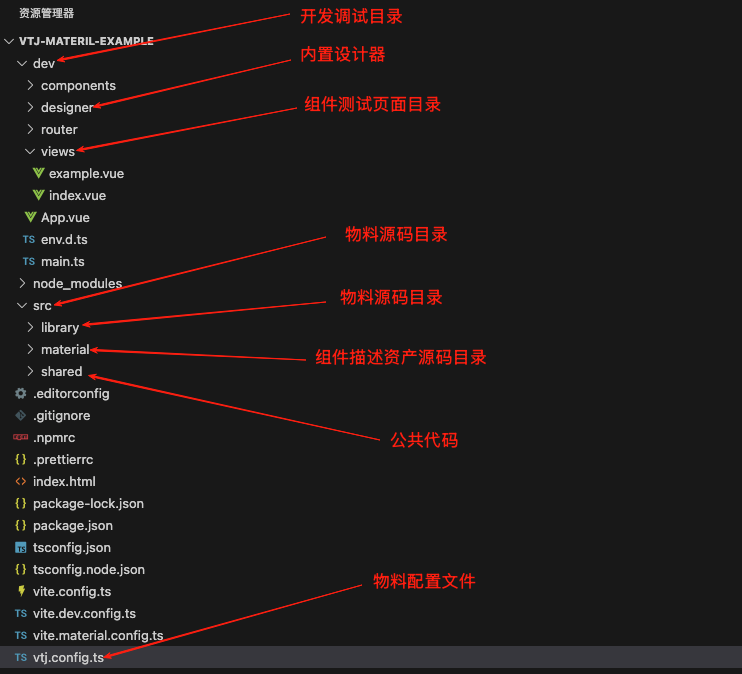
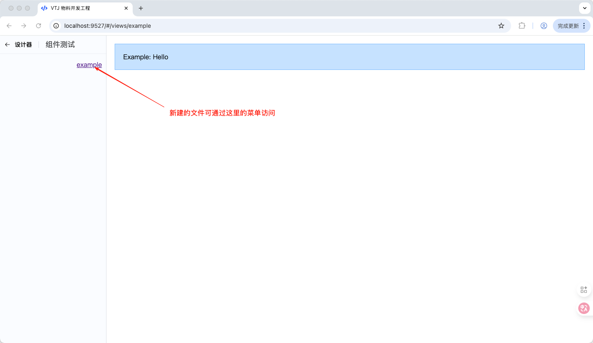
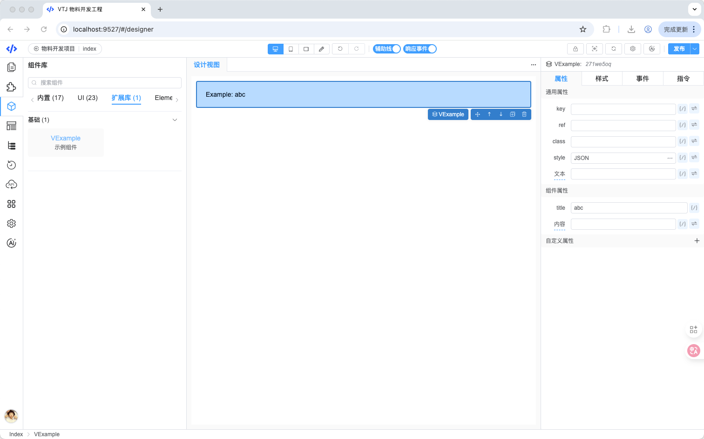
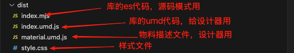
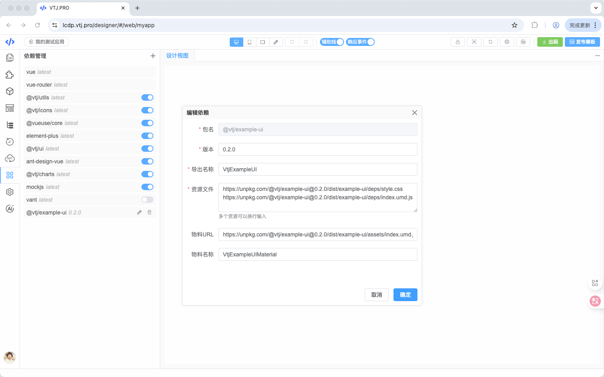

# 低代码物料制作指南

**低代码物料**是低代码开发中的核心构建单元，指预先封装好的、可复用的功能模块（如 UI 组件、工具函数、API 封装等）。开发者通过“搭积木”的方式组合这些物料，快速构建应用界面和逻辑，从而避免重复开发，提升效率。

本指南旨在系统化指导开发者如何高效构建符合规范的、可复用的低代码物料。

## 物料协议

低代码平台的**物料协议**在 `@vtj/core` 包中定义。设计器引擎依赖该协议来识别项目：

1.  依赖了哪些物料包
2.  每个物料包中包含哪些组件
3.  每个组件支持哪些属性 (Props)、事件 (Events) 和插槽 (Slots)
4.  每个属性使用哪种设置器 (Setter) 进行赋值

物料描述文件采用 `JSON` 格式，严格遵循协议约定，对物料包中的 Vue 组件进行结构化描述。设计器的组件库面板也完全依赖此描述文件来展示可用组件。

### 物料描述定义 (`Material`)

```ts
/**
 *  物料描述 (Material)
 */
export interface Material {
  /**
   * 物料包版本号 (遵循语义化版本规范)
   */
  version: string;

  /**
   * 物料包唯一标识符 (通常与 npm 包名一致)
   */
  name: string;

  /**
   * 物料包导出的全局变量名 (用于设计器加载)
   */
  library: string;

  /**
   * 物料包中文名称 (显示在组件库面板)
   */
  label: string;

  /**
   * 组件分类配置
   */
  categories: MaterialCategory[];

  /**
   * 组件详细描述列表
   */
  components: MaterialDescription[];

  /**
   * 排序号 (数字小的在组件库面板中靠前显示)
   */
  order: number;

  /**
   * 是否隐藏整个物料包 (不显示在组件库面板)
   */
  hidden?: boolean;
}

// 资产分类 (MaterialCategory)
export interface MaterialCategory {
  // 分类唯一标识 (ID)
  id: number | string;
  // 分类中文名称
  category: string;
}
```

### 组件描述定义 (`MaterialDescription`)

```ts
export interface MaterialDescription {
  /**
   * 组件在低代码设计器中的唯一名称 (建议前缀避免冲突，如 'AButton')
   */
  name: string;

  /**
   * 组件在原始库中的导出名称 (例如：'Button'，对应 `import { Button } from 'ant-design-vue'`)
   */
  alias?: string;

  /**
   * 父级组件名称 (用于处理组件嵌套导出的情况)
   * 示例：
   *   parent: 'Button'
   *   alias: 'Group'
   *   name: 'AButtonGroup'
   *   // 对应代码: const AButtonGroup = Button.Group;
   * 当 parent 存在时，alias 可支持多级路径 (如 'Group.Item')
   */
  parent?: string;

  /**
   * 组件预览图标 URL 或 Base64 数据
   */
  icon?: string;

  /**
   * 组件中文名称/描述 (显示在组件库面板和设计器)
   */
  label?: string;

  /**
   * 组件详细文档 URL (可选)
   */
  doc?: string;

  /**
   * 所属分类 ID (关联 MaterialCategory.id)
   */
  categoryId?: number | string;

  /**
   * 组件支持的属性列表
   */
  props?: MaterialProp[];

  /**
   * 组件支持的事件列表
   */
  events?: Array<string | MaterialEvent>; // 可简写为事件名字符串

  /**
   * 组件支持的插槽列表
   */
  slots?: Array<string | MaterialSlot>; // 可简写为插槽名字符串

  /**
   * 组件拖入画布时的默认低代码片段 (初始结构/配置)
   */
  snippet?: Partial<NodeSchema>;

  /**
   * 父容器限制规则
   *   - `undefined` 或 `true`: 可放置在任何组件内 (默认)
   *   - `false`: 不能放置在任何组件内 (通常是根组件)
   *   - `string[]`: 只能放置在指定名称的组件内
   */
  parentIncludes?: boolean | string[];

  /**
   * 子组件限制规则
   *   - `undefined` 或 `true`: 可接受任何子组件 (默认)
   *   - `false`: 不能接受任何子组件
   *   - `string[]`: 只能接受指定名称的子组件
   */
  childIncludes?: boolean | string[];

  /**
   * 是否在组件库面板中隐藏此组件 (物料包本身需 visible)
   */
  hidden?: boolean;

  /**
   * 组件来源类型 (如 'builtIn', 'custom', 'thirdParty' - 可选)
   */
  from?: NodeFrom;

  /**
   * 组件唯一 ID (通常用于 Block 物料 - 可选)
   */
  id?: string;

  /**
   * 组件所属的 npm 包名 (可选，用于依赖管理)
   */
  package?: string;
}
```

### 属性、事件、插槽、设置器定义

```ts
/**
 * 组件属性定义 (MaterialProp)
 */
export interface MaterialProp {
  /**
   * 属性名 (JS 中使用，驼峰式)
   */
  name: string;

  /**
   * 属性中文标签 (显示在属性面板)
   */
  label?: string;

  /**
   * 属性提示说明/文档 (鼠标悬停显示)
   */
  title?: string;

  /**
   * 属性默认值
   */
  defaultValue?: JSONValue;
  /**
   * 属性设置器
   *   - 类型1：设置器名称字符串 (如 'StringSetter')
   *   - 类型2：设置器配置对象
   *   - 类型3：设置器数组 (允许多个设置器切换使用)
   */
  setters?: string | MaterialSetter | Array<string | MaterialSetter>;

  /**
   * 属性可选值 (用于 SelectSetter/RadioSetter 等)
   *   - 格式1：字符串数组 (['small', 'medium', 'large'])
   *   - 格式2：对象数组 ({label: '小号', value: 'small'}, ...)
   */
  options?: string[] | { label: string; value: JSONValue }[];

  /**
   * 属性期望的数据类型 (用于校验和提示 - 可选)
   */
  type?: DataType[]; // 如 ['String', 'Number', 'Boolean', 'Array', 'Object', 'Function']
}

/**
 * 属性设置器定义 (MaterialSetter)
 */
export interface MaterialSetter {
  /**
   * 设置器唯一标识名 (需与内置或注册的 Setter 匹配)
   */
  name: string;

  /**
   * 设置器对应的 Vue 组件 (自定义设置器时必需)
   */
  component?: any;

  /**
   * 设置器显示名称 (可选)
   */
  label?: string;

  /**
   * 传递给设置器组件的额外配置参数 (可选)
   */
  props?: Record<string, any>;
}

/**
 * 组件事件定义 (MaterialEvent)
 */
export interface MaterialEvent {
  /**
   * 事件名 (如 'change', 'click')
   */
  name: string;

  /**
   * 事件回调函数的参数名称列表 (用于生成代码和文档)
   */
  params?: string[]; // 如 ['event', 'value']
}

/**
 * 组件插槽定义 (MaterialSlot)
 */
export interface MaterialSlot {
  /**
   * 插槽名 (默认插槽为 'default')
   */
  name: string;

  /**
   * 作用域插槽向子组件传递的参数名称列表
   */
  params?: string[]; // 如 ['rowData', 'index']
}
```

## 物料开发流程

### **开发步骤概览**

1.  **创建项目**: 使用脚手架初始化物料开发项目。
2.  **项目配置**: 设置项目基本信息 (package.json)。
3.  **物料配置**: 配置 `vtj.config.ts` 核心文件。
4.  **物料编码**: 开发 UI 组件、工具函数、API 等。
5.  **编写描述**: 为每个组件编写物料描述文件。
6.  **本地测试**: 利用内置设计器调试物料。
7.  **编译打包**: 生成最终物料包产物。
8.  **部署使用**: 将物料包提供给设计器使用。

### 1. 创建物料开发项目

VTJ 脚手架提供了专用的物料开发项目模板。通过以下命令创建项目：

```bash
npm create vtj@latest --registry=https://registry.npmmirror.com -- -t material
```

项目内置了一个基于 `StorageService` 的设计器，便于在开发过程中实时测试物料。

**项目工程目录结构**

```
your-material-project/
├── src/
│   ├── library/         # 物料源码 (UI 组件、工具、API)
│   │   ├── ui/          # UI 组件
│   │   ├── utils/       # 工具函数
│   │   ├── api/         # API 封装
│   │   └── index.ts     # 库入口文件，注册导出所有物料
│   ├── material/        # 物料描述文件
│   │   ├── components/  # 单个组件的描述文件
│   │   └── index.ts     # 物料描述入口，聚合所有组件描述
│   └── ...              # 其他项目源码
├── dev/                 # 开发调试目录
│   └── views/           # 测试视图/页面 (.vue 文件自动注册为路由)
├── vtj.config.ts        # **核心配置文件**
├── package.json
├── tsconfig.json
└── ...                  # 其他配置文件
```

 _(示意图：物料项目目录结构)_

### 2. 初始化项目配置

在 `package.json` 文件中配置关键信息：

- `name`: 物料包的 npm 名称 (也是物料描述中的 `name` 字段来源)。
- `version`: 物料包版本号 (也是物料描述中的 `version` 字段来源)。
- 其他字段 (如 `description`, `author`, `license`) 按需填写。

```json
{
  "name": "your-material-package-name",
  "version": "1.0.0",
  "description": "My Custom Low-Code Material Components",
  "main": "dist/index.umd.js",
  "types": "dist/types/index.d.ts",
  "files": ["dist"],
  "scripts": {
    "dev": "vtj dev",
    "build": "vtj build"
    // ... other scripts
  }
  // ... other package.json fields
}
```

### 3. 配置 `vtj.config.ts`

此文件是物料项目构建的核心配置文件，位于工程根目录。**请重点关注 `library` 和 `material` 配置项，它们是设计器识别物料的关键。**

```ts
import { defineConfig } from '@vtj/cli';

export default defineConfig({
  /**
   * 调试项目配置信息 (用于内置设计器)
   */
  project: {
    id: 'my-material-dev', // 项目ID
    name: '物料开发测试项目', // 项目名称
    platform: 'web' // 目标平台
  },

  /**
   * 【关键】库导出名称 (library)
   * - 对应物料描述 `Material.library`
   * - 设计器通过此名称加载物料包
   */
  library: 'VX', // 例如: 'MyMaterialLib'

  /**
   * 【关键】物料描述导出名称 (material)
   * - 对应包含 `Material` 接口对象的变量名
   * - 设计器通过此名称获取物料描述
   */
  material: 'VXMaterial', // 例如: 'MyMaterialDescription'

  /**
   * 物料在设计器组件面板中的显示标题
   */
  label: '扩展组件库', // 例如: '我的自定义组件'

  /**
   * 库产物文件路径 (CSS 和 JS)
   * - 构建后生成的样式和脚本文件
   */
  outputLibrary: [
    'dist/style.css', // 样式文件
    'dist/index.umd.js' // UMD 格式库文件
  ],

  /**
   * 物料描述产物文件路径
   * - 构建后生成的包含 `Material` 对象的 JS 文件
   */
  outputMaterial: 'dist/material.umd.js'
});
```

:::warning 重要提示

- `library` 和 `material` 的值必须与你在 `/src/library/index.ts` 和 `/src/material/index.ts` 中实际导出的变量名严格一致。
- 修改这些名称会直接影响设计器加载物料的能力。
  :::

### 4. UI 组件库、工具函数、API 等物料编码

完成配置后，在 `/src/library/` 目录下开发你的物料：

- `/src/library/ui/`: 放置 Vue UI 组件。
- `/src/library/utils/`: 放置工具函数。
- `/src/library/api/`: 放置 API 请求封装。
- `/src/library/index.ts`: **物料库入口文件**，负责导入并注册所有物料 (组件、工具、API)。

**关键文件示例 (`/src/library/ui/index.ts`):**

```ts
import { register } from '@vtj/core';
import YourButton from './YourButton.vue';
import YourInput from './YourInput.vue';
// ... 导入其他 UI 组件

// 注册 UI 组件 (使其在设计器和运行时可用)
export function registerUI(app: any) {
  register(app, {
    // '组件在设计器中的名称': 组件实例
    VYourButton: YourButton,
    VYourInput: YourInput
    // ... 注册其他组件
  });
}
```

**关键文件示例 (`/src/library/index.ts`):**

```ts
import { registerUI } from './ui';
import * as utils from './utils';
import * as api from './api';

// 【关键】导出 library 变量 (对应 vtj.config.ts 中的 `library`)
export const VX = {
  // 注册 UI 组件到 Vue App
  install(app: any) {
    registerUI(app);
  },
  // 导出工具函数
  utils,
  // 导出 API 方法
  api
};

// 【关键】导出 material 变量 (对应 vtj.config.ts 中的 `material`)
// 注意：实际物料描述对象在 `/src/material/index.ts` 中定义并聚合，通常在此导入
import material from '../material';
export const VXMaterial = material;
```

:::info 提示

- **复用现有库**: 如果你已有成熟的组件库/工具库，只需为其编写物料描述文件 (`/src/material/`)，可以跳过大部分 `/src/library/` 下的编码工作。确保你的库能在 Vue 项目中正常安装 (`app.use(yourLib)`) 和使用即可。
- **开发新物料**: 遵循 Vue 组件开发规范编写组件，并在入口文件中正确注册导出。
  :::

**测试组件**
在 `/dev/views/` 目录下创建 `.vue` 文件。这些文件会自动注册为路由页面，可用于编写和测试你的物料组件。

 _(示意图：在 /dev/views/ 下创建测试页面)_

### 5. 编写 UI 组件物料描述文件

物料描述文件是设计器理解和使用组件的“说明书”，必须放置于 `/src/material/` 目录下（通常按组件拆分到子目录或文件）。务必在 `/src/material/index.ts` 中导入并聚合所有组件的描述。

**物料描述文件示例 (`/src/material/components/VExample.ts`):**

```ts
import type { MaterialDescription } from '@vtj/core';

const VExample: MaterialDescription = {
  name: 'VExample', // 设计器中使用的唯一名称
  label: '示例组件', // 显示名称
  categoryId: 'base', // 关联分类ID (需在Material.categories中定义)

  // 组件支持的属性
  props: [
    {
      name: 'title', // 属性名 (JS)
      label: '标题', // 属性显示名
      setters: 'StringSetter' // 使用字符串设置器
    },
    {
      name: 'content',
      label: '内容',
      title: '鼠标悬停显示的提示文字', // 提示说明
      setters: [
        // 允许多个设置器切换
        'StringSetter', // 文本设置器
        'ArraySetter' // 数组设置器 (用于复杂内容)
      ],
      defaultValue: '默认内容' // 默认值
    }
  ],

  // 组件支持的事件
  events: [
    'click', // 简写：只有事件名
    {
      name: 'change', // 事件名
      params: ['newValue', 'oldValue'] // 事件回调参数
    }
  ],

  // 组件支持的插槽
  slots: [
    {
      name: 'default', // 默认插槽
      params: ['item'] // 作用域插槽参数 (如 v-slot="slotProps")
    },
    {
      name: 'footer' // 具名插槽 footer
    }
  ],

  // (可选) 组件拖入画布时的默认结构/配置
  snippet: {
    props: {
      title: '示例标题',
      content: ['第一项', '第二项']
    },
    children: [
      {
        componentName: 'VText',
        props: {
          text: '这是默认插槽内容'
        }
      }
    ]
  }
};

export default VExample;
```

**关键文件示例 (`/src/material/index.ts`):**

```ts
import type { Material } from '@vtj/core';
import VExample from './components/VExample'; // 导入组件描述
import VButton from './components/VButton';
// ... 导入其他组件的描述

// 【关键】定义物料分类
const categories: MaterialCategory[] = [
  { id: 'base', category: '基础组件' },
  { id: 'input', category: '表单组件' }
  // ... 其他分类
];

// 【关键】聚合所有组件描述
const components: MaterialDescription[] = [
  VExample,
  VButton
  // ... 其他组件描述
];

// 【关键】构建完整的 Material 对象 (对应 vtj.config.ts 中的 `material` 导出)
const VXMaterial: Material = {
  version: process.env.PACKAGE_VERSION || '1.0.0', // 通常从 package.json 或环境变量获取
  name: process.env.PACKAGE_NAME || 'my-material', // 通常从 package.json 获取
  library: 'VX', // 必须与 vtj.config.ts 中的 `library` 一致
  label: '扩展库',
  categories,
  components,
  order: 10 // 物料包在组件库面板中的排序
};

export default VXMaterial;
```

**内置设置器 (Built-in Setters)**
设计器提供了一系列开箱即用的设置器，可在物料描述的 `props.setters` 中直接使用其名称：

```ts
// 常用内置设置器参考列表 (vtj/core 中定义)
export const builtInSetters = [
  { name: 'InputSetter', component: ..., type: 'String' }, // 文本输入
  { name: 'StringSetter', component: ..., type: 'String' }, // 同 InputSetter
  { name: 'BooleanSetter', component: ..., type: 'Boolean' }, // 布尔开关
  { name: 'NumberSetter', component: ..., type: 'Number' }, // 数字输入
  { name: 'SelectSetter', component: ..., type: 'String' }, // 下拉选择
  { name: 'RadioSetter', component: ..., type: 'String' }, // 单选按钮组
  { name: 'ColorSetter', component: ..., type: 'String' }, // 颜色选择器
  { name: 'IconSetter', component: ..., type: 'String' }, // 图标选择器 (通用)
  { name: 'VanIconSetter', component: ..., type: 'String' }, // Vant 图标选择器 (示例)
  { name: 'JsonSetter', component: ..., type: 'Object', props: { type: 'JSON' } }, // JSON 编辑器
  { name: 'ObjectSetter', component: ..., type: 'Object', props: { type: 'Object' } }, // 对象属性编辑
  { name: 'ArraySetter', component: ..., type: 'Array', props: { type: 'Array' } }, // 数组项编辑
  { name: 'FunctionSetter', component: ..., type: 'Function' }, // 函数编辑器
  { name: 'ExpressionSetter', component: ..., type: 'Object' }, // JS 表达式编辑器
  { name: 'SliderSetter', component: ..., type: 'Number' }, // 滑块
  { name: 'RangeSetter', component: ..., type: 'Array', props: { range: true } }, // 范围滑块
  { name: 'FileSetter', component: ..., type: 'String', props: { multiple: false } }, // 文件上传 (单)
  { name: 'FilesSetter', component: ..., type: 'String', props: { multiple: true } }, // 文件上传 (多)
  { name: 'CssSetter', component: ..., type: 'String' }, // CSS 样式编辑器
  // ... 其他设置器 (如 SizeSetter, TagSetter, ImageSetter, SectionSetter)
];
```

**物料本地测试**
运行 `npm run dev` 启动开发服务器。访问内置设计器 (`/dev` 路由)，即可实时查看和测试你编写的物料描述是否正确，组件是否能被正确识别、拖拽、配置。

 _(示意图：在内置设计器中测试物料)_

### 6. 编译打包产物

开发测试完成后，执行构建命令生成最终部署的物料包：

```bash
npm run build
```

构建完成后，将在项目根目录生成 `dist/` 文件夹，包含以下关键产物：

- `dist/index.umd.js`: 物料库的 UMD 格式 JS 文件 (包含组件、工具、API 的实现)。
- `dist/style.css`: 物料库的样式文件 (如果组件有样式)。
- `dist/material.umd.js`: 物料描述文件的 UMD 格式 JS 文件 (包含 `Material` 对象)。
- (可选) `dist/types/`: TypeScript 类型声明文件。

 _(示意图：构建产物目录)_

这些产物可以发布到 npm 仓库、私有 Git 仓库或静态文件服务器，具体方式由团队规范决定。

### 7. 部署到设计器

将编译好的物料包提供给低代码设计器使用，通常需要两步：

**1. 添加物料包依赖**

- **方式 A (npm/git 发布)**： 在设计器项目 (`package.json`) 中添加你物料包的依赖。
  ```json
  "dependencies": {
    "your-material-package-name": "^1.0.0"
  }
  ```
- **方式 B (本地/静态文件)**： 在设计器项目的构建配置 (如 `vite.config.ts`) 中，通过 `alias` 或 `resolve` 配置指向物料产物的本地路径或 CDN URL。

**2. 在设计器中注册物料**
在设计器的**依赖管理**模块 (或类似配置界面) 添加该物料资源：

- **`library` 资源**: 指定 `index.umd.js` 和 `style.css` 的访问路径。
- **`material` 资源**: 指定 `material.umd.js` 的访问路径。
  - 如果物料包已通过 npm/git 安装并被设计器项目正确 `import`，路径通常是包名 (如 `'your-material-package-name/dist/material.umd.js'`)。
  - 如果是本地文件或 CDN，使用绝对路径或 `/public/` 下的相对路径 (如 `'/public/assets/your-material/material.umd.js'`)。

 _(示意图：在设计器依赖管理界面添加物料)_

**验证**
完成注册后，在设计器的组件库面板中应能看到你的物料包分类和组件列表。尝试拖拽组件到画布并配置其属性、事件、插槽，确保功能符合预期。
