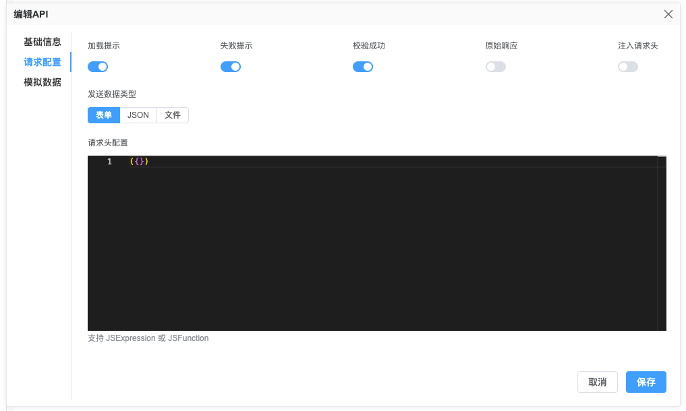

# HTTP 请求工具

一个强大的基于 Axios 的 HTTP 客户端封装，为现代 Web 应用提供增强功能。

## 功能特性

- 🚀 基于 Promise 的 API
- 🔁 请求拦截器
- 🚫 请求取消功能
- ⏳ 加载状态管理
- 📊 响应验证
- 🛠️ 可定制的错误处理
- 🔄 特定情况自动重试
- 📦 支持表单数据、JSON 和 URL 编码格式

## 基本用法

```typescript
import { request } from '@vtj/utils';

// GET 请求
const fetchData = async () => {
  try {
    const response = await request({ url: '/api/data' });
    console.log(response.data);
  } catch (error) {
    console.error('请求失败:', error);
  }
};

// POST 请求
const createItem = async (itemData) => {
  return request({
    method: 'post',
    url: '/api/items',
    data: itemData
  });
};

// Path 参数
const getData = async (id: string) => {
  try {
    const response = await request({ url: '/api/user/:id', params: { id } });
    console.log(response.data);
  } catch (error) {
    console.error('请求失败:', error);
  }
};

// POST请求，同时带 Query params 参数

const postData = async () => {
  try {
    const response = await request({
      url: '/api/user/:id',
      method: 'post',
      data: itemData,
      params: { id },
      query: { name: '名称' }
    });
    console.log(response.data);
  } catch (error) {
    console.error('请求失败:', error);
  }
};

// 发送json格式数据
request({
  type: 'post',
  url: '/api/json',
  settings: {
    type: 'json'
  },
  data: jsonData
});

// 文件上传
request({
  type: 'post',
  url: '/api/file',
  settings: {
    type: 'data'
  },
  data: {
    file: File
  }
});
```

## 配置选项

`request` 在 `axios` 的基础上增加了 `settings` 参数选项，有以下配置设置选项

### 请求设置

| 选项             | 类型                            | 默认值    | 描述                |
| ---------------- | ------------------------------- | --------- | ------------------- |
| `type`           | 'form' \| 'json' \| 'data'      | 'form'    | 请求负载格式        |
| `injectHeaders`  | boolean                         | false     | 注入自定义请求头    |
| `headers`        | Record<string,string>           | undefined | 自定义请求头        |
| `loading`        | boolean                         | false     | 启用加载状态        |
| `failMessage`    | boolean                         | true      | 显示错误消息        |
| `originResponse` | boolean                         | false     | 返回原始 Axios 响应 |
| `validSuccess`   | boolean                         | true      | 验证响应是否成功    |
| `validate`       | (res: AxiosResponse) => boolean | undefined | 自定义校验方法      |
| `showError`      | (msg: string, e: any) => void   | undefined | 自定义失败提示      |
| `showLoading`    | showLoading: () => void;        | undefined | 显示loading方法     |
| `hideLoading`    | () => void;                     | undefined | 关闭 loading方法    |

在设计器API管理中的请求配置是对应上述请求配置



### 创建自定义实例

```typescript
import { createRequest } from '@vtj/utils';

const customRequest = createRequest({
  baseURL: 'https://api.example.com',
  timeout: 5000,
  settings: {
    type: 'json',
    loading: true,
    showLoading: () => console.log('加载中...'),
    hideLoading: () => console.log('完成!')
  }
});
```

### 全局配置

可以通过以下方式全局设置`request`配置选项

```ts
import { request } from '@vtj/utils';
import { ElNotification, ElLoading } from 'element-plus';

let _loading: any = null;

function loading() {
  return ElLoading.service({
    lock: true,
    text: 'Loading',
    background: 'rgba(0, 0, 0, 0.7)'
  });
}

function notify(
  message: string,
  title: string = '',
  type: 'success' | 'warning' | 'error' | 'info' = 'warning'
) {
  ElNotification({
    title,
    message,
    type
  });
}

request.setConfig({
  settings: {
    type: 'form', // 默认表单格式提交
    validSuccess: true, // 验证成功状态
    originResponse: false, // 不返回原始响应
    loading: true, // 启用加载状态
    validate: (res: any) => {
      // 响应验证函数
      return res.data?.code === 0 || !!res.data?.success;
    },
    failMessage: true, // 启用失败消息提示
    showError: (msg: string) => {
      // 错误消息显示回调
      if (notify) {
        notify(msg || '未知错误');
      }
    },
    showLoading: () => {
      // 显示加载状态回调
      if (_loading) {
        _loading.close();
      }
      if (loading) {
        _loading = loading();
      }
    },
    hideLoading: () => {
      // 隐藏加载状态回调
      if (_loading) {
        _loading.close();
        _loading = null;
      }
    }
  }
});
```

## 高级功能

### 请求取消

```typescript
// 取消特定请求
request.cancel('request-id', '用户取消操作');

// 取消所有待处理请求
request.cancel();
```

### 拦截器

```typescript
// 添加请求拦截器
const removeInterceptor = request.useRequest((config) => {
  config.headers.Authorization = `Bearer ${token}`;
  return config;
});

// 稍后移除拦截器
removeInterceptor();
```

### 错误处理

```typescript
request({
  url: '/api/protected',
  settings: {
    showError: (msg, error) => {
      alert(`错误: ${msg}`);
      console.error('请求详情:', error.config);
    }
  }
});
```

## 辅助函数

### createApi

创建可复用的 API 端点：

```typescript
const getUser = createApi<{ id: string }, User>('/user/:id');
const user = await getUser({ profile: 'profile' }, { params: { id: 'id' } });
```

### createApis

一次性创建多个 API 端点：

```typescript
const api = createApis({
  getPosts: '/posts',
  createPost: { method: 'post', url: '/posts' },
  updatePost: { method: 'patch', url: '/posts/:id' }
});

await api.getPosts();
await api.createPost({ title: '新文章' });
```

### useApi (Vue 组合式 API)

```vue
<script setup>
  import { useApi } from '@vtj/utils';
  import { getUser } from './api';

  const { data, error, loading } = useApi(
    getUser({ id: '123' }),
    (res) => res.data
  );
</script>

<template>
  <div v-if="loading">加载用户中...</div>
  <div v-else-if="error">错误: {{ error.message }}</div>
  <div v-else>{{ data }}</div>
</template>
```

## TypeScript 支持

该模块提供全面的 TypeScript 支持：

```typescript
interface User {
  id: string;
  name: string;
  email: string;
}

// 类型化的 API 函数
const getUser = createApi<{ id: string }, User>('/users/:id');

// 类型化的响应
const response = await request<User>({ url: '/user/123' });
console.log(response.name); // 类型安全的属性访问
```

## 最佳实践

1. 使用 `createApi` 创建可复用的 API 端点
2. 通过 `showLoading`/`hideLoading` 回调实现加载指示器
3. 使用响应拦截器全局处理常见错误
4. 在组件卸载时取消请求
5. 使用 TypeScript 接口进行请求/响应验证
