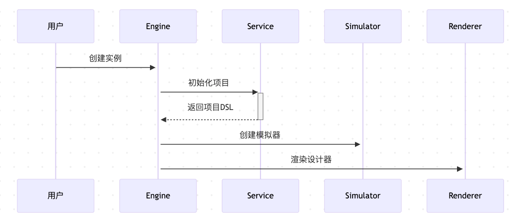

# 设计器引擎

## 概述

`Engine` 是 VTJ 设计器的核心引擎类，负责管理整个设计器的生命周期和状态。它整合了项目管理、文件操作、历史记录、渲染等核心功能，是设计器架构的中枢系统。


## 构造函数 (EngineOptions)

创建 Engine 实例时需传入配置对象：

```typescript
interface EngineOptions {
  container: MaybeRef<HTMLElement | undefined>; // 设计器渲染容器（必需）
  service: Service; // 文件服务接口（必需）
  project?: Partial<ProjectSchema>; // 当前加载的项目信息
  dependencies?: Record<string, () => Promise<any>>; // 项目依赖
  materials?: Record<string, () => Promise<any>>; // 项目物料
  materialPath?: string; // 内置物料路径
  globals?: Record<string, any>; // 全局变量
  adapter?: Partial<ProvideAdapter>; // 设计器画布适配
  install?: (app: App, engine?: Engine) => void; // 初始化回调
  access?: Access; // 权限控制器
  remote?: string | null; // 远程服务地址
  checkVersion?: boolean; // 是否检查版本
  openApi?: OpenApi; // OpenAPI服务
  enhance?: boolean | EnhanceConfig; // 应用增强配置
}
```

## 核心方法

### 1. 文件操作

#### `openFile(fileId?: string)`

打开指定文件：

```typescript
// 打开首页
engine.openFile(project.homepage);

// 打开特定页面
engine.openFile('page_123');
```

#### `saveCurrentFile()`

保存当前编辑的文件：

```typescript
// 通常在内容变更后调用
engine.saveCurrentFile();
```

### 2. 项目操作

#### `publish()`

发布整个项目：

```typescript
// 整站发布
engine.publish();
```

#### `genSource()`

生成项目源代码：

```typescript
// 返回生成的源代码
const source = await engine.genSource();
```

### 3. 历史记录

#### `initHistory(block: BlockModel | null)`

初始化区块的历史记录：

```typescript
// 当激活新文件时自动调用
engine.initHistory(currentBlock);
```

### 4. 生命周期

#### `dispose()`

销毁引擎并清理资源：

```typescript
// 组件卸载时调用
onUnmounted(() => {
  engine.dispose();
});
```

## 事件系统

Engine 使用事件发射器实现模块间通信，关键事件包括：

| 事件名称                 | 触发时机     | 参数              |
| ------------------------ | ------------ | ----------------- |
| `EVENT_PROJECT_CHANGE`   | 项目信息变更 | ProjectModelEvent |
| `EVENT_BLOCK_CHANGE`     | 区块内容变更 | BlockModel        |
| `EVENT_HISTORY_CHANGE`   | 历史记录变更 | HistoryModelEvent |
| `EVENT_PROJECT_PUBLISH`  | 项目发布     | -                 |
| `SAVE_BLOCK_FILE_FINISH` | 文件保存完成 | ProjectModelEvent |

**事件监听示例**：

```typescript
emitter.on(EVENT_PROJECT_CHANGE, (e) => {
  console.log('项目变更:', e.model);
});
```

## 使用示例

### 基础用法：初始化引擎

```typescript
import { Engine } from '@vtj/designer';

const engine = new Engine({
  container: document.getElementById('designer-container'),
  service: fileService,
  project: {
    name: '我的项目',
    pages: [...],
    blocks: [...]
  },
  materialPath: './materials/',
  access: new Access({...}),
});
```

### 高级用法：集成到Vue应用

```vue
<script setup>
  import { useEngine } from '@vtj/designer';

  const engine = useEngine();

  // 打开首页
  const openHomePage = () => {
    engine.openFile();
  };
</script>

<template>
  <button @click="openHomePage">打开首页</button>
  <div id="designer-container"></div>
</template>
```

## 最佳实践

1. **初始化顺序**：



2. **错误处理**：

   - 使用 `try/catch` 包裹可能失败的操作
   - 检查 `project.value?.locked` 处理项目锁定状态

3. **性能优化**：
   - 使用 `shallowReactive` 减少响应式开销
   - 通过 `nextTick` 确保DOM更新后操作
