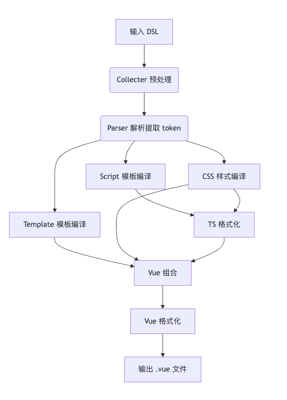

# Generator 代码生成器

## 设计目标

将可视化设计稿（DSL）结合组件物料描述，转换为可直接运行的 Vue 单文件组件（.vue），实现从设计到代码的无缝转换。

## 核心处理流程



## 参数说明

```ts
generator(
  dsl: BlockSchema, // 页面结构DSL
  componentMap: Map<string, MaterialDescription>, // 组件物料映射
  dependencies: Dependencie[] = [], // 第三方依赖
  platform: PlatformType = 'web', // 目标平台
  formatterDisabled?: boolean // 禁用格式化
)
```

## 输出说明

返回 Promise 解析为以下结构的 Vue SFC 文件：

```vue
<template>
  <!-- 解析生成的模板 -->
</template>

<script lang="ts" setup>
  // 生成的TypeScript逻辑
</script>

<style scoped lang="scss">
  /* 生成的样式 */
</style>
```

## 使用示例

```ts
import { generator } from '@vtj/coder';

const vueCode = await generator(
  pageSchema,
  componentMap,
  [{ name: 'lodash', version: '^4.0' }],
  'web'
);
```

## 辅助方法

### createEmptyPage()

创建空白源码模式页面：

```ts
createEmptyPage(file: PageFile) => Promise<string>
```

生成默认页面模板，包含文件路径提示：

```vue
<template>
  <div>
    <h3>源码模式页面</h3>
    <div>文件路径：/.vtj/vue/{file.id}.vue</div>
  </div>
</template>
```

## 注意事项

1. **格式化控制**：默认启用 Prettier 格式化，可通过 `formatterDisabled=true` 禁用
2. **错误处理**：格式化失败时返回原始未格式化代码
3. **平台适配**：通过 `platform` 参数支持多平台输出
4. **依赖管理**：需显式传入第三方依赖确保正确导入
