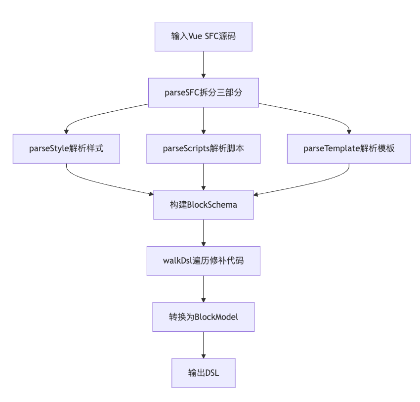

# parseVue 解析器

`parseVue` 是 VTJ 框架中用于解析 Vue 单文件组件(SFC)的核心函数，它能将 Vue 组件源码转换为结构化的 DSL（领域特定语言）描述。

## 作用

`parseVue` 主要完成以下功能：

1. **组件解析**：将 Vue SFC 拆解为模板(template)、脚本(script)和样式(style)三部分
2. **元数据提取**：从组件中提取以下关键信息：
   - 状态(state)
   - 计算属性(computed)
   - 方法(methods)
   - 生命周期(lifeCycles)
   - 属性(props)
   - 事件(emits)
   - 依赖注入(inject)
3. **模板转换**：将模板转换为节点树(nodes)结构
4. **代码规范化**：对 JS/TS 代码进行格式化和上下文修补
5. **错误收集**：在解析过程中收集所有语法和语义错误
6. **DSL生成**：最终输出标准的 BlockSchema DSL

## 工作原理

### 解析流程

`parseVue` 的完整解析流程如下：



### 核心处理阶段

#### 1. SFC 解析 (`parseSFC`)

- 使用 `@vue/compiler-sfc` 的解析能力
- 将源码拆分为 `<template>`, `<script>` 和 `<style>` 三个部分
- 处理多语言块（如多个 `<style>` 或 `<script>` 标签）

#### 2. 样式解析 (`parseStyle`)

- 合并所有 `<style>` 块内容
- 提取 CSS 规则和预处理器信息
- 收集样式解析错误

#### 3. 脚本解析 (`parseScripts`)

- 解析 `<script>` 内容
- 提取以下元素：
  ```ts
  {
    state, // 响应式状态
      watch, // 侦听器
      lifeCycles, // 生命周期钩子
      computed, // 计算属性
      methods, // 方法
      props, // 组件属性
      emits, // 自定义事件
      inject, // 注入依赖
      handlers, // 事件处理器
      imports, // 导入语句
      dataSources; // 数据源
  }
  ```
- 处理组合式 API 和选项式 API

#### 4. 模板解析 (`parseTemplate`)

- 将模板转换为 AST（抽象语法树）
- 提取：
  - `nodes`: 模板节点树
  - `slots`: 插槽定义
  - `context`: 模板上下文引用
- 平台相关处理（web/uniapp）

#### 5. DSL 构建

整合所有解析结果构建 BlockSchema 对象：

```ts
{
  id,
    name,
    inject,
    props,
    state,
    watch,
    lifeCycles,
    computed,
    methods,
    dataSources,
    slots,
    emits,
    nodes,
    css;
}
```

#### 6. 代码修补 (`patchCode`)

- 使用 `tsFormatter` 标准化代码格式
- 上下文相关修补：
  - 平台特定全局变量替换
  - 成员访问修正（如 `this` 替换）
  - 依赖库别名处理

#### 7. 模型转换 (`BlockModel.toDsl()`)

将中间表示转换为最终 DSL 输出

## 用法

### 函数签名

```ts
function parseVue(options: IParseVueOptions): Promise<BlockSchema>;
```

### 参数说明

```ts
interface IParseVueOptions {
  id: string; // 组件唯一标识
  name: string; // 组件名称
  source: string; // Vue SFC 源码
  project: ProjectSchema; // 项目配置
}

interface ProjectSchema {
  dependencies?: Dependencie[]; // 项目依赖
  platform?: 'web' | 'uniapp'; // 目标平台
}
```

### 使用示例

```ts
import { parseVue } from '@vtj/parser';

const vueSource = `
<template>
  <div>
    {{ `${state.message}(${state.count})` }}
  </div>
  <ElButton type="primary" @click="increment"> 按钮</ElButton>
</template>
<script lang="ts">
  import { defineComponent, reactive } from 'vue';
  import { ElButton } from 'element-plus';
  import { useProvider } from '@vtj/renderer';
  export default defineComponent({
    name: 'MyBlock',
    components: { ElButton },
    setup(props) {
      const state = reactive({ count: 0, message: 'Hello VTJ' });
      return { state, props };
    },
    methods: {
      increment() {
        this.state.count++;
      }
    }
  })
</script>
<style lang="scss" scoped></style>

`;

const options = {
  id: 'demo-component',
  name: 'DemoComponent',
  source: vueSource,
  project: {
    dependencies: [
      {
        package: '@vtj/core',
        library: 'VTJCore'
      }
    ],
    platform: 'web'
  }
};

parseVue(options)
  .then((dsl) => {
    console.log('解析结果:', dsl);
  })
  .catch((errors) => {
    console.error('解析错误:', errors);
  });
```

### 输出示例

```json
{
  "name": "MyBlock",
  "locked": false,
  "inject": [],
  "state": {
    "count": {
      "type": "JSExpression",
      "value": "0"
    },
    "message": {
      "type": "JSExpression",
      "value": "'Hello VTJ'"
    }
  },
  "lifeCycles": {},
  "methods": {
    "increment": {
      "type": "JSFunction",
      "value": "() => {\n  this.state.count++;\n}"
    }
  },
  "computed": {},
  "watch": [],
  "css": "",
  "props": [],
  "emits": [],
  "slots": [],
  "dataSources": {},
  "__VTJ_BLOCK__": true,
  "__VERSION__": "1751100462006",
  "id": "173bd0g0",
  "nodes": [
    {
      "id": "2vm73ccuk0",
      "name": "div",
      "from": "",
      "invisible": false,
      "locked": false,
      "children": {
        "type": "JSExpression",
        "value": "`${this.state.message}(${this.state.count})`"
      },
      "props": {},
      "directives": [],
      "events": {}
    },
    {
      "id": "2vn73ccuk0",
      "name": "ElButton",
      "from": "element-plus",
      "invisible": false,
      "locked": false,
      "children": " 按钮",
      "props": {
        "type": "primary"
      },
      "directives": [],
      "events": {
        "click": {
          "name": "click",
          "handler": {
            "type": "JSFunction",
            "value": "this.increment"
          },
          "modifiers": {}
        }
      }
    }
  ]
}
```

## 注意事项

1. **源码规范**：

   - 必须使用标准 Vue SFC 格式
   - 支持 Vue 2 和 Vue 3 语法

2. **错误处理**：

   - 错误以数组形式返回
   - 包含位置信息和错误原因
   - 常见错误类型：
     - 模板语法错误
     - 脚本解析错误
     - CSS 语法错误

3. **平台适配**：

   - 通过 `platform` 参数指定目标平台
   - 影响模板解析结果：
     - `web`: 标准 DOM 处理
     - `uniapp`: 小程序特定组件处理

4. **依赖管理**：

   - 必须在 `dependencies` 中声明外部依赖
   - 依赖映射关系用于代码修补

5. **性能考虑**：
   - 大型组件建议异步调用
   - 避免在热路径中频繁调用
