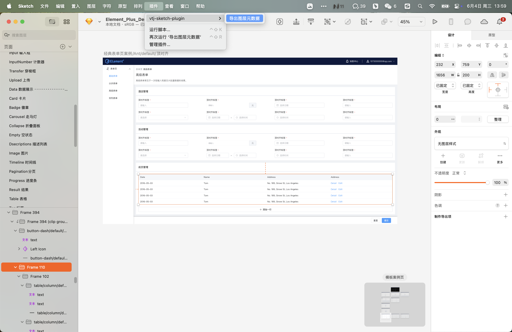
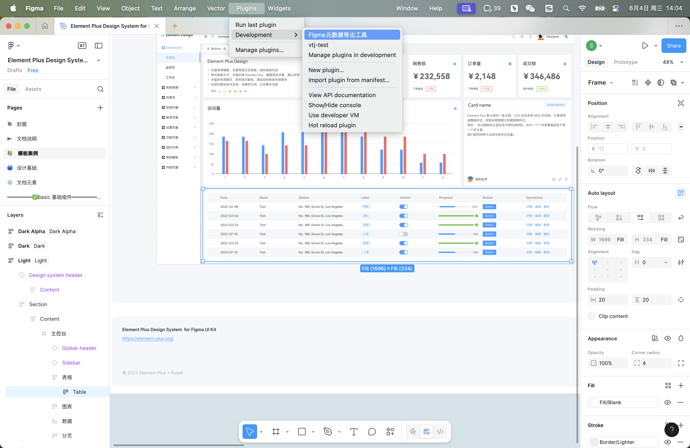
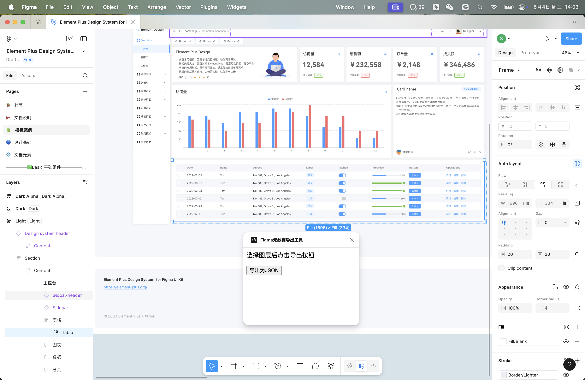
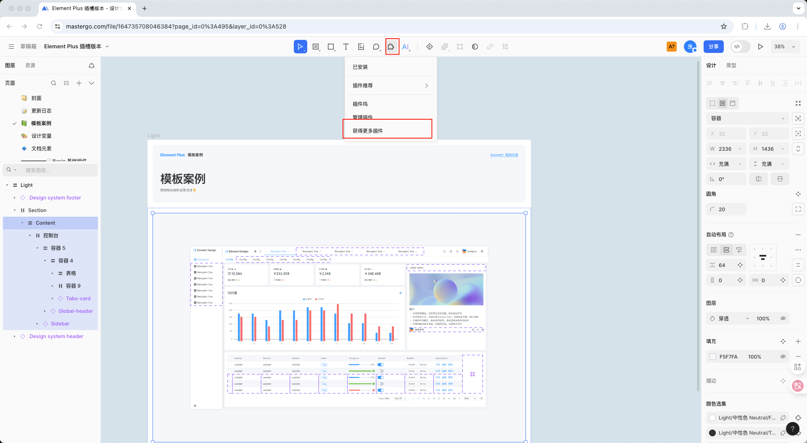
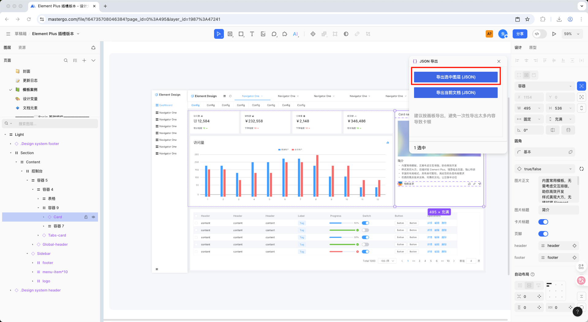
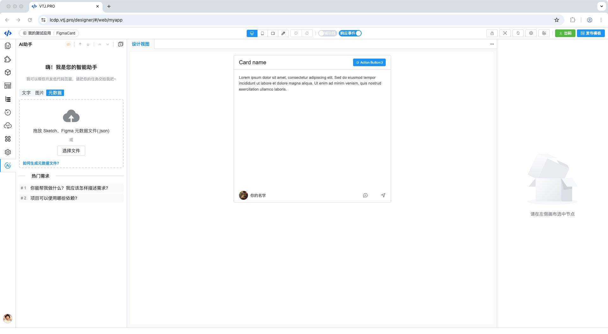
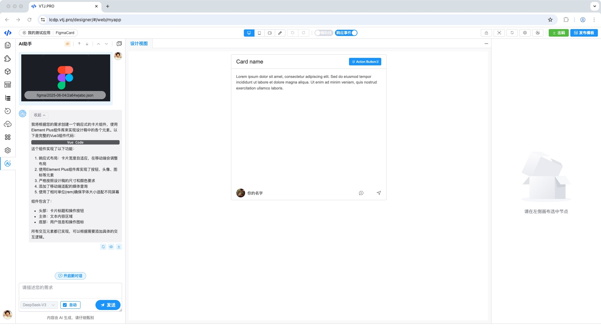
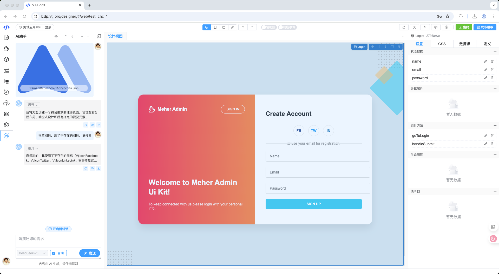

# AI识别设计稿元数据生成页面

VTJ的AI助手支持识别 Sketch、Figma 和 MasterGo 设计稿的元数据，当需要高精度还原设计图时，您可以使用这种方式通过AI开发页面组件。 Sketch 和 Figma 的元数据文件是一个json格式的文件，可以通过VTJ官方提供的插件导出。

## Sketch元数据导出插件

### 安装Sketch插件

1. [下载 vtj-sketch-plugin 插件](https://gitee.com/newgateway/vtj-sketch-plugin/raw/master/vtj.sketchplugin.zip)
1. 解压后把 `vtj.sketchplugin` 复制到 Sketch 的插件文件夹，即完成安装。

### 导出Sketch元数据

打开Sketch，选中你需要导出的图层，然后点击菜单： `插件 > vtj-sketch-plugin > 导出图层元数据`。 选择文件保存位置，即可导出json文件。

## Figma元数据导出插件

### 安装Figma插件

1. [下载 vtj-figma-plugin 插件](https://gitee.com/newgateway/vtj-figma-plugin/raw/master/vtj-figma-plugin.zip)
1. 解压zip，打开Figma客户端，打开菜单：`Plugins > Development > import plugin from manifest` 选择解压后的 `manifest.json`文件完成安装

### 导出Figma元数据

打开 Figma客户端，选中您需要导出的图层，点击菜单 `Plugins > Development > Figma元数据导出工具` 打开插件。插件显示后点击 `导出为JSON` 按钮。 选择文件保存位置，即可导出json文件。

## MasterGo元数据导出插件

### 安装插件

MasterGo 社区有现成的JSON导出插件，可以搜索然后安装。

- 打开 MasterGo 工作区，在顶部插件工具栏 点击 `获得更多插件`
- 搜索 `JSON导出`，安装插件

### 复制JSON数据

- 在 MasterGo 工作区选中需要导出的图层
- 打开`JSON导出`插件
- 点击 `导出选中图层（JSON）` 按钮，提示已复制，表示已经把数据复制到粘贴板
- 打开 `VTJ设计器`, 在AI助手元数据的输入框粘贴JSON数据，点确定，按提示操作，即可以生成Vue组件

## AI识别元数据

打开VTJ设计器在 在AI助手新建话题 选择元数据，上传文件或粘贴的方式输入的 Sketch、 Figma 或 MasterGo 元数据json文件，即可通过AI高精度还原设计图。

