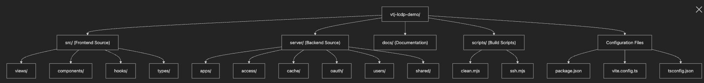
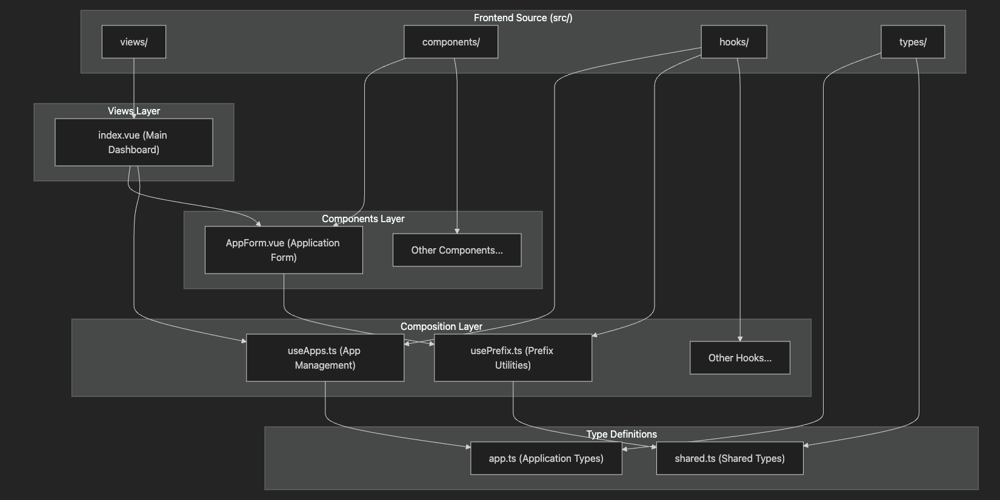
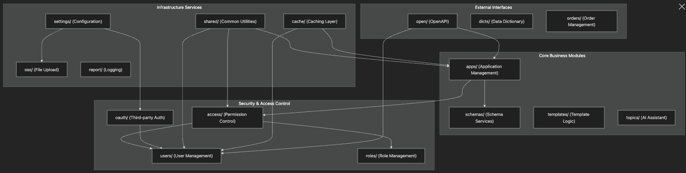
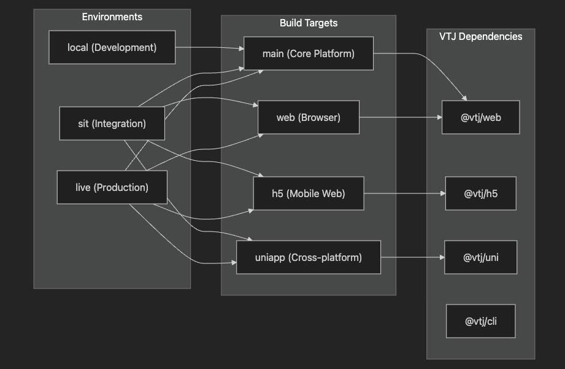
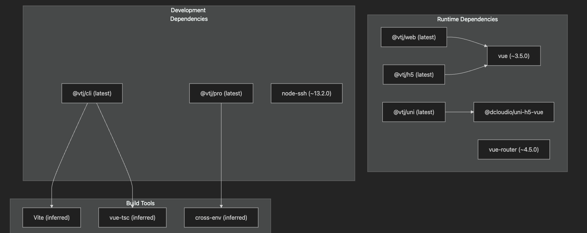

# 项目结构

本文档全面概述了 VTJ 低代码开发平台（VTJ LCDP）的存储库结构，涵盖前端 Vue.js 组件、后端 NestJS 模块、构建系统配置和多平台部署架构的组织方式。

有关多平台构建系统配置的详细信息，请参阅[多平台构建系统文档](./1.2.md)。组件间的架构关系，请参考[架构概述文档](./2.md)。

## 仓库组织

VTJ LCDP 采用整体式（Monolithic）代码仓库结构，将前端、后端和构建配置集成在统一代码库中，支持多种部署目标。

### 顶级目录结构

## 前端结构

前端基于 Vue.js 3 组合式 API 模式开发，使用 TypeScript 实现，按业务功能模块化组织。

### Vue.js 组件架构

## 后端模块结构

后端采用模块化的 NestJS 架构，实现了跨功能域的清晰关注点分离。

### NestJS 模块组织

### 后端核心模块功能说明

| 模块路径   | 中文描述         | 主要功能                   | 技术实现细节                       |
| ---------- | ---------------- | -------------------------- | ---------------------------------- |
| apps/      | 应用管理模块     | 核心应用生命周期管理       | 提供应用启动、停止、监控等基础服务 |
| access/    | 权限控制模块     | 分层权限管理体系           | RBAC 模型，支持细粒度权限控制      |
| cache/     | 缓存模块         | 双层缓存系统（内存+Redis） | 支持缓存失效策略和分布式同步       |
| oauth/     | 第三方登录模块   | OAuth 2.0 身份验证流程     | 支持主流OAuth提供商集成            |
| users/     | 用户模块         | 用户账户全生命周期管理     | 包含注册、登录、资料维护等功能     |
| roles/     | 角色模块         | 基于角色的访问控制（RBAC） | 角色-权限映射管理                  |
| schemas/   | Service 接口模块 | Schema 服务实现            | 提供数据模型定义和验证服务         |
| templates/ | 模板业务模块     | 模板业务逻辑处理           | 支持模板版本管理和动态加载         |
| shared/    | 公共模块         | 共享工具类和类型定义       | 包含通用工具函数和基础类型         |

## 构建系统配置

项目通过多环境构建配置系统，支持不同目标的自动化构建和部署。

### 多环境构建矩阵

### 构建脚本配置说明

| 脚本命令             | 环境  | 构建目标   | TypeScript 检查 | 主要用途                   |
| -------------------- | ----- | ---------- | --------------- | -------------------------- |
| npm run dev          | local | 开发服务器 | 否              | 本地开发环境热更新         |
| npm run sit:main     | sit   | main       | 是              | 集成测试环境 - 主应用构建  |
| npm run sit:web      | sit   | web        | 是              | 集成测试环境 - Web应用构建 |
| npm run sit:h5       | sit   | h5         | 是              | 集成测试环境 - H5应用构建  |
| npm run sit:uniapp   | sit   | uniapp     | 是              | 集成测试环境 - UniApp构建  |
| npm run build:main   | live  | main       | 是              | 生产环境 - 主应用构建      |
| npm run build:web    | live  | web        | 是              | 生产环境 - Web应用构建     |
| npm run build:h5     | live  | h5         | 是              | 生产环境 - H5应用构建      |
| npm run build:uniapp | live  | uniapp     | 是              | 生产环境 - UniApp构建      |

## 依赖项和生态系统集成

项目通过专用平台包和开发工具与 VTJ 生态系统深度集成。

### VTJ 生态系统依赖关系

## 配置文件结构

### 核心配置文件说明

| 文件路径          | 主要用途             | 关键特性                     | 配置示例                     |
| ----------------- | -------------------- | ---------------------------- | ---------------------------- |
| package.json      | 项目元数据和脚本管理 | 多目标构建配置，VTJ 生态依赖 | 定义构建脚本和依赖版本       |
| vite.config.ts    | 构建配置             | 基于环境的多目标构建         | 配置不同环境的构建参数       |
| tsconfig.json     | TypeScript 配置      | 严格的类型检查               | 设置编译选项和路径映射       |
| scripts/clean.mjs | 清理工具             | 构建产物管理                 | 自动清理临时文件和旧构建产物 |
| scripts/ssh.mjs   | 部署脚本             | 基于SSH的自动化部署          | 配置服务器连接和部署路径     |

项目结构反映了专为多平台部署设计的低代码平台架构，保持了前端展示层、后端业务逻辑层和构建系统配置层的清晰分离。模块化的后端设计支持功能扩展，而前端结构则通过TypeScript实现了可维护的Vue.js组件开发。
