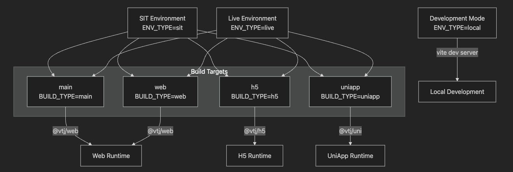
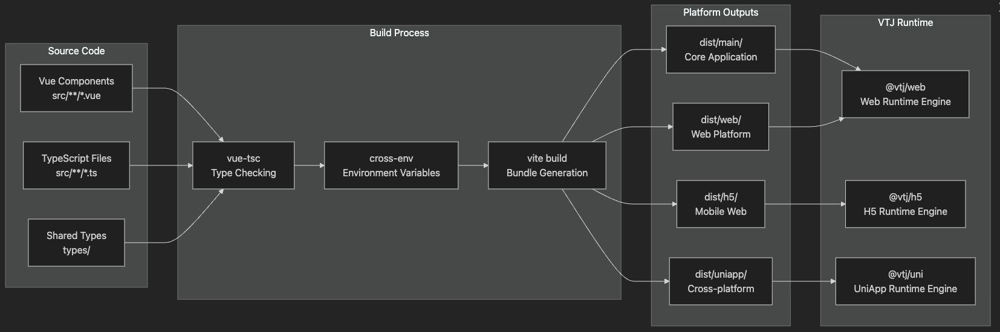
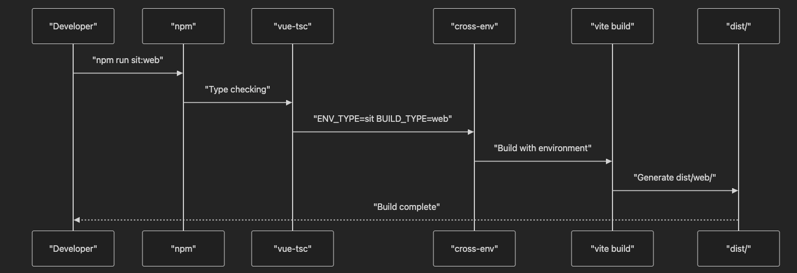

# 多平台构建系统

## 目的和范围

本文档详细介绍了 VTJ 低代码开发平台的多平台构建系统，该系统支持跨多种目标平台（Web、H5、UniApp）的自动化构建与部署，并针对不同环境（SIT、Live）提供差异化配置。构建系统深度集成 VTJ 生态系统包，实现高效的跨平台编译工作流。

有关整体项目结构的信息，请参阅[项目结构文档]()。有关开发设置和配置的详细信息，请参阅[开发配置文档]()。

## 构建环境

构建系统支持两种主要部署环境，每种环境具有特定的配置优化和目标：

| 环境 | 目的             | 环境变量      | 构建脚本                                      | 技术实现细节                   |
| ---- | ---------------- | ------------- | --------------------------------------------- | ------------------------------ |
| SIT  | 集成测试与预发布 | ENV_TYPE=sit  | sit:main, sit:web, sit:h5, sit:uniapp         | 启用调试模式，包含源码映射文件 |
| LIVE | 生产环境部署     | ENV_TYPE=live | build:main, build:web, build:h5, build:uniapp | 代码压缩优化，移除调试信息     |

### 环境配置流程



## 平台目标

构建系统为四个核心平台目标生成优化产物，每个目标使用特定的 VTJ 生态系统包：

### 构建目标架构



### 平台专属配置说明

| 平台   | 构建类型          | 运行时包 | 目标用例           | 技术实现细节                       |
| ------ | ----------------- | -------- | ------------------ | ---------------------------------- |
| 主应用 | BUILD_TYPE=main   | @vtj/web | 功能完整的核心应用 | 包含完整业务逻辑和后台服务         |
| Web    | BUILD_TYPE=web    | @vtj/web | 标准Web浏览器部署  | 优化PC端体验，支持响应式布局       |
| H5     | BUILD_TYPE=h5     | @vtj/h5  | 移动Web应用        | 移动端优先设计，触控交互优化       |
| UniApp | BUILD_TYPE=uniapp | @vtj/uni | 跨平台移动应用     | 编译为微信小程序/原生App等多端格式 |

## VTJ 生态系统集成

构建系统通过运行时依赖和开发工具与 VTJ 生态系统紧密集成：

### 运行时依赖项

- **@vtj/web**：Web平台运行时引擎（v3.2.1）
- **@vtj/h5**：H5移动Web运行时引擎（v2.8.0）
- **@vtj/uni**：UniApp跨平台运行时引擎（v1.5.3）
- **vue**：核心Vue.js框架（~3.5.0）
- **vue-router**：客户端路由管理（~4.5.0）

### 开发工具链

- **@vtj/cli**：VTJ项目脚手架与命令行工具（v0.9.2）
- **@vtj/pro**：专业开发工具套件（v1.1.0）
  - 包含代码生成器、API模拟器等开发辅助工具
- **vite**：构建工具核心（v5.0.0）

## 构建脚本编排

构建系统提供精细的平台构建控制和批量操作能力：

### 单平台构建流程



### 批量构建操作

系统提供两条全量构建命令，按顺序执行所有平台构建：

| 命令          | 执行操作                                         | 使用场景               |
| ------------- | ------------------------------------------------ | ---------------------- |
| npm run sit   | sit:main → sit:web → sit:h5 → sit:uniapp         | 集成测试环境全平台构建 |
| npm run build | build:main → build:web → build:h5 → build:uniapp | 生产环境全平台构建     |

## 部署与分发

构建系统在 `dist/` 目录下生成可部署产物，各平台在独立子目录中组织。`package.json` 的 `files` 数组指定了npm包分发包含的内容：

```json
"files": [
  "dist/",
  "package.json",
  "README.md"
]
```

### 产物目录结构

```
dist/
├── main/         # 主应用构建产物
├── web/          # Web平台构建产物
├── h5/           # H5移动端构建产物
└── uniapp/       # UniApp跨平台构建产物
```

构建系统通过严格的版本控制和环境隔离机制，确保多平台部署的一致性和可靠性，为VTJ低代码平台提供强大的跨平台支持能力。
