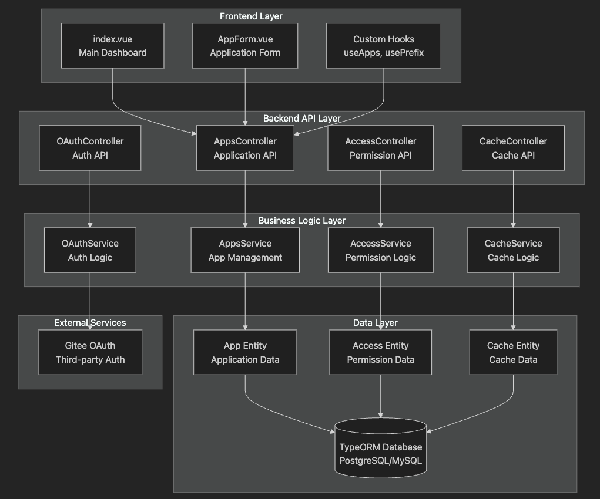
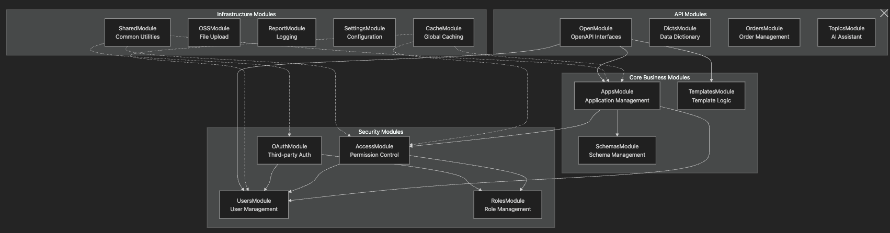
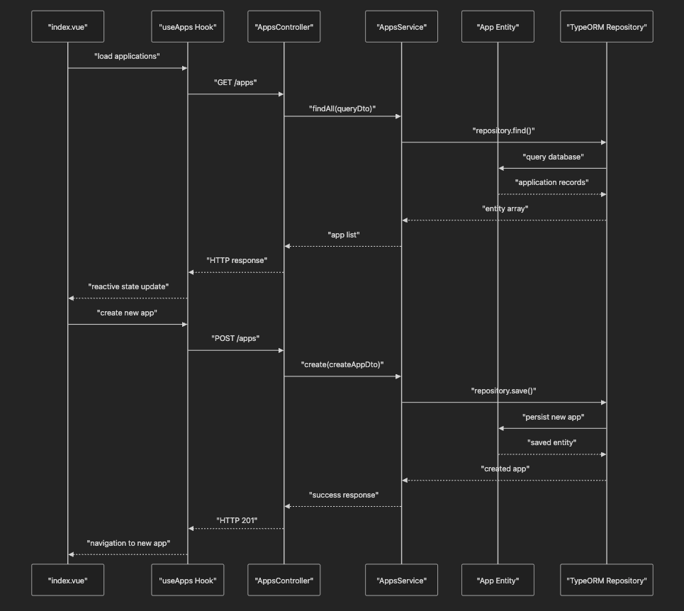
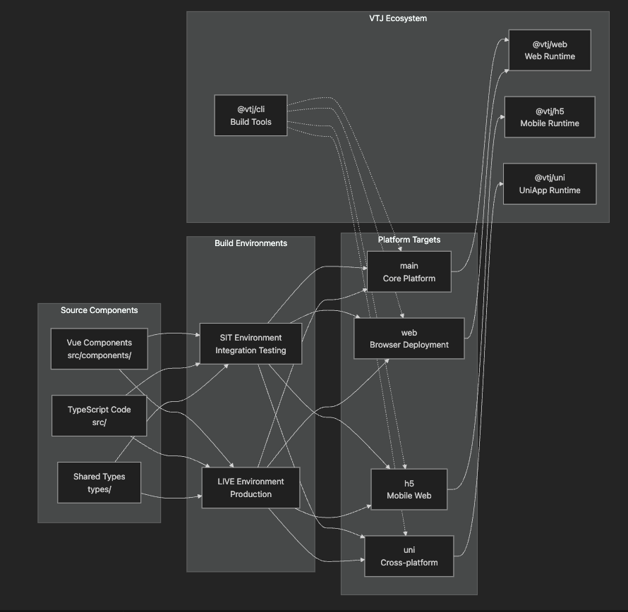

# 架构概述

本文档全面概述了 VTJ 低代码开发平台的系统架构，包括前端组件、后端模块和多平台构建系统之间的协同关系。系统采用现代全栈架构设计，实现了表示层、业务逻辑层和数据持久层的清晰分离，支持多种部署目标的同时保持单一代码库。

## 系统架构

### 整体架构设计

VTJ 平台采用分层架构设计，各层职责明确：

1. **表示层**：基于Vue.js的前端组件，负责用户交互和数据展示
2. **业务逻辑层**：NestJS实现的后端服务，处理核心业务逻辑
3. **数据持久层**：ORM框架管理的数据访问，提供持久化存储能力

### 后端模块依赖关系

后端采用模块化的NestJS架构，各业务模块通过依赖注入实现松耦合：

## 前后端通信机制

### 通信流程

前端组件通过RESTful API与后端服务交互，状态管理由Vue组合式API钩子处理：

### 核心通信模式

| 模式类型   | 实现方式      | 使用场景           | 技术实现细节                    |
| ---------- | ------------- | ------------------ | ------------------------------- |
| 请求-响应  | RESTful API   | 常规数据查询和操作 | Axios实现，支持拦截器和错误处理 |
| 服务端推送 | WebSocket     | 实时通知和状态更新 | Socket.IO集成，支持房间和广播   |
| 批量操作   | GraphQL批处理 | 复杂数据聚合请求   | Apollo Server实现，支持查询合并 |

## 多平台构建架构

平台通过统一的构建系统支持多目标部署，核心架构如下：

### 跨平台一致性保障

| 机制           | 实现方式                 | 技术优势               |
| -------------- | ------------------------ | ---------------------- |
| 统一核心库     | @vtj/core基础包          | 跨平台通用业务逻辑复用 |
| 平台适配层     | 运行时注入平台特定实现   | 保持核心代码平台无关   |
| 构建时条件编译 | Vite插件实现平台特性标记 | 按需打包减少体积       |

## 模块交互与设计模式

### 服务层依赖管理

后端服务采用分层架构，通过NestJS依赖注入容器管理模块间依赖：

| 层级       | 职责                 | 典型组件            |
| ---------- | -------------------- | ------------------- |
| 控制器层   | 请求处理和响应格式化 | REST控制器          |
| 服务层     | 核心业务逻辑实现     | 领域服务            |
| 仓库层     | 数据访问和持久化     | TypeORM实体仓库     |
| 基础设施层 | 外部服务集成和工具   | 邮件服务、OSS客户端 |

### 关键数据流模式

| 模式名称     | 应用场景     | 技术实现                  | 优势特点                 |
| ------------ | ------------ | ------------------------- | ------------------------ |
| 请求-响应    | API调用      | Axios + NestJS拦截器      | 简单高效，易于调试       |
| 事件驱动更新 | 状态变更通知 | Vue响应式系统 + Pinia     | 解耦组件，提高可维护性   |
| 分层访问控制 | 权限管理     | RBAC + 权限继承树         | 细粒度控制，支持权限委派 |
| 多层缓存     | 性能优化     | 内存(LRU) + Redis二级缓存 | 减少数据库压力，加速响应 |

### 横切关注点处理

| 关注点   | 解决方案           | 实现技术              | 关键特性                   |
| -------- | ------------------ | --------------------- | -------------------------- |
| 身份验证 | OAuth 2.0集成      | Passport.js策略       | 支持Gitee等第三方登录      |
| 授权管理 | 基于角色的访问控制 | CASL权限库            | 声明式权限规则，上下文感知 |
| 缓存策略 | 全局缓存模块       | NestJS缓存管理器      | 可配置TTL，命中率监控      |
| 日志记录 | 集中式日志系统     | Winston + ELK Stack   | 结构化日志，支持审计追踪   |
| 配置管理 | 环境感知配置       | ConfigModule + dotenv | 多环境支持，热重载         |
| 文件管理 | 对象存储集成       | OSS SDK封装           | 分块上传，访问控制策略     |
| 异常处理 | 全局异常过滤器     | NestJS异常过滤器      | 统一错误格式，堆栈跟踪     |

平台架构通过清晰的层次划分和模块化设计，实现了高内聚低耦合的系统结构，为低代码开发提供了可靠的技术基础。
