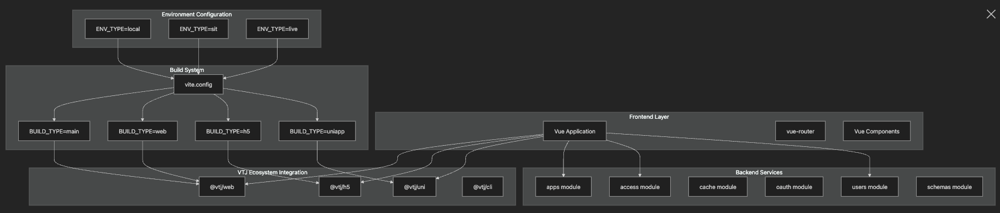
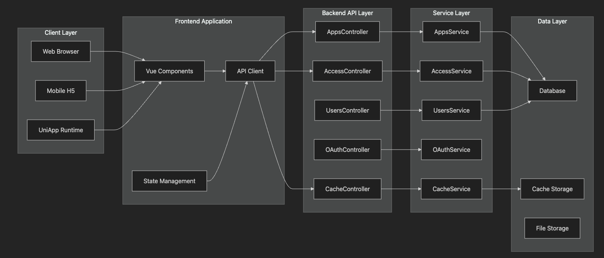
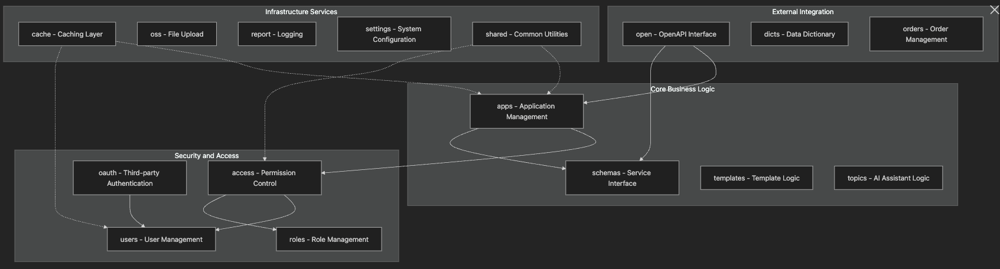

# 基于 VTJ 的在线低代码平台概述

## 目的和范围

本文档全面概述了 VTJ 低代码开发平台（LCDP），这是一个支持快速创建和部署应用程序的多平台开发环境。该平台由 Vue.js 前端应用程序和 NestJS 后端 API 组成，支持多种部署目标，包括 Web 浏览器、移动 H5 应用和跨平台 UniApp 环境。

本文档涵盖平台架构、核心技术和系统组织。有关特定子系统的详细信息，请参考：

- 项目结构
- 前端组件
- 后端服务

有关设置和配置的详细信息，请参阅：

- 开发配置
- 入门指南

## 系统架构概述

VTJ LCDP 采用现代 Web 应用程序架构，实现了前端展示、后端服务和多平台构建之间的明确分离。



## 平台架构

平台采用分层架构模式，各层职责分明：



## 多平台构建系统

平台支持四个不同的构建目标，每个目标针对特定部署场景优化：

| 构建目标 | 环境变量            | 输出类型       | 主要应用场景   |
| -------- | ------------------- | -------------- | -------------- |
| main     | `BUILD_TYPE=main`   | 核心应用程序包 | 主 Web 部署    |
| web      | `BUILD_TYPE=web`    | Web 优化包     | 浏览器特定功能 |
| h5       | `BUILD_TYPE=h5`     | 移动 H5 包     | 移动 Web 应用  |
| uniapp   | `BUILD_TYPE=uniapp` | 跨平台包       | 多平台应用部署 |

### 构建脚本配置

构建系统通过 npm 脚本使用环境特定配置：

```bash
# 开发环境 (热重载)
npm run dev  # ENV_TYPE=local

# SIT 环境构建 (系统集成测试)
npm run sit:main     # ENV_TYPE=sit BUILD_TYPE=main
npm run sit:web      # ENV_TYPE=sit BUILD_TYPE=web
npm run sit:h5       # ENV_TYPE=sit BUILD_TYPE=h5
npm run sit:uniapp   # ENV_TYPE=sit BUILD_TYPE=uniapp

# 生产环境构建
npm run build:main     # ENV_TYPE=live BUILD_TYPE=main
npm run build:web      # ENV_TYPE=live BUILD_TYPE=web
npm run build:h5       # ENV_TYPE=live BUILD_TYPE=h5
npm run build:uniapp   # ENV_TYPE=live BUILD_TYPE=uniapp
```

## 核心技术和依赖项

### 前端核心依赖

| 包                   | 版本                   | 功能描述                  |
| -------------------- | ---------------------- | ------------------------- |
| vue                  | ~3.5.0                 | 核心 Vue.js 框架          |
| vue-router           | ~4.5.0                 | 客户端路由管理            |
| @vtj/web             | latest                 | VTJ Web 平台集成库        |
| @vtj/h5              | latest                 | VTJ 移动 H5 平台适配      |
| @vtj/uni             | latest                 | VTJ UniApp 跨平台支持     |
| @dcloudio/uni-h5-vue | 3.0.0-4050720250324001 | UniApp H5 环境 Vue 运行时 |

### 开发工具依赖

| 包       | 版本    | 功能描述              |
| -------- | ------- | --------------------- |
| @vtj/cli | latest  | VTJ 命令行工具        |
| @vtj/pro | latest  | VTJ 专业开发工具套件  |
| node-ssh | ~13.2.0 | 支持 SSH 远程部署功能 |

## 后端模块概述

后端采用模块化 NestJS 架构，包含以下核心模块：



## 开发环境配置

平台支持三种环境配置：

- **ENV_TYPE=local**：热重载开发环境，支持实时代码更新
- **ENV_TYPE=sit**：系统集成测试环境，用于预发布验证
- **ENV_TYPE=live**：生产环境，优化性能和安全性

### 构建配置说明

1. **多目标支持**：每个环境可针对四个平台目标构建，共提供 12 种构建配置组合
2. **TypeScript 处理**：构建过程通过 `vue-tsc` 自动处理 TypeScript 编译
3. **环境变量注入**：使用 `cross-env` 实现跨平台环境变量注入
4. **构建优化**：生产环境构建启用代码压缩、Tree Shaking 等优化措施。
