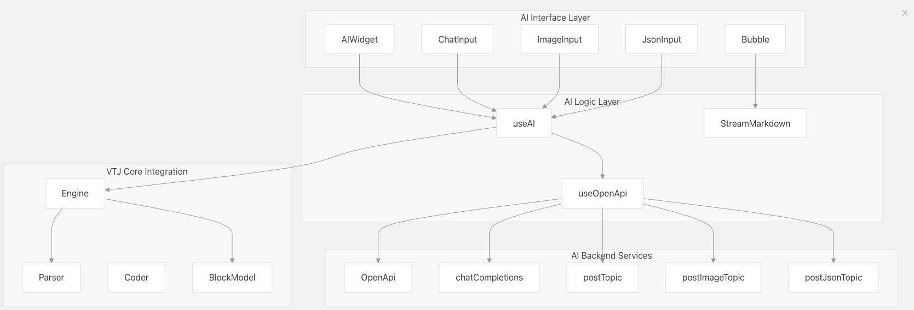
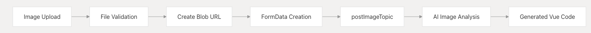
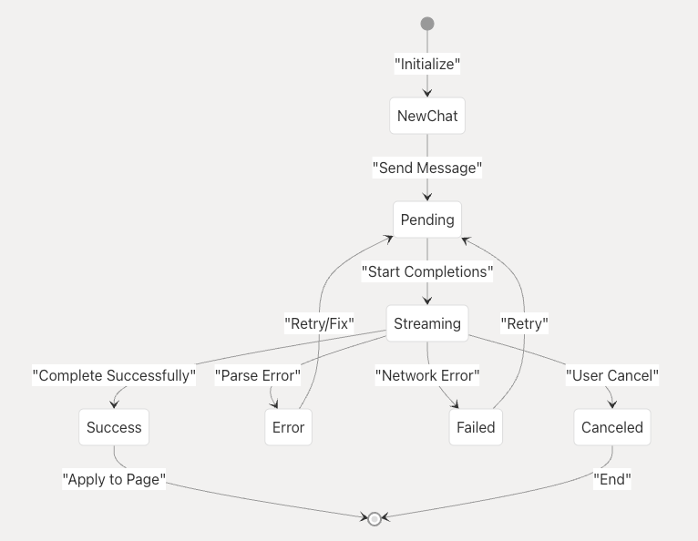
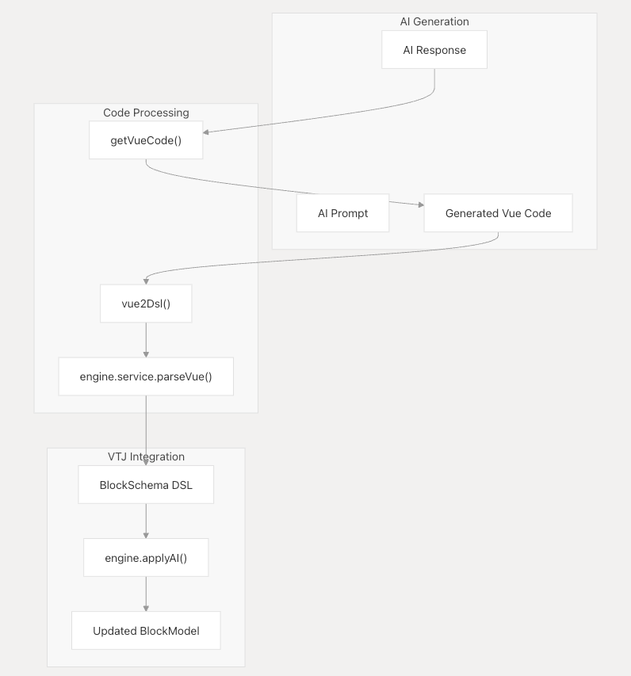
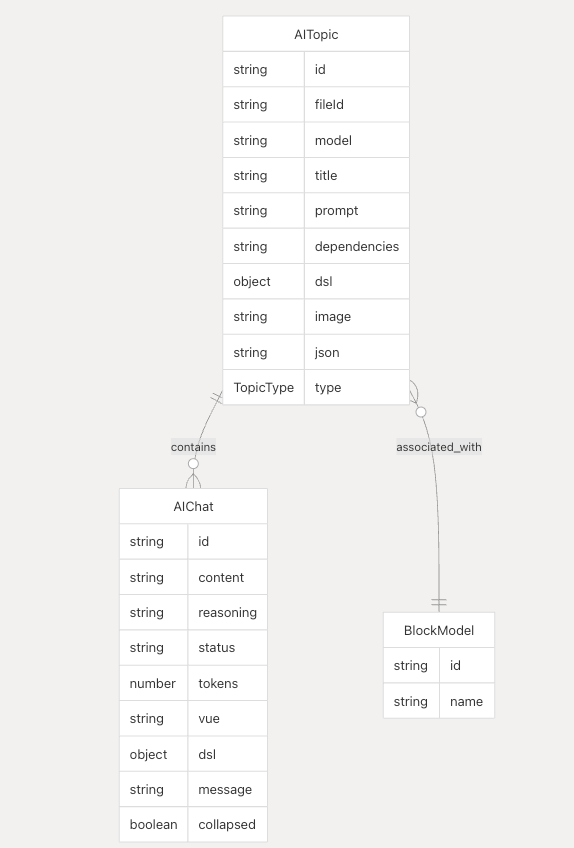

# AI 集成

本文档介绍了 VTJ 的 AI 驱动的代码生成和设计辅助功能。AI 集成使用户能够通过自然语言提示、图像上传和元数据文件生成 Vue 组件和页面。有关处理 AI 生成代码的核心低代码引擎的信息，请参阅**核心架构** 。有关可视化设计器界面的详细信息，请参阅 **设计器和渲染器** 。

## AI 系统架构

VTJ 的 AI 集成由多个层组成，这些层协同工作，将用户输入转换为可执行的 Vue 代码：



**AI 集成架构**

AI 系统通过分层架构运行，其中接口组件收集用户输入，逻辑层管理状态和 API 通信，后端服务处理 AI 处理。生成的代码直接与 VTJ 的核心引擎集成，用于解析和渲染。

## AI 输入类型和处理

VTJ 支持三种主要的 AI 输入模式，每种模式都针对不同的用例而设计：

| 输入类型    | 元件       | 文件扩展名       | 用例               |
| ----------- | ---------- | ---------------- | ------------------ |
| 文本信息    | ChatInput  | 不适用           | 自然语言要求       |
| 图像        | ImageInput | .png、.jpg .jpeg | 设计模型、屏幕截图 |
| JSON/元数据 | JsonInput  | .json            | Figma、Sketch 导出 |

### 文本输入处理

基于文本的 AI 生成通过 AISendData 接口处理自然语言提示：


**文本输入处理流程**

文本输入流使用当前项目上下文创建一个主题，包括现有的 DSL 和生成的 Vue 源代码，为 AI 提供完整的代码生成上下文。

### 图像输入处理

图像处理支持从屏幕截图、模型和设计文件生成设计到代码：



**图像到代码处理管道**

图像输入系统接受设计文件，并通过经过设计识别训练的专用 AI 模型对其进行处理，将视觉布局转换为语义 Vue 组件。

## AI 聊天系统和实时流媒体

AI 聊天系统管理与流式响应的对话交互：



**AI 聊天状态机**

聊天系统通过结构化状态机维护对话状态，该状态机处理流式响应、错误恢复和用户交互。

### 实时响应流

流式处理实现使用服务器发送事件 （SSE） 进行实时 AI 响应：

```ts
// Key streaming logic from chatCompletions
const chatCompletions = async (
  topicId: string,
  chatId: string,
  callback?: (data: any, done?: boolean) => void,
  error?: (err: any, cancel?: boolean) => void
) => {
  // Streaming implementation with AbortController
  const controller = new AbortController();
  // Process streaming chunks and update UI reactively
};
```

流式处理系统处理增量 AI 响应，实时更新 UI，同时保持对话上下文并处理中断。

## 代码生成和 DSL 集成

AI 系统通过双向代码转换与 VTJ 的核心引擎紧密集成：



**AI 代码生成和集成管道**

代码生成管道从 AI 响应中提取 Vue 代码，将其解析为 VTJ 的 DSL 格式，并将更改应用于当前块模型以进行即时渲染。

### Vue 代码提取和解析

系统从 AI markdown 响应中提取 Vue 代码，并将其转换为 VTJ 的内部 DSL：

| 功能       | 目的                   | 输入         | 输出         |
| ---------- | ---------------------- | ------------ | ------------ |
| getVueCode | 从 markdown 中提取 Vue | AI 响应文本  | Vue SFC 代码 |
| vue2Dsl    | 转换为 DSL             | Vue SFC 代码 | 块架构       |
| applyAI    | 应用于 engine          | 块架构       | 更新的 UI    |

解析过程根据 VTJ 的组件规则验证生成的代码，并在代码不符合预期模式时提供错误反馈。

## AI 主题和聊天管理

AI 系统通过基于主题的组织维护对话历史记录：



**AI 数据模型关系**

主题系统按文件上下文组织对话，每个主题包含多个聊天交流。主题链接到特定的 BlockModel 实例，以实现上下文感知生成。

### 主题生命周期管理

主题是为每个新的 AI 对话创建的，并在会话中持续存在：

- **主题创建** ：onPostTopic 使用项目上下文创建新主题
- **聊天添加** ：onPostChat 向现有主题添加消息
- **历史管理**：主题按 BlockModel 上下文加载
- **清理 **：onRemoveTopic 使用级联处理主题删除

主题系统使用户能够在每个文件中维护多个 AI 对话，同时保留对话上下文和生成的代码历史记录。

## 自动应用和用户体验功能

VTJ 的 AI 集成包括多项 UX 增强功能，以简化开发：

### 自动应用功能

启用自动应用功能后，会自动将生成的代码应用于当前页面：

```ts
// Auto-apply logic in completions callback
if (data.auto) {
  onApply(c); // Automatically apply generated DSL
}
```

### 交互式代码审查

系统通过 `Detail` 组件提供详细的代码审查界面：

- **代码编辑器** ：在应用之前修改生成的 Vue 代码
- **DSL 预览** ：查看转换后的 DSL 结构
- **重新生成** ：修改代码后更新 DSL
- **Apply Control**：手动应用已审核的代码

### 错误处理和恢复

AI 系统包括全面的错误处理：

| 错误类型 | 处理器       | 恢复作                 |
| -------- | ------------ | ---------------------- |
| 解析错误 | vue2Dsl 捕获 | 显示错误消息，报价修复 |
| 网络错误 | 完成错误     | 重试机制               |
| 验证错误 | DSL 验证     | 显示验证错误           |
| 取消     | onCancelChat | Clean 状态，允许重试   |

错误系统提供上下文反馈和恢复选项，使用户能够迭代优化其 AI 生成的代码。
