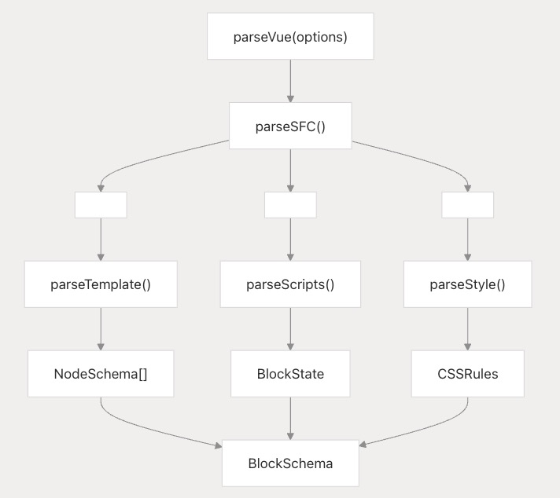
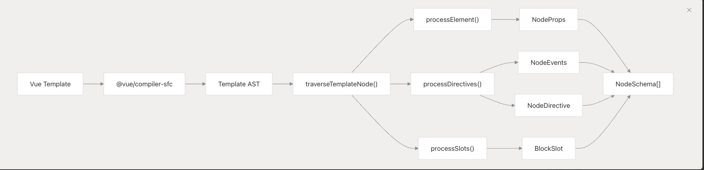
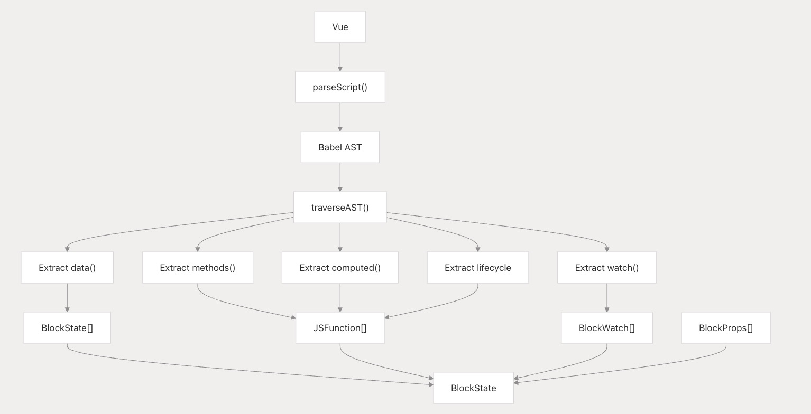
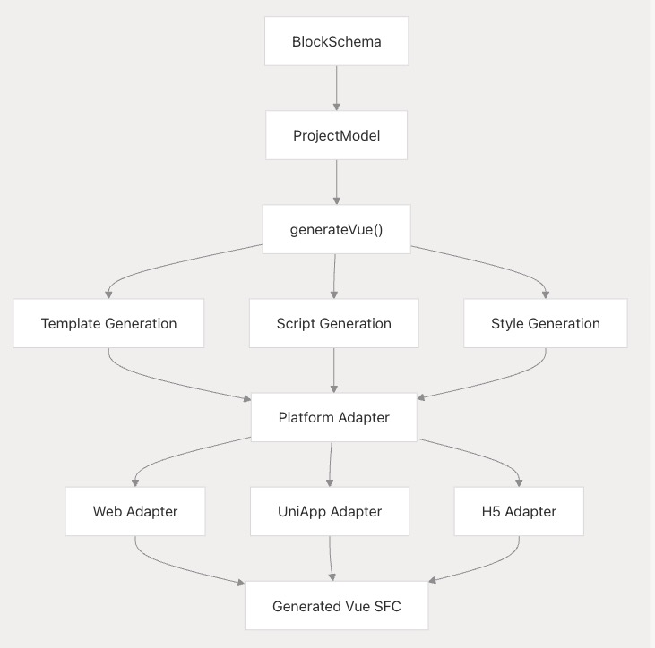
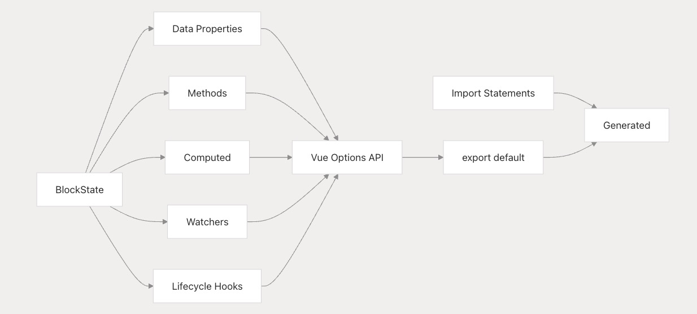
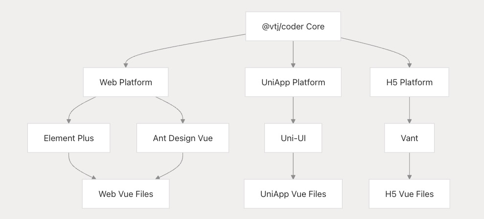

# 代码生成与解析管道

本文档详细介绍了 VTJ 平台在 Vue 单文件组件(SFC)与领域特定语言(DSL)之间的双向转换系统。该系统通过 `@vtj/parser` 和 `@vtj/coder` 包实现代码开发与可视化低代码设计之间的无缝集成。关于管道编排的引擎架构，请参考引擎、提供者与服务层文档；关于数据模型实现，请查阅项目模型和块模型文档。

## 架构概述

代码生成与解析管道构成了 VTJ AI 增强开发工作流的核心支柱，支持人类可读的 Vue 代码与机器可处理的 DSL 表示之间的高效转换。

## 解析管道：Vue SFC 到 DSL

解析管道通过多阶段处理将 Vue 单文件组件转换为 VTJ 的内部 DSL 表示。

### 解析器入口点

主解析函数 `parseVue` 编排整个转换流程：

`ParseVueOptions` 接口定义了必要的输入参数，包括目标项目上下文、块标识符和源代码。

### 模板解析

模板解析使用 Vue 编译器基础设施将模板语法转换为 `NodeSchema` 结构：

**关键处理函数：**

- 处理元素节点（ElementNode）
- 解析文本节点（TextNode）
- 转换条件语句（v-if/v-else）
- 处理循环指令（v-for）
- 解析插槽（SlotNode）

### 脚本解析

脚本解析提取 Vue 组件逻辑并转换为 BlockState 表示：

脚本解析器处理 Vue Options API 和 Composition API：

1. 提取组件属性（props）
2. 解析数据（data）和状态（state）
3. 转换计算属性（computed）
4. 处理生命周期钩子（lifecycle hooks）
5. 提取方法（methods）和监听器（watchers）

## 代码生成管道：DSL 到 Vue SFC

代码生成管道将内部 DSL 转换回可部署的 Vue 单文件组件，针对不同目标平台优化。

### 生成流程

平台适配器确保生成的代码针对特定部署目标优化：

1. **Web 平台**：标准 Vue 3 组件
2. **UniApp 平台**：跨平台小程序组件
3. **H5 平台**：移动端优化组件

### 模板代码生成

模板生成将 `NodeSchema` 结构转换回 Vue 模板语法：

| 节点类型        | 生成输出              | 特殊处理                 |
| --------------- | --------------------- | ------------------------ |
| ElementNode     | HTML 元素             | 标签名格式、属性绑定     |
| TextNode        | 文本内容              | 表达式插值处理           |
| ConditionalNode | v-if/v-else-if/v-else | 分支逻辑优化             |
| LoopNode        | v-for 指令            | 迭代器语法生成           |
| SlotNode        | slot 元素             | 命名插槽、作用域插槽处理 |

生成器处理平台特定的标签名称，并确保动态内容的正确转义。

### 脚本代码生成

脚本生成从 `BlockState` 表示重建 Vue 组件逻辑：

**生成过程：**

1. 生成组件选项结构
2. 处理 TypeScript 类型注解
3. 自动管理依赖项导入
4. 优化 Composition API 逻辑
5. 确保响应式数据一致性

## 核心组件与数据结构

### 解析器组件

| 组件          | 功能描述    | 核心能力                    |
| ------------- | ----------- | --------------------------- |
| parseVue      | 主解析入口  | 编排 SFC → DSL 转换流程     |
| parseTemplate | 模板处理器  | Vue 模板 → NodeSchema 转换  |
| parseScripts  | 脚本分析器  | 组件逻辑 → BlockState 转换  |
| parseStyle    | 样式处理器  | CSS → CSSRule 转换          |
| htmlToNodes   | HTML 解析器 | 原生 HTML → NodeSchema 转换 |

### 编码器组件

代码生成系统使用平台适配器确保跨平台兼容性：

**适配器功能：**

1. 组件库 API 桥接
2. 事件处理机制适配
3. 样式作用域处理
4. 构建工具配置生成

### 数据结构转换

管道执行关键数据结构转换：

| 源格式      | 目标格式     | 转换过程                  |
| ----------- | ------------ | ------------------------- |
| 模板 AST    | NodeSchema[] | AST 解析 + 属性提取       |
| Script AST  | BlockState   | Babel AST 分析 + 逻辑提取 |
| Vue 样式    | CSSRules     | CSS 解析 + 作用域处理     |
| BlockSchema | SFC 结构     | DSL → 代码生成            |

每个转换过程保持语义一致性，同时适应目标表示的约束条件。

## 平台支持与扩展能力

### 多平台代码生成

系统支持生成平台优化的代码：

**平台适配：**

- **Web 平台**：使用 Element Plus/Ant Design Vue 的标准 Vue 3 组件
- **UniApp 平台**：支持小程序/移动端的跨平台组件
- **H5 平台**：使用 Vant UI 的移动端优化组件

**适配差异处理：**

1. 组件库 API 差异
2. 事件处理机制
3. 样式解决方案
4. 构建配置优化

### HTML 导入支持

系统通过 htmlToNodes 支持原生 HTML 内容导入：

**导入流程：**

1. 解析 HTML 结构
2. 转换为 NodeSchema 表示
3. 集成到可视化设计器
4. 支持进一步编辑和组件化

:::info 文档说明
本文档由AI辅助生成，可能存在技术细节偏差，最新实现请参考原始文档：[https://deepwiki.com/ChenXiaohui99/vtj/2.3-code-generation-and-parsing-pipeline]()
:::
