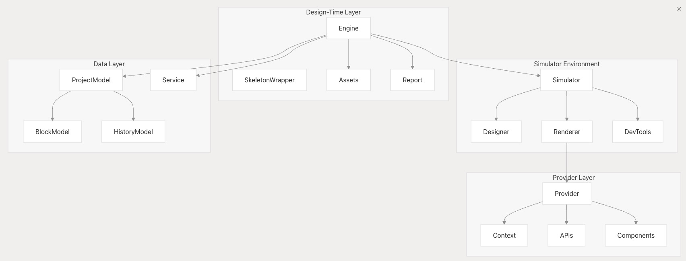
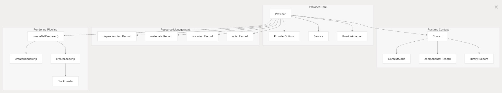
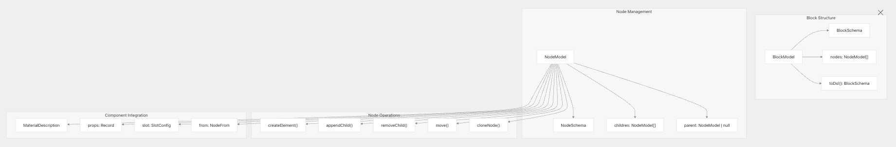
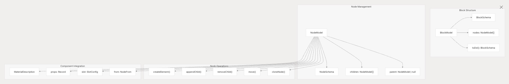
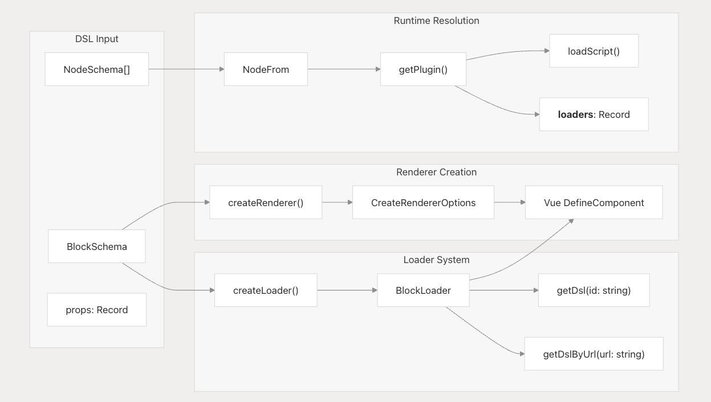
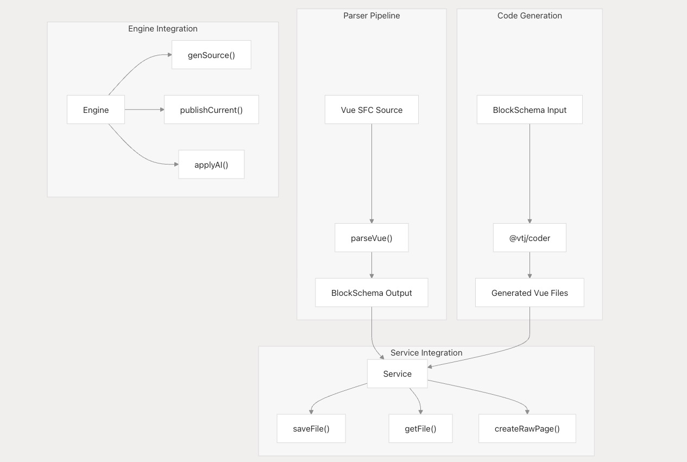
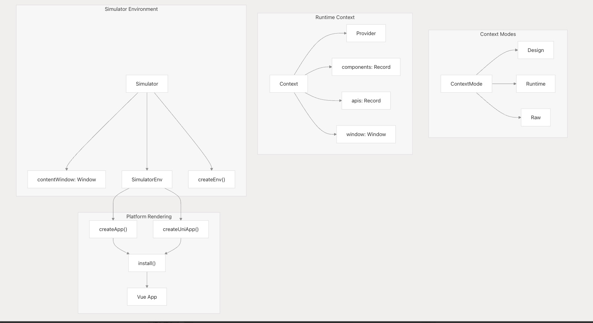
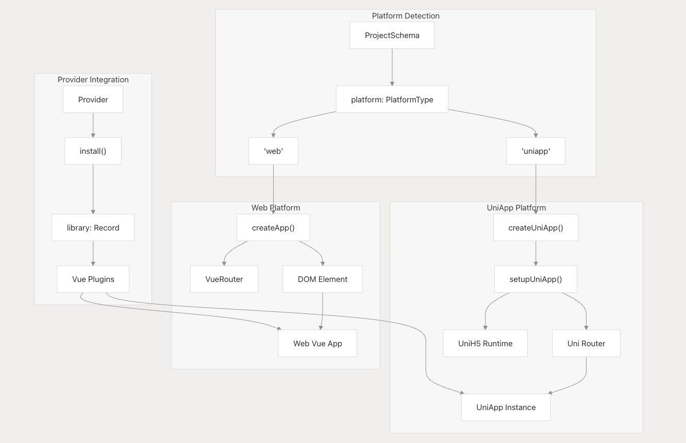

# 核心架构设计

本文档详细阐述了 VTJ 低代码平台的核心架构组件，包括引擎协调层、服务提供者系统、数据模型和代码转换管道。关于 UI 组件库的具体实现，请参考 UI 组件库文档；关于平台适配层实现，请查阅平台实现文档。

## 引擎、服务提供者与模拟器层

VTJ 架构围绕三个核心协调组件构建，形成完整的设计-开发工作流：

### 设计时引擎架构

`Engine` 类作为设计时环境的中央协调器，通过以下关键职责管理完整生命周期：

1. **项目管理**  
   通过 `Service` 接口协调 `ProjectModel` 实例和文件操作
2. **模拟器控制**  
   管理 iframe 沙箱环境中的组件渲染和实时预览
3. **资源管理**  
   通过 `Assets` 类处理物料加载和组件注册
4. **事件协调**  
   实现模型事件绑定，支持响应式更新和状态持久化

### 服务提供者架构

`Provider` 类管理不同执行模式下的运行时服务：

**支持模式：**

- **设计模式**：完整可视化编辑能力
- **运行时模式**：生产环境优化执行
- **原始模式**：直接执行 Vue 组件

**核心功能：**

1. **资源加载**  
   根据项目配置异步加载依赖项、物料和组件
2. **API 管理**  
   通过 `createSchemaApis` 创建基于 Schema 的 RESTful API
3. **组件注册**  
   动态解析组件并安装 Vue 插件
4. **DSL 渲染**  
   提供工厂方法将 BlockSchema 转换为可执行 Vue 组件

## 项目模型与块模型系统

数据层采用响应式模型架构，通过事件驱动机制管理项目状态和组件定义。

### 模型层次结构与事件机制

`ProjectModel` 管理项目全局状态：

**核心数据结构：**

- **页面(page)**：应用路由单元
- **块(block)**：可复用组件单元
- **依赖项(dependencies)**：外部库版本管理
- **配置(configuration)**：项目级设置

**关键特性：**

- **文件操作**：支持 `PageFile` 和 `BlockFile` 的 CRUD 操作（含验证和事件触发）
- **依赖管理**：支持外部库和物料的动态加载与版本控制
- **状态同步**：通过事件驱动更新，由 `Service` 层触发状态持久化
- **平台适配**：支持多目标平台（`web`, `h5`, `uniapp`）

关键方法包括 `createPage()`, `createBlock()`, `setDeps()` 和 `active()`，每个操作触发相应事件实现 UI 同步

### 块模型与节点层次结构

`BlockModel` 将组件或页面表示为 `NodeModel` 节点树：

**架构特性：**

- **层次结构**：基于插槽(slot)的内容组织，形成树形父子关系
- **组件集成**：通过物料描述(MaterialDescription)和节点来源(NodeFrom)配置动态加载组件
- **状态管理**：支持锁定(locked)、可见性(visible)和验证状态(validation)的响应式属性
- **序列化**：实现运行时模型与可序列化 BlockSchema/NodeSchema 的双向转换

## 代码生成与解析管道

VTJ 通过多层解析和代码生成管道，实现 Vue 单文件组件(SFC)与低代码 DSL 的双向转换。

### DSL 到组件渲染管道

渲染管道通过四个阶段将 `BlockSchema` 转换为可执行 Vue 组件：

1. **DSL 加载**  
   `createLoader` 函数创建 BlockLoader，递归解析组件依赖
2. **组件解析**  
   NodeFrom 配置指定组件加载方式（`Schema`, `UrlSchema`, `Plugin`）
3. **异步组件创建**  
   利用 Vue 的 `defineAsyncComponent`，通过支持缓存的加载器实现异步加载
4. **上下文集成**  
   `CreateRendererOptions` 提供运行时上下文（Vue 实例、组件库、API）

### Vue SFC 解析与代码生成

双向转换系统支持可视化设计与代码编辑的无缝切换：

**核心处理流程：**

1. **解析器集成**  
   `@vtj/parser` 将 Vue 单文件组件(SFC)转换为 `BlockSchema`
2. **代码生成**  
   `@vtj/coder` 根据 `BlockSchema` 生成完整 Vue 项目结构
3. **服务层操作**  
   通过 `Service.saveFile()` 和 `Service.getFile()` 实现文件同步
4. **AI 集成**  
   `Engine.applyAI()` 方法支持 AI 生成 DSL 集成到设计流程

`Engine.genSource()` 方法编排完整代码生成流程，`createRawPage()` 支持混合工作流（可视化组件 + 代码组件）

## 运行时架构与上下文管理

运行时系统通过分层上下文架构管理不同模式（mode）和平台（platform）的组件执行。

### 上下文与模式管理

运行时架构根据 `ContextMode` 调整行为：

**执行模式：**

- **设计模式**：提供完整设计时功能，支持热重载(hot-reload)和可视化编辑
- **运行时模式**：为生产环境优化组件执行性能
- **原始模式**：直接执行 Vue 组件，无低代码平台开销

`Simulator` 创建隔离的 iframe 环境（通过 `contentWindow`），包含专属的 `SimulatorEnv`：

- **组件注册表**：从物料(materials)和依赖(dependencies)解析的组件集合
- **API 层**：基于 Schema 的 API，支持模拟数据
- **平台适配器**：针对不同平台的应用创建策略

### 多平台运行时适配

针对不同平台采用特定的运行时创建策略：

**平台适配实现：**

- **Web 平台**：创建带 Vue 路由器和 DOM 挂载的标准 Vue 应用
- **UniApp 平台**：使用 `setupUniApp()` 和 `UniH5` 运行时进行跨平台配置
- **插件安装**：根据依赖配置自动安装库插件
- **路由配置**：平台特定的路由历史模式实现

`Provider.install()` 方法管理跨平台的插件安装和全局属性设置

:::info 文档说明
本文档由AI辅助生成，可能存在技术细节偏差，最新架构设计请参考原始技术文档：  
[VTJ核心架构原文](https://deepwiki.com/ChenXiaohui99/vtj/2-core-architecture)
:::
