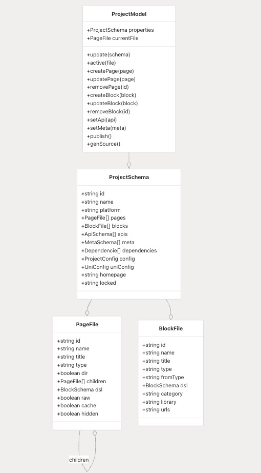
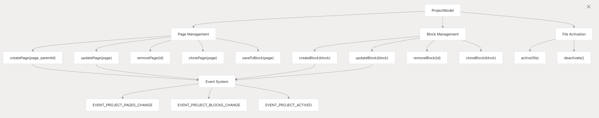
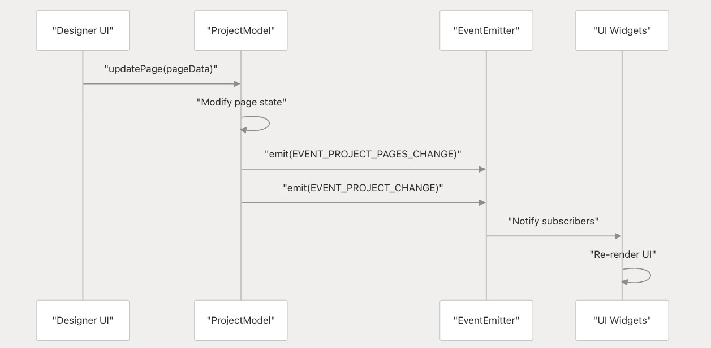
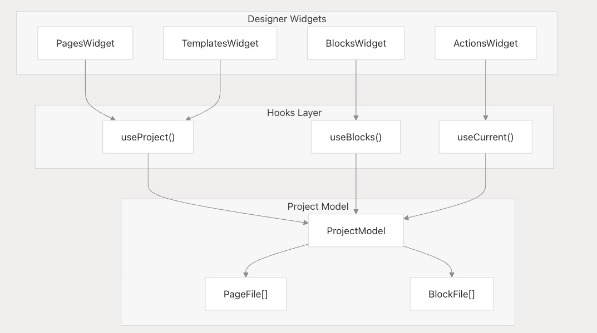
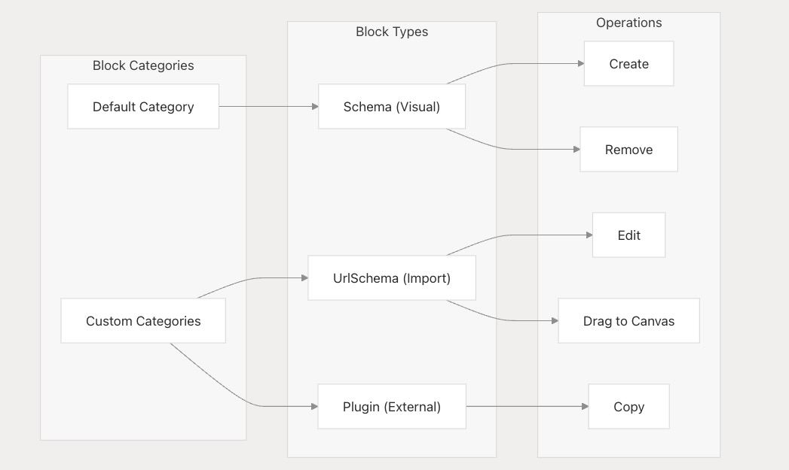
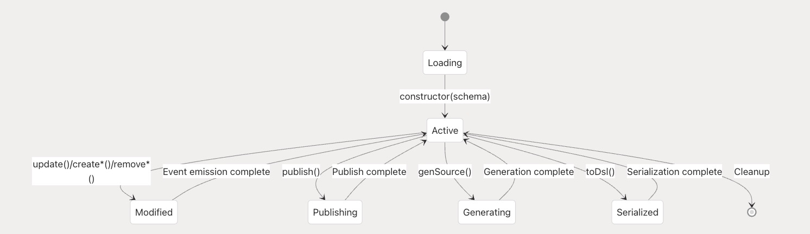

# 项目模型和块模型

本文档涵盖了 VTJ 低代码平台的核心数据层，特别是管理项目结构、文件组织和状态管理的 `ProjectModel` 和 `BlockModel` 类。这些模型充当所有设计时作的中央数据存储，并为可视化设计人员的文件管理功能提供基础。

有关在运行时渲染和执行这些模型的信息，请参阅 Engine、Provider 和 Service Layer。有关从这些模型生成代码的详细信息，请参阅代码生成和解析管道 。

## 数据模型架构

project 和 block 模型形成一个分层数据结构，代表整个低代码 project 状态：



## ProjectModel 类结构

`ProjectModel` 类用作管理项目状态的主要接口，并为对所有项目实体执行 CRUD 作提供方法：

### 核心属性

| 属性         | 类型             | 描述                              |
| ------------ | ---------------- | --------------------------------- |
| id           | 字符串           | 唯一项目标识符                    |
| name         | 字符串           | 项目名称                          |
| platform     | 平台类型         | 目标平台（'web'、'h5'、'uniapp'） |
| pages        | 页面文件[]       | 项目页面和目录                    |
| blocks       | BlockFile[]      | 可重用的块组件                    |
| currentFile  | 页面文件、块文件 | 当前活动文件                      |
| dependencies | 依赖             | 外部包依赖项                      |
| apis         | ApiSchema        | API 定义                          |
| meta         | 元模式[]         | 元数据配置                        |

### 文件管理作

ProjectModel 提供了全面的文件管理功能：



## 事件驱动型架构

ProjectModel 为状态更改通知实现了一个全面的事件系统：

### 事件类型

| 事件常量                    | 触发条件         | 目的             |
| --------------------------- | ---------------- | ---------------- |
| EVENT_PROJECT_CHANGE        | 任何项目属性更改 | 常规项目更新     |
| EVENT_PROJECT_ACTIVED       | 文件打开/关闭    | 活动文件状态更改 |
| EVENT_PROJECT_PAGES_CHANGE  | 页面 CRUD 作     | 页面列表更新     |
| EVENT_PROJECT_BLOCKS_CHANGE | 阻止 CRUD 作     | 黑名单更新       |
| EVENT_PROJECT_DEPS_CHANGE   | 依赖项修改       | 依赖项管理       |
| EVENT_PROJECT_PUBLISH       | 项目发布         | 发布工作流程     |
| EVENT_PROJECT_GEN_SOURCE    | 代码生成         | 源代码生成       |

### 事件流模式



## 文件类型系统

VTJ 管理两种具有不同特征的主要文件类型：

### PageFile 结构

页面表示可导航的应用程序屏幕，可以按层次结构进行组织：

```ts
interface PageFile {
  id: string; // Unique identifier
  name: string; // Component name (PascalCase)
  title: string; // Display title
  type: 'page'; // File type marker
  dir?: boolean; // Directory flag
  children?: PageFile[]; // Child pages (for directories)
  dsl?: BlockSchema; // Design schema (null for directories)
  raw?: boolean; // Source code mode flag
  cache?: boolean; // Page caching
  hidden?: boolean; // Hide in navigation
  pure?: boolean; // Pure component mode
}
```

### BlockFile 结构

区块是可重用的组件，可以通过多种方法创建：

```ts
interface BlockFile {
  id: string;
  name: string;
  title: string;
  type: 'block';
  fromType: 'Schema' | 'UrlSchema' | 'Plugin'; // Creation method
  dsl?: BlockSchema; // Design schema
  category?: string; // Organization category
  library?: string; // Plugin library name
  urls?: string; // External resource URLs
}
```

`fromType` 属性确定如何处理块：

- **Schema** ：通过可视化设计器创建
- **UrlSchema**：从外部 JSON 架构导入
- **Plugin** ：从外部 JavaScript/CSS 资源加载

## 与 Designer UI 集成

项目模型通过反应式钩子和 widget 组件与 designer 界面紧密集成：

### UI 组件集成



### UI 上下文中的文件操作

设计器小部件为文件作提供了用户友好的界面：

### Pages 小组件作

```ts
// Page management actions
const onAction = async (action: any) => {
  const { name, modelValue } = action;
  const { data } = modelValue;

  switch (name) {
    case 'add':
      // Create new page/directory
      project.value?.createPage(pageData, parentId);
      break;
    case 'edit':
      // Update existing page
      project.value?.updatePage(pageData);
      break;
    case 'remove':
      // Delete page
      project.value?.removePage(data.id);
      break;
    case 'copy':
      // Clone page
      project.value?.clonePage(data, parentId);
      break;
    case 'saveToBlock':
      // Convert page to reusable block
      await project.value?.saveToBlock(data);
      break;
  }
};
```

### 区块管理界面

块小部件提供分类组织和拖放功能：



## 数据持久化和序列化

ProjectModel 为持久化和共享提供了序列化功能：

### DSL 导出格式

```ts
toDsl(_version?: string): ProjectSchema {
  const attrs = ProjectModel.attrs.reduce((result, current) => {
    result[current] = (this as any)[current];
    return result;
  }, {} as Record<string, any>);

  // Clean DSL data for serialization
  if (attrs.pages) {
    attrs.pages = attrs.pages.map((page: PageFile) => ({
      ...page,
      dsl: undefined // Remove design schemas
    }));
  }

  return {
    __VTJ_PROJECT__: true,
    id: this.id,
    ...attrs
  } as ProjectSchema;
}
```

此方法创建适用于以下各项的可序列化表示形式：

- 项目文件存储
- 版本控制
- 模板发布
- 代码生成输入

### 状态管理生命周期



## 锁管理系统

ProjectModel 通过锁定机制包含协作编辑支持：

```ts
lock(id: string) {
  this.locked = id;
  // Emit change event
}

unlock(id: string) {
  if (id !== this.locked) return;
  this.locked = '';
  // Emit change event
}
```

该系统可防止在协作环境中进行并发修改，并与身份验证系统集成，以确保只有授权用户才能修改锁定的项目。
