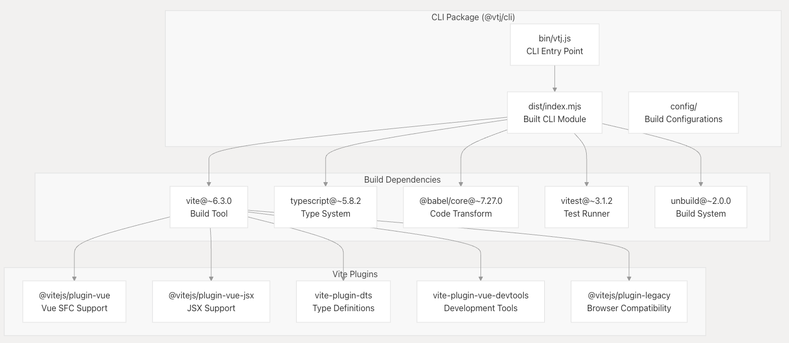
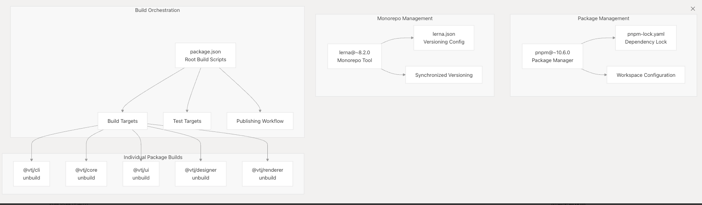
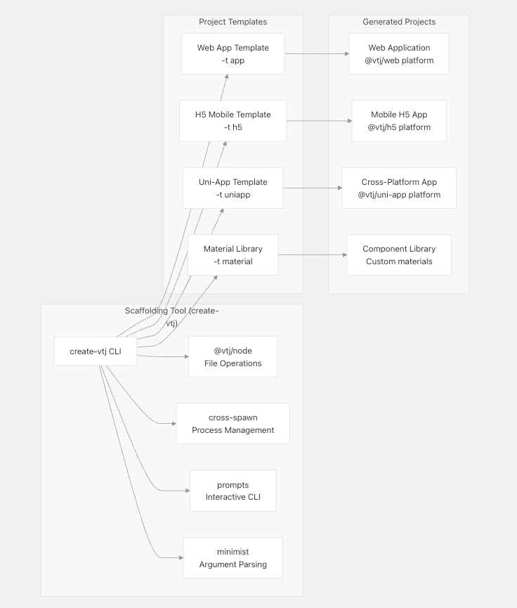
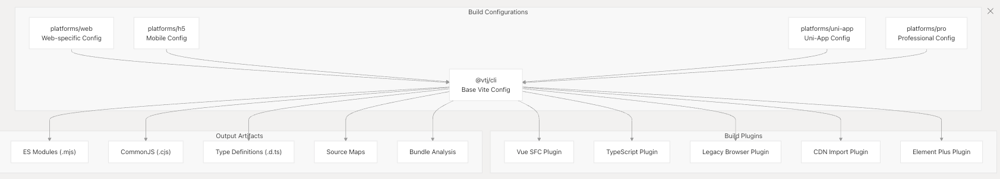

# CLI 和构建系统

本文档介绍了支持 VTJ 开发和部署的命令行界面工具、构建过程和项目基架系统。它解释了开发人员如何通过 CLI 命令与 VTJ 交互，monorepo 构建系统如何工作，以及如何创建和配置新项目。

有关核心引擎体系结构的信息，请参阅**核心体系结构** 。有关多平台部署的详细信息，请参**阅平台实现** 。

## CLI 包体系结构

VTJ CLI 作为 `@vtj/cli` 软件包实现，该软件包用作整个 VTJ 生态系统的中央构建工具。CLI 提供了全面的构建功能，包括 Vite 配置、TypeScript 编译、测试实用程序和开发服务器管理。

### CLI 包结构

CLI 包通过 `vtj` 二进制命令公开其功能，主要实现使用 `unbuild` 构建以实现最佳 Node.js 兼容性。

## Monorepo 构建系统

VTJ 使用由 Lerna 和 PNPM 管理的复杂 monorepo 结构，支持跨所有软件包的协调开发和同步发布。

### 构建系统组件

构建系统确保所有软件包保持版本同步，目前整个 monorepo 的版本为 0.12.40。

## 项目脚手架系统

`create-vtj` 软件包提供项目基架功能，允许开发人员使用预配置的模板快速引导新的 VTJ 项目。

### 脚手架架构

基架系统支持多种项目类型，每种类型都配置了适用于其目标平台的适当依赖项和构建配置。

## 开发工作流程脚本

根 package.json 定义了一组全面的 npm 脚本，用于编排整个 VTJ 生态系统中的开发、构建和部署工作流程。

### 开发脚本

| 脚本类别   | 脚本示例                    | 目的                         |
| ---------- | --------------------------- | ---------------------------- |
| 开发服务器 | dev, pro:dev, app:dev       | 启动不同平台的开发服务器     |
| 构建命令   | build, pro:build, web:build | 构建生产分发                 |
| 测试       | test, cli:test, coverage    | 运行测试套件并生成覆盖率报告 |
| 包管理     | setup, clean, reset         | 管理依赖项和工作区状态       |
| 出版       | patch, minor, prerelease    | 版本管理和包发布             |

### 构建管道流

构建管道可确保 monorepo 中所有软件包之间的协调构建和同步发布。

## 构建目标和平台支持

VTJ 支持多个构建目标和部署平台，每个平台都有特定的构建配置和输出格式。

### 平台构建矩阵

| 平台      | 包           | 构建工具    | 输出格式         | 目标环境           |
| --------- | ------------ | ----------- | ---------------- | ------------------ |
| Web       | @vtj/web     | Vite        | ES 模块 + UMD    | 现代浏览器         |
| H5 移动版 | @vtj/h5      | Vite        | ES 模块 移动网页 |
| Uni-App   | @vtj/uni-app | Uni-App CLI | Multiple         | iOS/Android/小程序 |
| 专业的    | @vtj/pro     | Vite        | 企业平台         |
| 组件库    | @vtj/ui      | unbuild     | ES 模块 + CJS    | 库分发             |

## 构建配置管理

## 检测和质量保证

构建系统使用 Vitest 作为主要测试运行程序，集成了全面的测试功能，并支持覆盖率报告和持续集成。

### 测试基础设施

| 元件         | 工具                   | 目的                |
| ------------ | ---------------------- | ------------------- |
| 测试运行程序 | vitest@~3.1.2          | 单元和集成测试      |
| 覆盖         | @vitest/coverage-v8    | 代码覆盖率分析      |
| 浏览器测试   | jsdom@~26.1.0          | Vue 组件的 DOM 模拟 |
| Vue 测试     | @vue/test-utils@~2.4.5 | Vue 组件测试工具    |

CLI 软件包提供统一的测试配置，这些配置可以被 monorepo 中的所有软件包继承，从而确保整个 VTJ 生态系统的测试实践一致。
