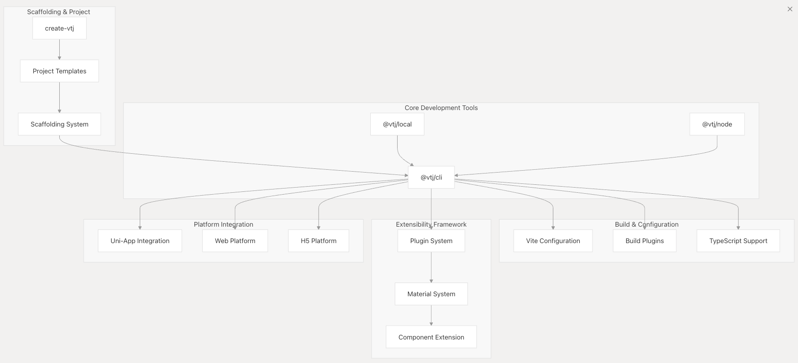
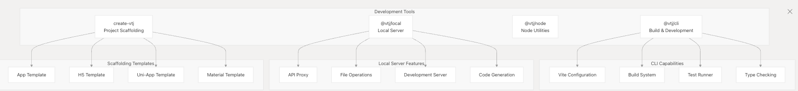
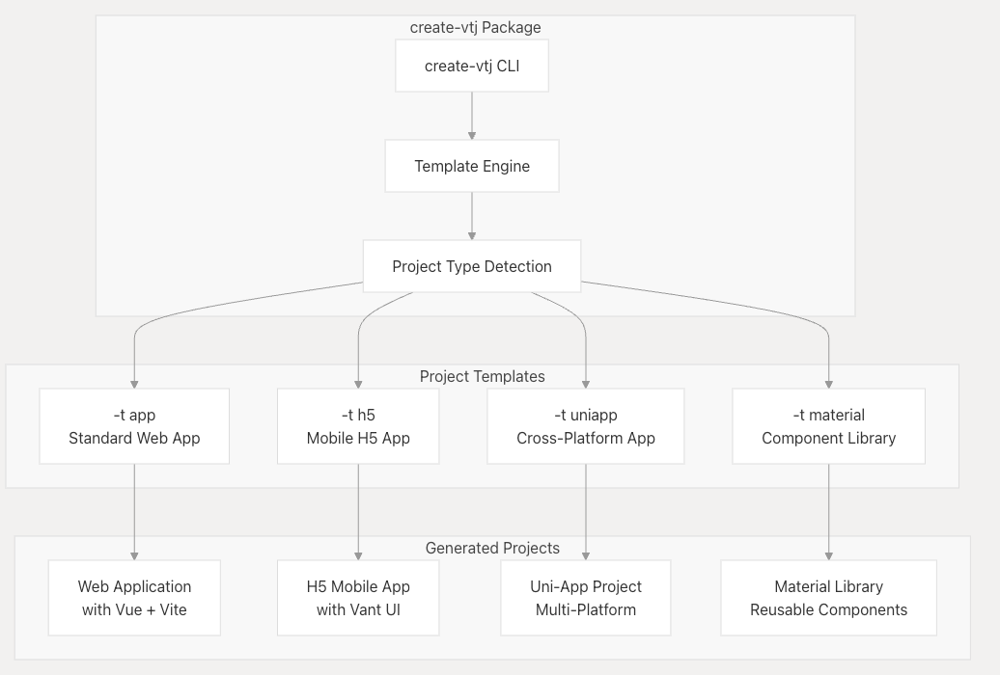
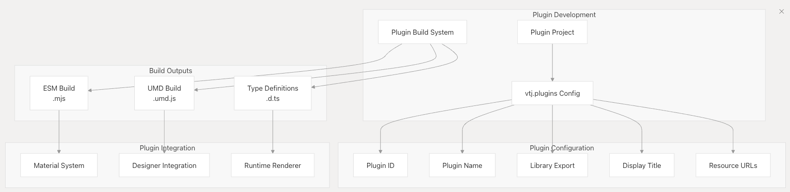
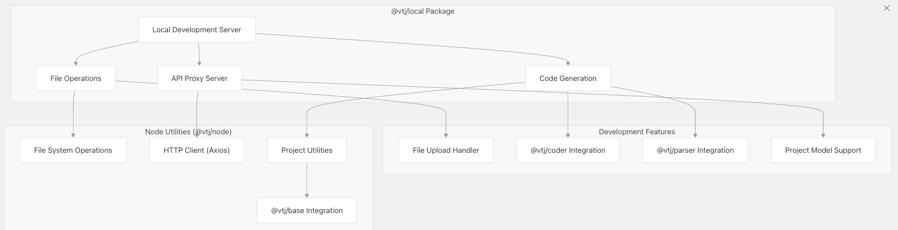
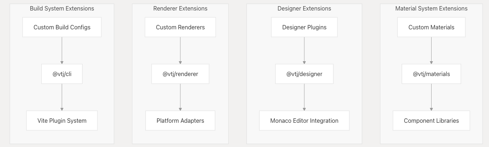
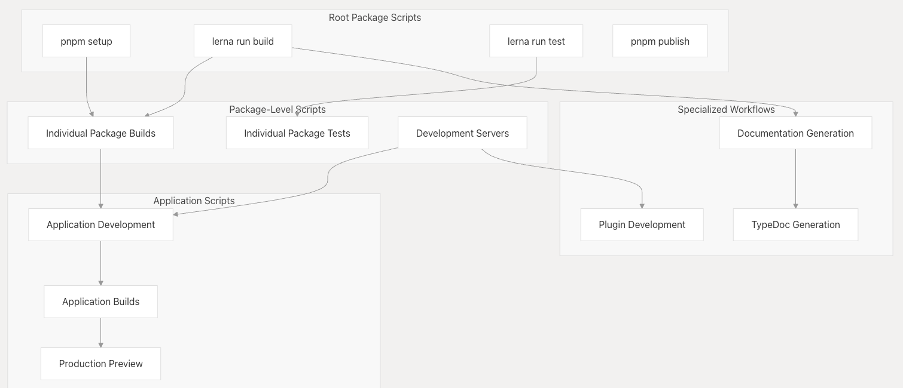

# 开发人员工具和可扩展性

VTJ 平台提供了一个由开发人员工具和可扩展性框架组成的综合生态系统，旨在支持开发、构建和扩展低代码应用程序。本页概述了关键的工具基础设施、基架系统和插件架构，使开发人员能够使用和扩展 VTJ 平台。

VTJ 开发人员工具生态系统由几个互连系统组成，以下小节中对此进行了详细说明：

- **CLI 和构建系统** : 命令行工具和构建配置
- **插件系统:** 自定义组件的扩展性框架
- **Uni-App 集成**: 跨平台开发支持

## 概述

VTJ 开发人员工具生态系统是围绕多个专用软件包构建的，这些软件包协同工作以提供完整的开发体验。这些工具与 Vite、TypeScript 和 Vue 等现代前端技术集成，为平台开发和扩展创建优化的工作流程。

**VTJ 开发人员工具生态系统**



## 核心开发人员工具

VTJ 生态系统包括几个提供开发工具和基础设施的核心软件包：

**核心开发包**



### 关键工具功能

| 包         | 主要功能                      | 主要出口                                                         |
| ---------- | ----------------------------- | ---------------------------------------------------------------- |
| @vtj/cli   | 构建工具和开发服务器          | createViteConfig、createUniappViteConfig、createPluginViteConfig |
| @vtj/local | 具有 API 代理的本地开发服务器 | 开发服务器、文件作、代码生成                                     |
| @vtj/node  | 用于工具的 Node.js 实用程序   | 文件系统实用程序、HTTP 客户端、项目作                            |
| create-vtj | 项目脚手架系统                | 针对不同平台创建基于模板的项目                                   |

## 项目脚手架系统

VTJ 平台通过 `create-vtj` 软件包包括一个复杂的项目基架系统，该系统为不同类型的 VTJ 应用程序提供基于模板的项目创建。

**脚手架架构**



### 可用的项目模板

| 模板     | 参数        | 生成的项目类型         | 主要特点                        |
| -------- | ----------- | ---------------------- | ------------------------------- |
| 应用程序 | -t app      | 标准 Vue Web 应用程序  | Vue 路由器、Pinia、Element Plus |
| H5       | -t h5       | 移动优先的 H5 应用程序 | Vant UI，移动优化               |
| UniApp   | -t uniapp   | 跨平台应用程序         | 多平台部署，Uni-UI              |
| 物料     | -t material | 组件库                 | 插件系统，可重用组件            |

## 插件开发框架

VTJ 提供了一个全面的插件开发框架，允许开发人员为低代码平台创建自定义组件、材料和扩展。

**插件系统架构**



### 插件配置结构

插件通过 `package.json` 中的 `vtj.plugins` 部分进行配置：

```json
// Example plugin configuration in package.json
{
  "vtj": {
    "plugins": [
      {
        "id": "v-test", // Unique plugin identifier
        "name": "VTest", // Component name for registration
        "library": "VTest", // Library export name
        "title": "测试", // Display title in designer
        "urls": "xxx.json,xxx.css,xxx.js" // Additional resources
      }
    ]
  }
}
```

## 本地开发基础设施

VTJ 平台包括用于本地开发的专用工具，包括具有 API 代理功能和文件作实用程序的开发服务器。

**本地开发架构**



### 开发服务器功能

| 特征     | 包         | 依赖                    | 目的                    |
| -------- | ---------- | ----------------------- | ----------------------- |
| 文件上传 | @vtj/local | formidable              | 处理开发中的文件上传    |
| 代码生成 | @vtj/local | @vtj/coder、@vtj/parser | 生成和解析 Vue SFC 文件 |
| API 代理 | @vtj/local | @vtj/node               | 开发期间的代理 API 请求 |
| 文件作   | @vtj/node  | FS-extra、 AXIOS        | 文件系统和 HTTP 作      |

## 扩展性框架

VTJ 为开发人员提供了多个扩展点，用于自定义和扩展平台的功能。

**扩展点和集成**



### 扩展开发工作流程

| 扩展类型      | 基础包                                 | 关键依赖项                         | 构建输出           |
| ------------- | -------------------------------------- | ---------------------------------- | ------------------ |
| 材料组件      | @vtj/materials                         | Element Plus、Ant Design Vue、Vant | 包含元数据的组件库 |
| Designer 插件 | @vtj/designer 摩纳哥编辑，highlight.js | 设计时功能                         |
| 自定义渲染器  | @vtj/renderer                          | @vtj/core、@vtj/utils              | 运行时渲染逻辑     |
| 构建插件      | @vtj/cli                               | Vite、Rollup 插件                  | 开发工具           |

## 开发工作流程集成

VTJ 开发人员工具与现代开发工作流程无缝集成，并通过 npm 脚本和命令行实用程序提供全面的自动化。

**Monorepo 开发工作**



### 关键开发命令

| 命令类别   | 示例命令                              | 目的                 |
| ---------- | ------------------------------------- | -------------------- |
| 设置和维护 | Pnpm 设置 、Pnpm 重置 、Pnpm 清理     | 环境初始化           |
| 建筑       | npm run build， lerna run build       | 编译所有软件包       |
| 测试       | npm run test、npm run 覆盖率          | 运行测试并生成覆盖率 |
| 发展       | npm run dev、npm run pro：dev         | 启动开发服务器       |
| 文档       | npm run docs：build， npm run typedoc | 生成文档             |

## 开发工作流程

VTJ CLI 使用以下命令（在项目 package.json 中提供）支持简化的开发工作流程：

| 命令        | 描述           |
| ----------- | -------------- |
| vtj dev     | 启动开发服务器 |
| vtj build   | 为生产而构建   |
| vtj preview | 预览生产版本   |
| vtj test    | 运行单元测试   |
| vtj clean   | 清理构建工件   |

## 结论

VTJ 开发人员工具提供了一套全面的实用程序，用于构建、测试和部署各种类型的低代码应用程序。通过利用 Vite、TypeScript 和 Vue 等现代前端工具，VTJ CLI 创建了一个强大而灵活的开发环境。

对于需要扩展 VTJ 本身功能的项目，开发人员工具支持使用专用构建配置和集成点进行插件开发。
