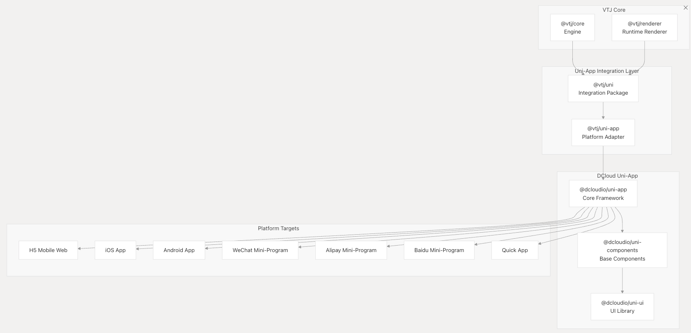
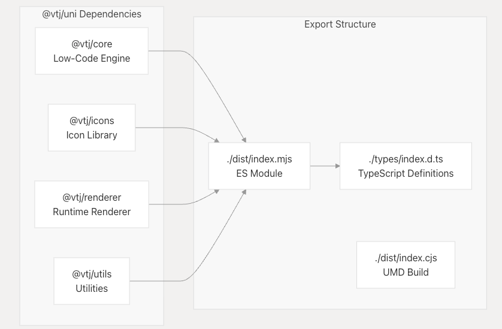
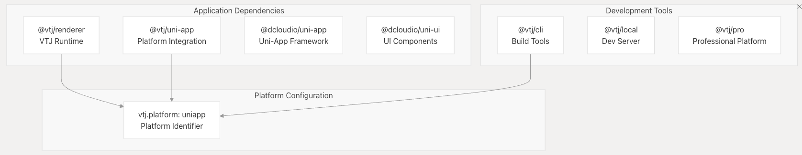
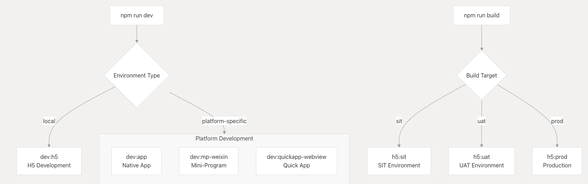
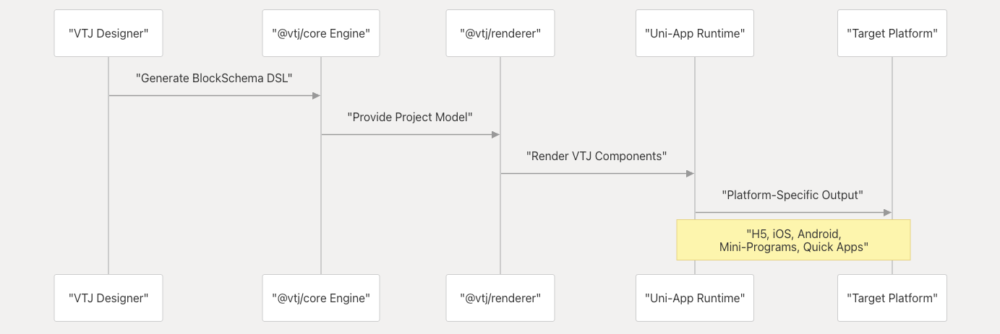

# Uni-App 集成

本文档介绍了 VTJ 通过 Uni-App 集成的跨平台开发能力，支持从单个 VTJ 项目部署到移动应用程序、小程序和多个平台目标。该集成允许 VTJ 低代码项目利用 Uni-App 的“一次编写，随处运行”的方法，同时保持可视化设计工作流程。

有关其他平台实现的信息，请参阅平台实现 。有关 **CLI 工具和构建过程**，请参阅 **CLI 和 Build System**。

## 架构概述

VTJ 的 Uni-App 集成由两个主要包组成：@vtj/uni 提供核心集成层，以及演示跨平台部署能力的示例应用程序。



## 平台支持矩阵

Uni-App 集成支持通过 DCloud 生态进行全面的跨平台部署：

| 平台类别 | 平台                                               | 生成命令模式                   |
| -------- | -------------------------------------------------- | ------------------------------ |
| 移动网页 | H5                                                 | dev:h5, build:h5               |
| 原生应用 | iOS、Android、通用应用程序                         | dev:app-ios, build:app-android |
| 小程序   | 微信、支付宝、百度、QQ、今日头条、京东、快手、Lark | dev:mp-weixin, build:mp-alipay |
| 快速应用 | Standard， 华为， Union                            | dev:quickapp-webview-huawei    |

每个平台目标都包括开发和生产版本变体，以及用于 SIT、UAT 和生产部署的环境特定配置。

## 包结构

### @vtj/uni

核心集成包提供了 VTJ 低代码引擎和 Uni-App 运行环境之间的桥梁：



该软件包可导出 ES 模块和 UMD 构建，支持不同的使用模式和构建系统。

### 示例应用程序结构

参考 Uni-App 实现演示了集成模式：



## 构建系统集成

### 开发脚本

Uni-App 集成提供了支持所有目标平台的全面开发脚本：



构建系统使用环境变量 （ENV_TYPE） 来控制部署目标，并包括跨环境警告抑制以实现 Vite CJS 兼容性。

### 特定于平台的构建命令

每个受支持的平台都有遵循一致命名模式的专用构建命令：

| 命令模式       | 例            | 目的                 |
| -------------- | ------------- | -------------------- |
| dev:platform   | dev:mp-weixin | 特定平台的开发服务器 |
| build:platform | build:app-ios | 平台的生产版本       |
| platform:env   | h5:prod       | 特定于环境的构建     |

## 运行时集成

### VTJ Renderer 集成

Uni-App 平台集成了 VTJ 的渲染器系统，在 Uni-App 运行环境中提供低代码功能：



该集成保留了 VTJ 的设计时功能，同时利用了 Uni-App 的跨平台编译。

### 元件库集成

Uni-App 项目既可以使用 VTJ 的组件库，也可以使用 Uni-App 的原生组件：

| 元件源                   | 使用上下文        | 集成方法           |
| ------------------------ | ----------------- | ------------------ |
| @dcloudio/uni-ui         | 平台原生组件      | 直接 Uni-App 集成  |
| @vtj/renderer            | VTJ 低代码组件    | 基于渲染器的实例化 |
| @dcloudio/uni-components | 基本 Uni-App 组件 | 框架级集成         |

## 开发工作流程

### 项目初始化

Uni-App 集成通过 CLI 系统支持 VTJ 的标准项目脚手架：

```shell
# Create Uni-App project using VTJ CLI
create-vtj my-uniapp-project -t uniapp
```

生成的项目包括平台配置标记和跨平台开发所需的所有依赖项。

### 多平台开发

开发工作流程支持跨多个平台同时开发，并具有热重载功能：

- **本地开发** ：使用 npm run dev 进行初级 H5 开发
- **平台测试** ：用于本机测试的特定于平台的开发服务器
- **构建验证 **：用于部署验证的特定于环境的构建

该集成保留了 VTJ 的可视化设计能力，同时提供了 Uni-App 的平台特定优化和原生 API 访问。
