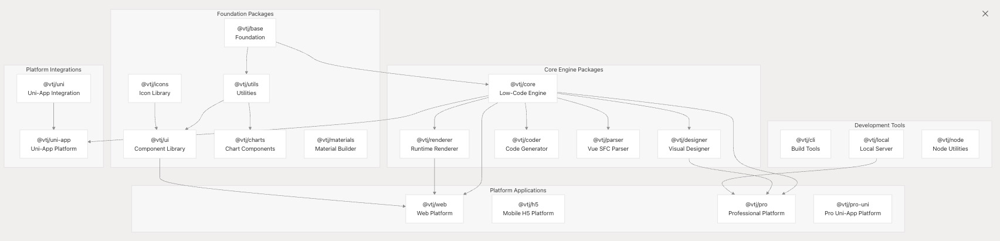
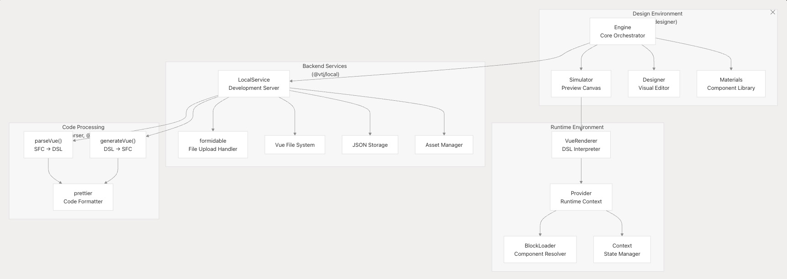
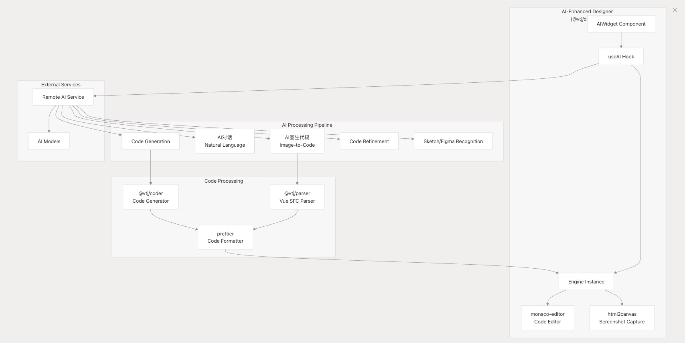

# 概述

VTJ.PRO 是一个 AI 驱动的 Vue3 低代码开发平台，支持 Vue 单文件组件 （SFC） 和领域特定语言 （DSL） 表示之间的双向转换。VTJ 构建在具有同步版本控制的 monorepo 架构之上，为可视化设计、代码生成和多平台部署提供了一个全面的软件包生态系统，同时保持与现有 Vue 3 开发工作流程的兼容性。

## 目的和范围

本文档简要概述了 VTJ 低代码平台，包括其架构、关键组件和设计理念。有关特定组件（如 Engine 和 Provider 系统）的详细信息，请参阅核心架构 ，或者有关工程和块模型的详细信息，请参阅工程和块模型 。

## 主要特点

- **双向代码流** ：在视觉设计和 Vue 源代码之间无缝转换
- **AI 集成** ：智能代码生成、优化和图像到代码转换功能
- **Vue 3 基础** ：建立在最新的 Vue 生态系统之上，支持 TypeScript 和 Vite
- **多平台支持** ：面向 Web 应用程序、移动应用程序和 UniApp（跨平台）项目
- **低学习曲线** ：专为 Vue 开发人员设计，需要最少的额外知识
- **非侵入式实施** ：与现有项目集成，无代码污染

## 系统架构概述

VTJ 遵循模块化架构，在多个软件包中明确分离关注点，从基础到平台特定的实现，按层组织。



## Monorepo 包架构



## 项目脚手架系统



## AI 增强的设计时到运行时流程

VTJ 的核心创新是 Vue SFC 和低代码 DSL 之间的双向转换，并通过 AI 功能进行了增强：

### 双向代码管道


### 数据结构流

## AI 驱动的开发功能

VTJ 将 AI 功能集成到整个开发管道中，重点是图像到代码的生成和智能辅助：

### AI 集成架构



## 开始

VTJ 提供了几种开始使用该平台的方法：

### 使用 create-vtj 创建项目

`create-vtj` 脚手架工具使用预配置的构建系统生成特定于平台的项目：

```shell
# Web applications (PC) - uses @vtj/web platform
npm create vtj@latest --registry=https://registry.npmmirror.com -- -t app

# Mobile H5 applications - uses @vtj/h5 platform
npm create vtj@latest --registry=https://registry.npmmirror.com -- -t h5

# Cross-platform apps - uses @vtj/uni-app platform
npm create vtj@latest --registry=https://registry.npmmirror.com -- -t uniapp

# Component development - uses @vtj/materials
npm create vtj@latest --registry=https://registry.npmmirror.com -- -t material
```

### 开发环境设置

对于 VTJ 本身的本地开发：

```shell
git clone https://gitee.com/newgateway/vtj.git
cd vtj
npm run setup && npm run build && npm run app:dev
```

### 与现有项目集成

VTJ 通过特定于平台的软件包与现有的 Vue 3 项目无缝集成。有关详细的集成模式，请参阅 集成指南

### 多平台部署架构

VTJ 通过专门的平台包支持多个部署目标，每个平台包都针对特定环境进行了优化：

| 平台      | 包           | 目标环境                         | 关键依赖项                                 |
| --------- | ------------ | -------------------------------- | ------------------------------------------ |
| Web       | @vtj/web     | 桌面 Web 应用程序                | element-plus、@vtj/core、@vtj/renderer     |
| 设计器    | @vtj/pro     | 使用 Designer 的企业平台         | @vtj/renderer、@vtj/local、 @vtj/materials |
| 移动式 H5 | @vtj/h5      | 移动 Web 应用程序                | vant、@vtj/core、@vtj/renderer             |
| UniApp    | @vtj/uni-app | 跨平台应用（iOS/Android/小程序） | @dcloudio/uni-app、@vtj/uni、@vtj/renderer |

### 平台架构


## 当前版本

VTJ 的当前版本是 0.12.40，在 monorepo 中的所有软件包之间同步。

## 结论

VTJ.PRO 是专为 Vue 3 开发人员设计的综合性低代码平台。通过实现视觉设计和 Vue 源代码之间的双向转换，它可以加速开发，同时保持直接代码访问的灵活性和强大功能。该平台的模块化架构、AI 集成和多平台支持使其适用于广泛的应用程序开发场景。
