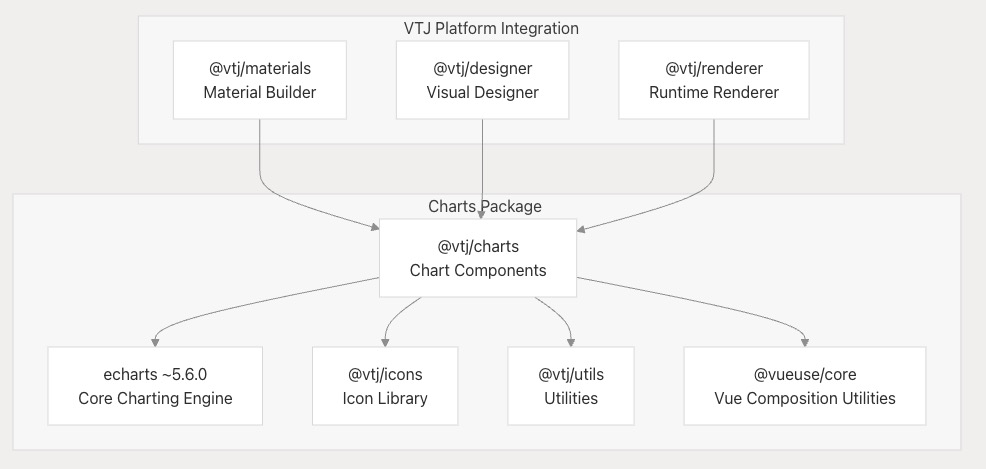
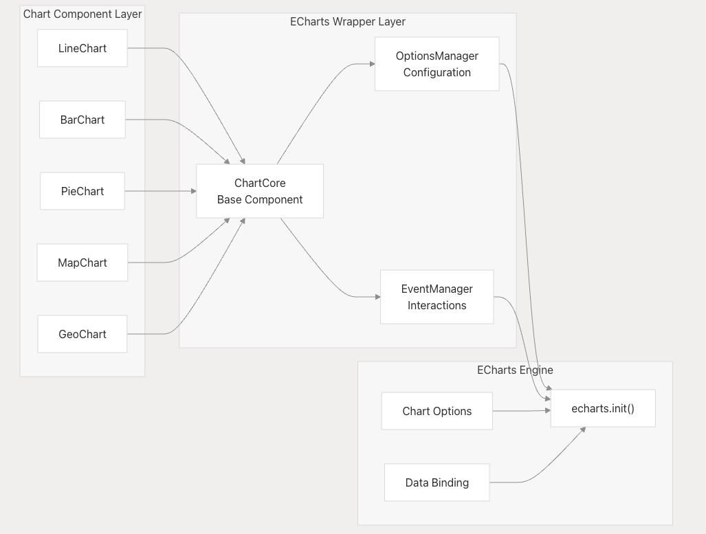
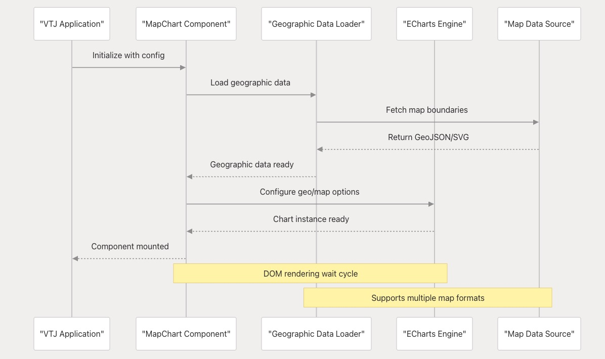
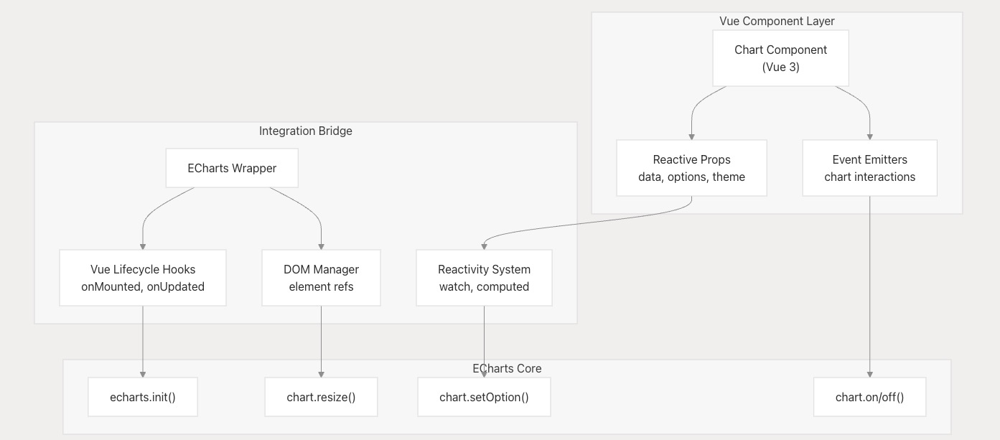
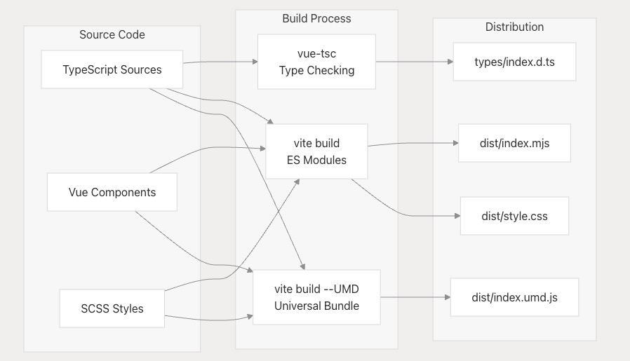

# 图表与可视化

本文档涵盖 `@vtj/charts` 包，该包通过 ECharts 集成为 VTJ 低代码平台提供全面的数据可视化能力。该软件包提供图表组件、地理映射和可视化工具，可与 VTJ 设计时和运行时环境无缝集成。

关于更广泛的 UI 组件生态系统，请参阅 **UI 组件库**。关于特定平台实现，请参阅**平台实现**文档。

## 包概述

`@vtj/charts` 包是 VTJ 组件生态中的核心可视化层，基于 ECharts 5.6.0 构建。该包提供 Vue 3 组件，封装了 ECharts 功能，同时保持与 VTJ 低代码设计模式的兼容性。

**图表包依赖项与集成架构**

## 图表组件系统

图表包采用基于组件的架构，将 ECharts 功能封装为可重用的 Vue 组件。这些组件专为 VTJ 低代码环境设计，同时提供对 ECharts 可视化能力的完整访问。

| 组件类别   | 功能描述                     | ECharts 集成机制      |
| ---------- | ---------------------------- | --------------------- |
| 基础图表   | 折线图、柱状图、饼图、散点图 | 直接 ECharts 选项绑定 |
| 地理图表   | 地图、地理数据可视化         | ECharts geo/map 组件  |
| 复合图表   | 多轴图表、组合图表           | ECharts 高级配置      |
| 交互式图表 | 刷选、区域缩放、图例控制     | ECharts 交互 API      |

**图表组件架构与 ECharts 集成**

## 地理可视化支持

图表包的核心功能是其地理可视化能力，支持地理地图和地理数据展示。此功能专门为 VTJ 应用中基于位置的数据可视化需求设计。

**地理图表初始化与数据加载流程**

地理可视化系统解决了以下关键问题：

- DOM 就绪状态检测
- 异步数据加载管理
- 地图就绪状态同步
- DOM 渲染时序处理

## ECharts 集成架构

该包为 ECharts 提供了复杂的封装层，在保留完整 ECharts API 访问能力的同时，确保与 Vue 3 响应式系统的兼容。此集成处理以下关键方面：

- **DOM 就绪检测**：确保 ECharts 在 DOM 元素可用后初始化
- **响应式更新**：当数据或配置 props 变化时自动更新图表
- **事件桥接**：将 ECharts 原生事件转换为 Vue 组件事件
- **资源管理**：在组件卸载时正确处理图表实例

**ECharts Vue 3 集成架构**

## 构建与分发系统

图表包采用双构建系统，同时生成 ES 模块和 UMD 包，确保在 VTJ 生态系统内不同部署场景的兼容性。

| 构建目标        | 输出格式          | 适用场景                        |
| --------------- | ----------------- | ------------------------------- |
| ES 模块         | dist/index.mjs    | 现代打包工具，支持 tree-shaking |
| UMD 包          | dist/index.umd.js | 浏览器全局变量、传统系统        |
| TypeScript 声明 | types/index.d.ts  | 类型安全与 IDE 支持             |
| CSS 样式包      | dist/style.css    | 组件样式                        |

**图表包构建与分发流程**

构建系统确保图表包：

1. 支持 VTJ 多平台部署目标
2. 通过 tree-shaking 优化包体积
3. 提供类型安全支持
4. 保持样式一致性
