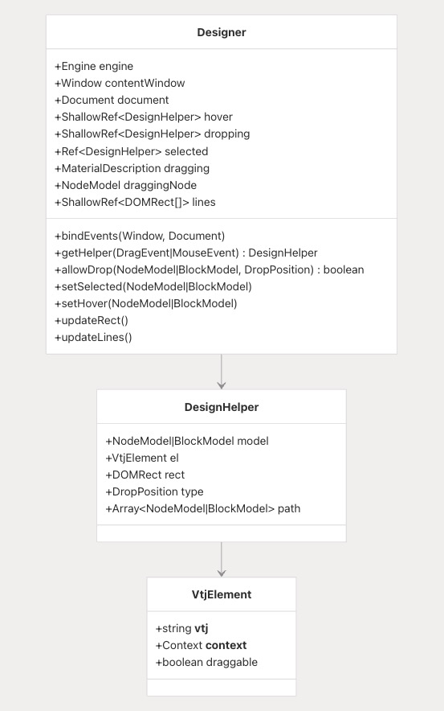
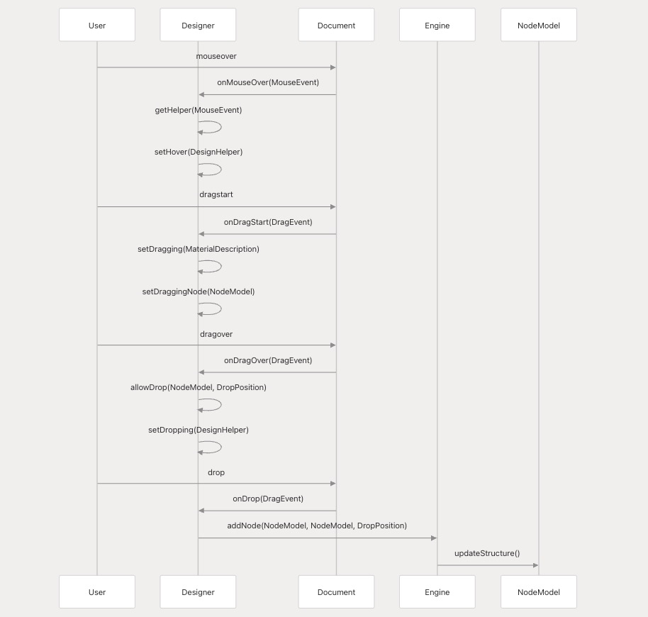
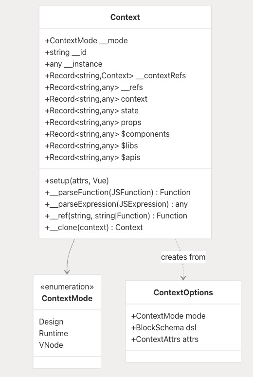
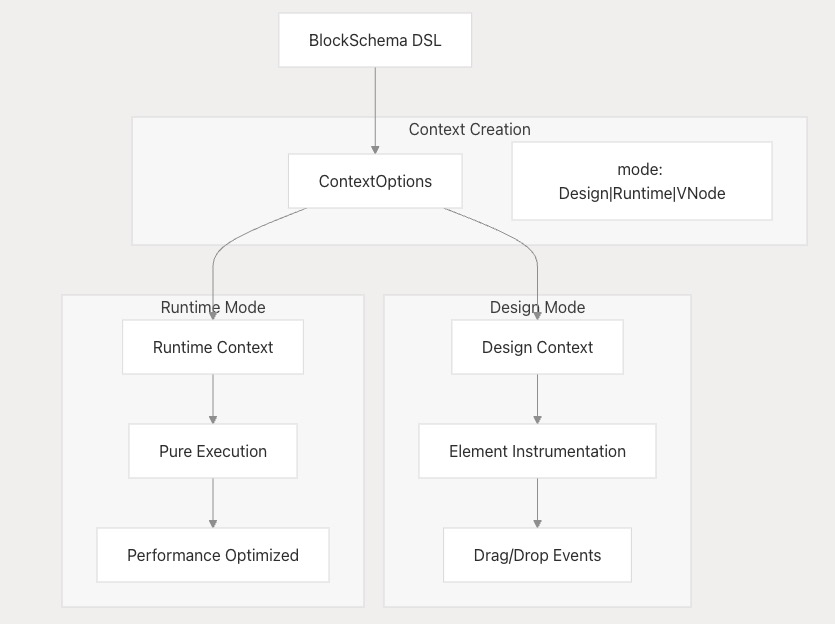
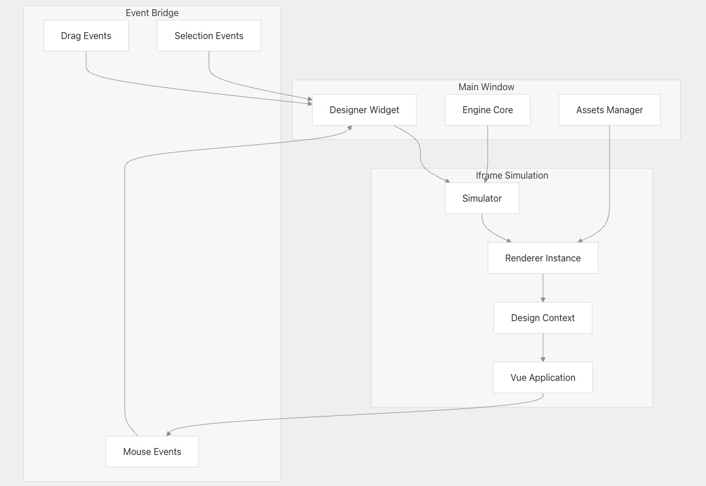
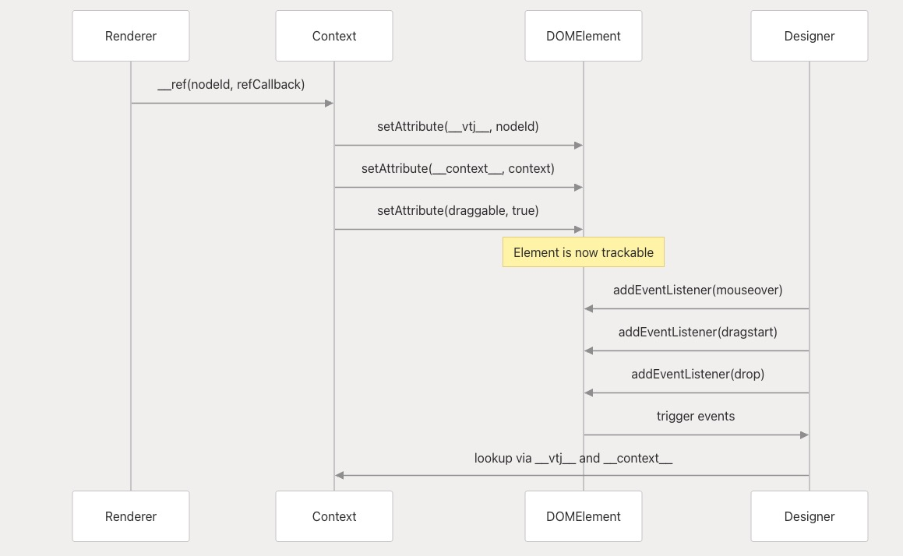
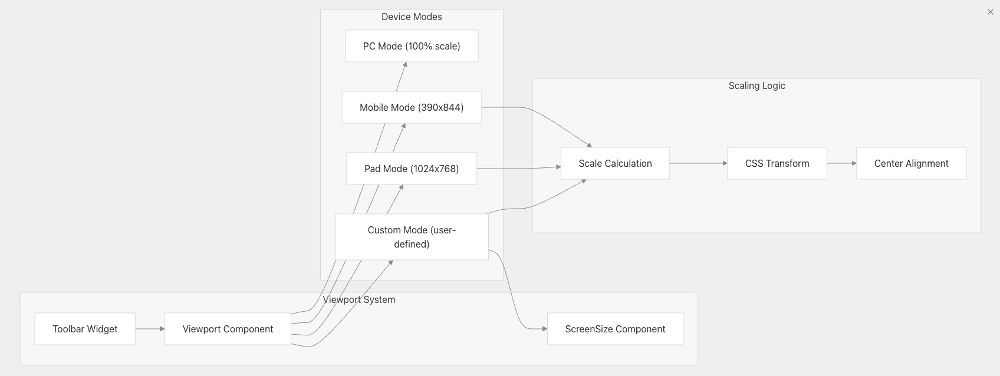

# 设计器与渲染器

本文档介绍了支持 VTJ 低代码体验的可视化设计环境（`@vtj/designer`）和运行时渲染系统（`@vtj/renderer`）。设计器提供交互式可视化编辑环境，用户可在其中拖放和配置组件；渲染器则负责在设计时预览和运行时环境中执行生成的 DSL 架构。

关于这些系统运行的核心引擎和数据模型，请参阅**引擎、提供程序和服务层**文档。关于提供实际组件的 UI 组件库，请参阅 **UI 组件库**文档。

## 设计器架构

设计器系统通过以 `Designer` 类为核心的复杂事件驱动架构，提供交互式可视化编辑功能，并与仿真环境深度集成。

### 核心设计器类

`Designer` 类作为所有设计时交互的中心协调器，管理以下功能：

- 鼠标事件处理
- 拖放操作
- 元素选择机制
- 视觉反馈系统

设计器通过检测具有特殊属性（`__vtj__`、`__context__`）的 DOM 元素运行，这些属性使其能够在可视元素与对应数据模型之间建立映射关系。

### 事件处理系统

设计器实现了一套全面的事件处理系统，能够捕获用户交互并将其转换为设计操作：

事件处理流程包括：

1. 原始事件捕获
2. 事件分类与路由
3. 操作指令生成
4. 状态更新与反馈

### 视觉反馈组件

设计器系统通过覆盖层组件提供实时视觉反馈，突出显示交互元素：

- 悬停高亮
- 选择边框
- 放置区域指示
- 操作状态提示

## 渲染器架构

渲染器系统为 VTJ DSL 模式提供运行时执行环境，支持多种执行模式和上下文。

### 上下文系统

`Context` 类作为运行时执行环境，为组件实例提供以下访问能力：

- 状态管理
- 属性传递
- 生命周期方法
- 实用工具函数

上下文系统支持三种执行模式：

1. **设计模式**：用于设计时交互的检测元素
2. **运行模式**：提供生产级执行环境
3. **VNode 模式**：支持无引用(refs)的虚拟节点渲染

### 多模式渲染

渲染器通过上下文系统在设计时和运行时模式之间无缝切换：

模式切换机制包括：

- 环境状态检测
- 渲染策略切换
- 上下文重配置
- 性能优化调整

## 设计时集成

设计器和渲染器系统通过基于 iframe 的共享模拟环境集成，支持实时预览和交互。

### 模拟器架构

模拟器架构包含以下关键组件：

- 沙箱环境隔离
- 双向通信通道
- 状态同步机制
- 资源加载管理

### 组件检测

在设计模式下，渲染器使用特殊属性检测 DOM 元素，使设计器能够跟踪和操作它们：

检测机制包括：

- 元素标记（`__vtj__`）
- 上下文关联（`__context__`）
- 属性映射
- 事件代理

## 视口与响应式设计

设计器提供复杂的视口系统，支持多种设备模式和自定义尺寸调整，便于响应式设计测试。

### 视口模式

视口系统支持：

- 预设设备尺寸（手机、平板、桌面）
- 自定义视口尺寸
- 方向切换（横屏/竖屏）
- 缩放控制

## 运行时性能优化

渲染器系统包含多项运行时性能优化，用于区分设计时检测和生产执行。

上下文系统自动管理以下方面以确保性能：

- Vue 实例生命周期
- 引用跟踪
- 资源清理
- 按需渲染

这些优化确保在不同执行模式下保持最佳性能，同时保留设计时检测所需的灵活性。
