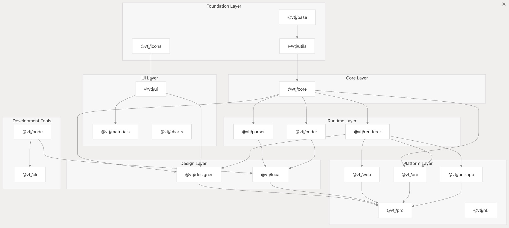
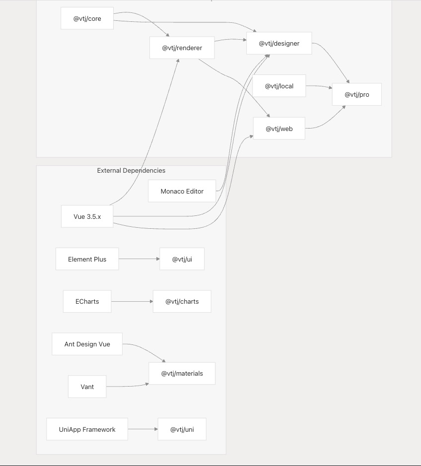
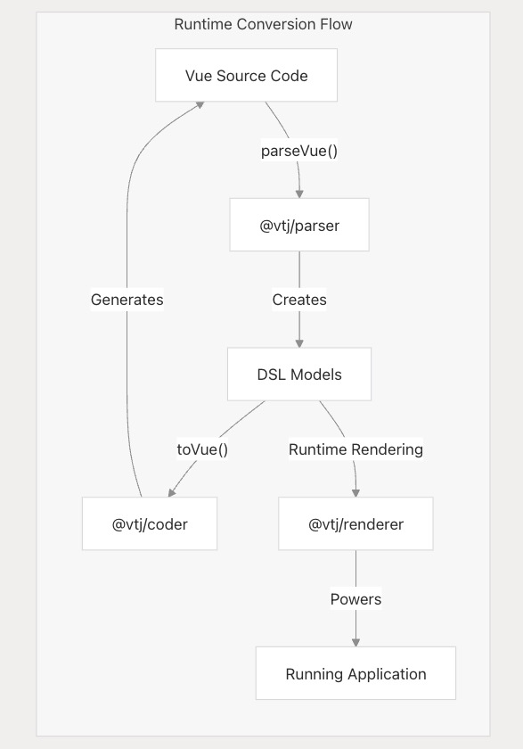
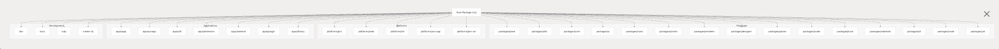
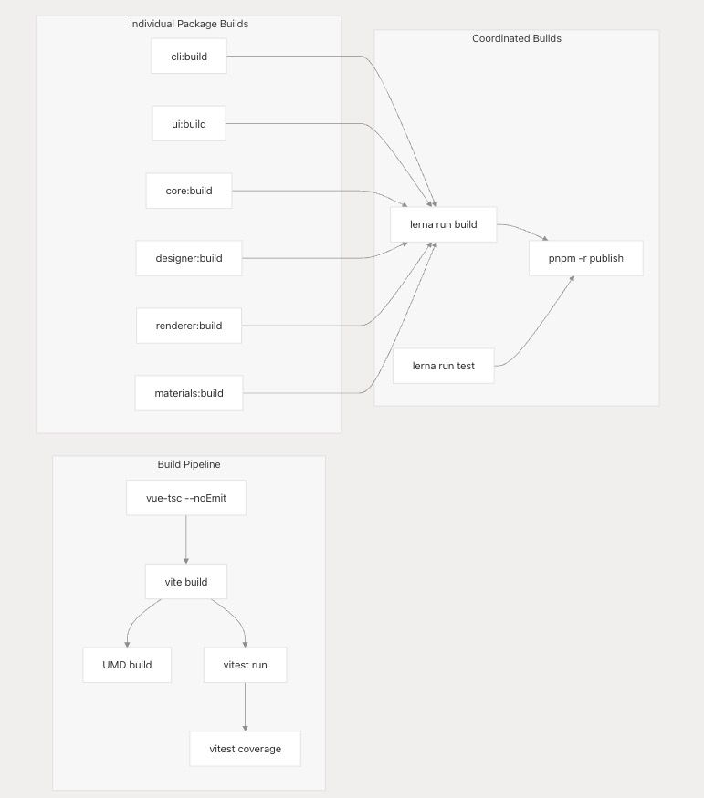

# 包结构和 Monorepo

本文档概述了 VTJ 低代码平台的 monorepo 结构、软件包依赖关系和构建系统组织。它概述了包的组织方式、它们之间的关系以及编排开发和部署的构建系统。有关核心架构组件的信息，请参阅**核心架构** 。

## Monorepo 结构概述

VTJ 平台使用 PNPM 工作区和 Lerna 进行包管理，以 monorepo 的形式进行组织。存储库包含组织为逻辑层的包，其工作区依赖项通过 workspace：~ 引用进行管理。monorepo 结构支持跨所有软件包的同步版本控制、共享工具和协调发布。



## 软件包描述和用途

VTJ 平台由以下主要软件包组成：

| 包             | 版本    | 描述                       | 依赖                                                               |
| -------------- | ------- | -------------------------- | ------------------------------------------------------------------ |
| @vtj/base      | 0.12.40 | 基础类型和实用程序         | reflect-metadata， 加密-js， dayjs， lodash-es                     |
| @vtj/utils     | 0.12.40 | 常用实用程序函数和帮助程序 | @vtj/base、axios、js-cookie                                        |
| @vtj/core      | 0.12.40 | 核心数据模型和引擎抽象     | @vtj/base                                                          |
| @vtj/icons     | 0.12.40 | 平台的图标组件             | @element-plus/icons-vue                                            |
| @vtj/ui        | 0.12.40 | UI 组件库                  | @vtj/icons、@vtj/utils、element-plus、sortablejs、vxe 表           |
| @vtj/materials | 0.12.40 | 设计师的组件材料           | @vtj/core、@vtj/ui、@vtj/utils、element-plus、ant-design-vue、vant |
| @vtj/charts    | 0.12.40 | 用于数据可视化的图表组件   | @vtj/icons、@vtj/utils、echarts                                    |
| @vtj/renderer  | 0.12.40 | 低代码 DSL 的运行时渲染器  | @vtj/core、@vtj/utils                                              |
| @vtj/parser    | 0.12.40 | 将 Vue 代码解析为 DSL 模型 | @vtj/base、@vtj/core、@babel/parser、@vue/compiler-sfc             |
| @vtj/coder     | 0.12.40 | 从 DSL 模型生成 Vue 代码   | @vtj/base， @vtj/core， 更漂亮                                     |
| @vtj/designer  | 0.12.40 | 可视化设计环境             | @vtj/核心、@vtj/渲染器、@vtj/UI、monaco-editor                     |
| @vtj/local     | 0.12.40 | 本地开发服务               | @vtj/编码器、@vtj/核心、@vtj/节点、@vtj/解析器                     |
| @vtj/pro       | 0.12.40 | 带 IDE 的专业平台          | @vtj/核心、@vtj/designer、@vtj/本地、@vtj/materials、@vtj/renderer |
| @vtj/web       | 0.12.40 | Web 平台实施               | @vtj/图表、@vtj/核心、@vtj/渲染器、@vtj/UI                         |
| @vtj/uni       | 0.12.40 | UniApp 支持包              | @vtj/core、@vtj/renderer、@vtj/utils                               |
| @vtj/uni-app   | 0.12.40 | UniApp 平台实现            | @vtj/核心、@vtj/渲染器、@vtj/uni                                   |
| @vtj/cli       | 0.12.4  | 构建和开发工具             | vite、vue-tsc、@vitejs/plugin-vue、rollup 插件                     |
| @vtj/node      | 0.12.40 | Node.js 实用程序           | @vtj/基础、FS-extra、AXIOS                                         |

## 包依赖项和关系



## 基础层：Core、Base 和 Utils

基础层为整个平台提供了必要的构建块。

### @vtj/base

基础包提供基本实用程序、类型和帮助程序函数。它包含：

- 类型定义
- 常用接口
- 加密实用程序
- 使用 dayjs 进行日期格式化
- Lodash 实用程序扩展

### @vtj/utils

utils 包基于 base 构建，并提供更专业的 Utility 函数：

- 基于 axios 的 HTTP 请求实用程序
- Cookie 管理
- 浏览器存储抽象
- 常见的帮助程序函数
- 路径匹配实用程序

### @vtj/core

核心包定义了低代码平台的主要数据模型和抽象：

- 项目模型
- 块模型
- 节点模型
- 状态管理
- 事件处理
- 数据绑定

此包是系统的概念核心，它定义了为低代码体验提供支持的域特定语言 （DSL）。

## 运行时层：Renderer、Parser 和 Coder



### @vtj/renderer

renderer 包负责：

- 在运行时将 DSL 模型转换为 Vue 组件
- 管理组件 state 和 props
- 处理事件和数据流
- 支持动态插槽渲染
- 为组件通信提供上下文

### @vtj/parser

parser 包提供：

- 将 Vue SFC 文件转换为 DSL 模型
- 使用 Babel 进行 AST 遍历和分析
- CSS 解析和提取
- 使用 Vue 编译器解析模板

### @vtj/coder

coder 包处理：

- 从 DSL 模型生成 Vue 源代码
- 使用 Prettier 进行格式化
- 模板生成
- 脚本和样式生成

## 设计层：Designer 和本地服务

设计层提供可视化设计环境和本地开发能力。

### @vtj/designer

Designer 包包含：

- 画布和属性面板组件
- 组件拖放功能
- 使用 Monaco Editor 的代码编辑器
- 组件树导航
- 预览模拟
- AI 辅助集成

### @vtj/local

本地服务包提供：

- 本地文件系统集成
- 项目加载和保存
- 将代码生成到文件
- 本地开发服务器集成
- 文件上传处理

## 平台实施

VTJ 通过专用软件包支持多个平台目标：

### @vtj/web

Web 包提供标准的 Web 实现，包括：

- 特定于 Web 的组件
- 与 Element Plus 集成
- 图表集成
- Web 运行时支持

### @vtj/pro

pro 包是完整的 IDE 体验，结合了：

- 设计师
- 本地服务
- 材料
- 运行时渲染器
- 平台集成

### @vtj/uni 和 @vtj/uni-app

这些 packages 为 UniApp 开发提供支持：

- UniApp 组件映射
- H5 和小程序支持
- UniApp 专用渲染
- 与 UniApp 框架集成

## 开发工具

### @vtj/cli

CLI 软件包提供开发和构建工具：

- 项目脚手架
- 构建配置
- 开发服务器
- 测试实用程序
- 插件支持

### @vtj/node

点包提供：

- 文件系统实用程序
- 用于服务器端作的 HTTP 实用程序
- 配置管理
- 项目模板处理

## Monorepo 管理和构建系统

### 工作区配置

VTJ monorepo 使用带有 Lerna 的 PNPM 工作区进行包管理。工作区配置在 pnpm-lock.yaml 中定义，并使用 workspace：~ 说明符通过工作区依赖项进行管理。

**PNPM 工作区结构：**


### 包版本控制策略

所有 VTJ 软件包都遵循同步版本控制策略。大多数软件包的当前版本为 0.12.40，CLI 版本为 0.12.4。此同步通过根 package.json 中定义的 Lerna 命令进行管理。

**版本管理命令：**

- lerna version patch --yes - 修补程序版本更新
- lerna version minor --yes - 次要版本更新
- lerna version prerelease --yes - 预发行版本
- pnpm -r publish --access public - 同步发布

### 构建系统架构

构建系统使用通过 npm 脚本编排的工具组合：

**构建工具：**

- Vite - 软件包的主要构建工具
- Vue-tsc - Vue 组件的 TypeScript 编译
- Unbuild - Node.js 包的统一构建系统
- Rollup - 使用插件捆绑模块
- Terser - JavaScript 缩小
- Sass - CSS 预处理

**构建编排：**



该平台使用：

- 具有同步版本的语义版本控制
- 使用 PNPM 工作区和 Lerna 进行 Monorepo 管理
- 跨所有包的协调构建管道
- 自动化测试和覆盖率报告

## 在应用程序中使用包

应用程序可以通过多种方式使用 VTJ 软件包：

1. 使用完整的 PRO 体验：

```ts
import { createApp } from 'vue';
import { VtjPro } from '@vtj/pro';

const app = createApp(App);
app.use(VtjPro);
```

2. 仅使用 Web 渲染器：

```ts
import { createApp } from 'vue';
import { VtjWeb } from '@vtj/web';

const app = createApp(App);
app.use(VtjWeb);
```

3. 使用 UniApp 集成：

```ts
import { createSSRApp } from 'vue';
import { VtjUniApp } from '@vtj/uni-app';

export function createApp() {
  const app = createSSRApp(App);
  app.use(VtjUniApp);
  return { app };
}
```

## 应用实例

该存储库包含几个示例应用程序：

| 应用程序  | 描述                                  | 使用的软件包                   |
| --------- | ------------------------------------- | ------------------------------ |
| 应用程序  | 标准 Web 应用程序                     | @vtj/web、@vtj/plugin-ckeditor |
| 优尼 APP  | UniApp 实施                           | @vtj/uni-app、@vtj/renderer    |
| H5 系列   | 移动 H5 应用程序 @vtj/h5、@vtj/渲染器 |
| 外延      | 浏览器扩展                            | @vtj/专业版、@vtj/Web          |
| 材料      | 材质编辑器                            | @vtj/专业版、@vtj/Web          |
| 插件      | 插件开发                              | @vtj/专业版、@vtj/Web          |
| LCDP 系列 | 在线演示                              | @vtj/网页、@vtj/专业版         |

这些示例展示了 VTJ 支持的不同集成方法和平台目标。
