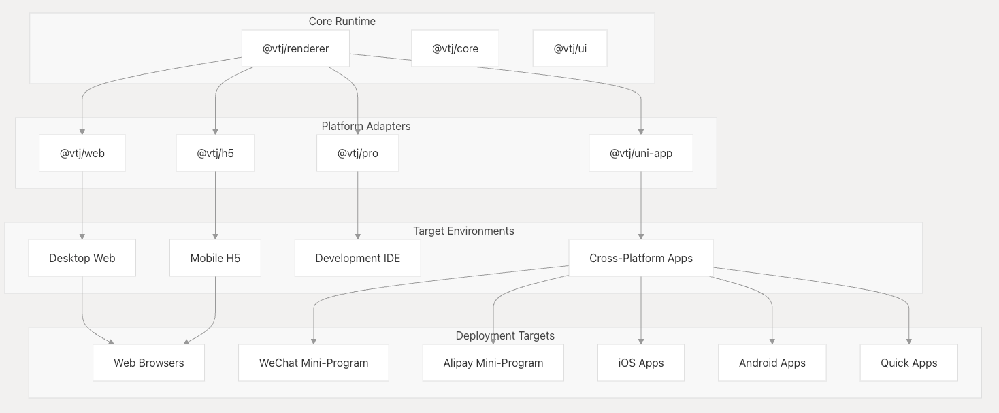
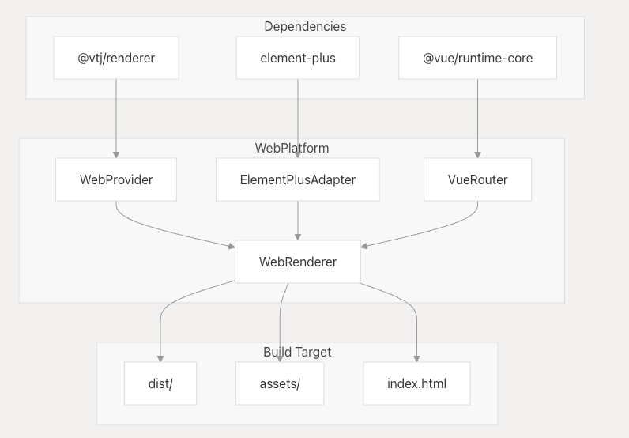
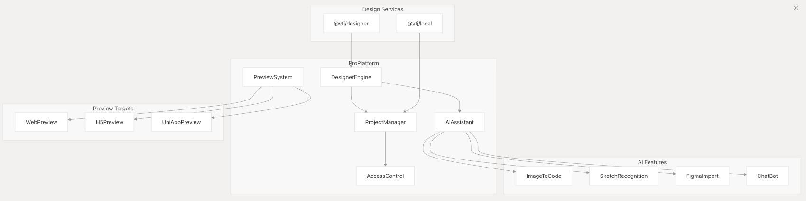
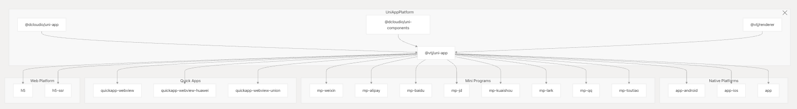
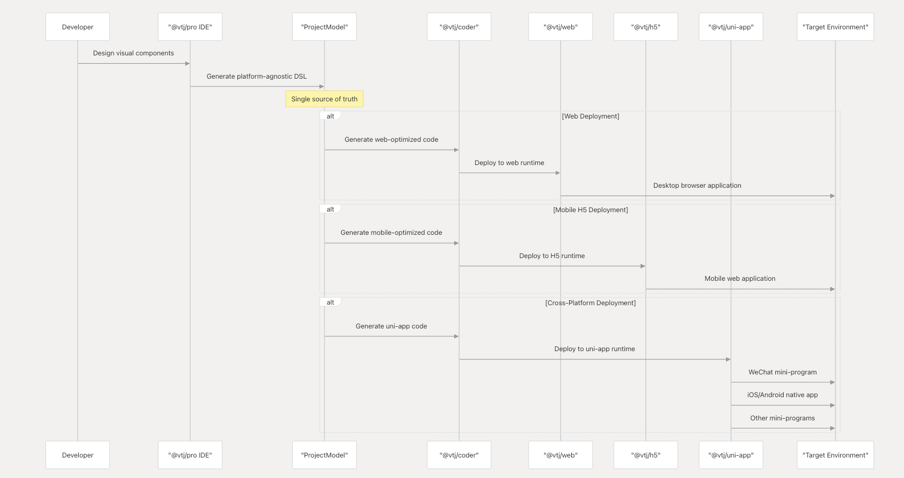
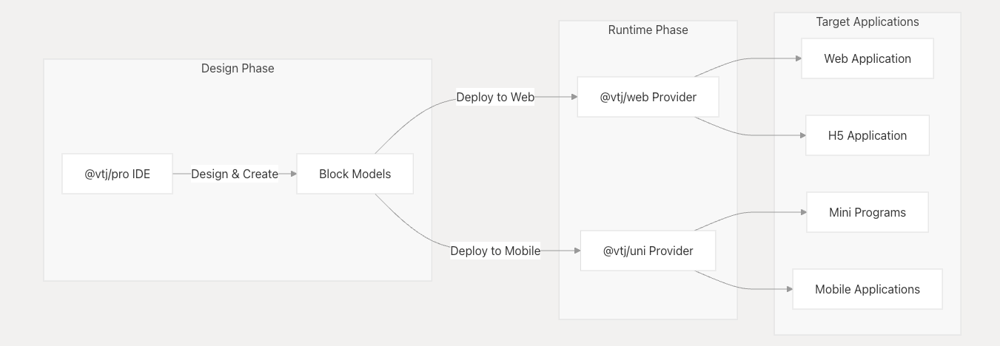

# 平台实施

VTJ 通过针对不同运行时环境的专用平台包提供多平台部署支持。每个平台实施都针对特定部署场景优化了低代码运行时，同时保持了统一的开发体验。

## 平台架构概述

VTJ 平台生态系统由四个主要实施组成：



VTJ 提供全面的多平台部署支持，涵盖 Web、移动和跨平台环境。平台层将低代码设计转换为针对每个目标运行时的优化应用程序。

## 完整的平台矩阵

VTJ 支持通过专用适配器部署到多个平台类别：

| 平台包       | 目标环境        | 主要用例                              |
| ------------ | --------------- | ------------------------------------- |
| @vtj/web     | 桌面 Web        | 使用 Element Plus 的标准 Web 应用程序 |
| @vtj/h5      | 移动网页        | 针对移动设备优化的 H5 应用程序        |
| @vtj/pro     | 开发环境        | 可视化设计师和 IDE                    |
| @vtj/pro-uni | 专业版 + 跨平台 | 带 Uni-App 预览的专业 IDE             |
| @vtj/uni-app | 跨平台应用程序  | 原生应用和小程序                      |

### Web 平台

`@vtj/Web` 平台面向具有完整 Element Plus 集成的桌面 Web 浏览器。它为 VTJ 应用程序提供标准的 Web 运行时。

### 平台配置



### 主要特点

- Element Plus UI 框架集成
- element-plus-admin 模板支持（在 v0.9.10 中添加）
- SCSS 现代编译器支持（在 v0.9.0-alpha.0 中添加）
- 删除 VXE 表组件以优化构建 （v0.8.141）
- 自动更新功能（在 v0.8.161 中添加）

## H5 移动平台

`@vtj/h5` 平台通过支持触摸的界面和特定于移动设备的功能，为移动 Web 环境优化了 VTJ 应用程序。

### 移动优化功能

- 移动优先的响应式设计
- 触控手势支持
- 移动 UI 框架集成 （Vant）
- 针对移动网络优化的捆绑包大小
- H5 协议支持（v0.9.16 引入）

## 设计器平台

`@vtj/pro` 平台充当全面的 IDE 和设计环境，将可视化设计工具与多平台预览功能相结合。

### IDE 架构



### AI 驱动的功能

- 具有自然语言处理功能的 AI 助手（在 v0.12.0-alpha.0 中添加）
- 图片转代码生成（AI 图生代码，v0.12.8 新增）
- Sketch 和 Figma 元数据识别（v0.12.32 新增）
- AI 对话取消支持（在 v0.12.10 中添加）

### 设计时功能

- 模板管理系统（v0.9.0-alpha.0 新增）
- 路由位置定义（v0.9.0-alpha.0 新增）
- 访问配置支持（v0.8.166 新增）
- 应用增强配置（v0.12.20 新增）
- DevTools 模块集成（v0.8.131 新增）

## 跨平台应用程序

`@vtj/uni-app` 平台可通过 DCloud uni-App 框架部署到多个移动平台和小程序。

### 多平台构建系统

Uni-App 平台支持广泛的部署目标：



### 平台依赖项

| 屬地                     | 版本                   | 目的             |
| ------------------------ | ---------------------- | ---------------- |
| @dcloudio/uni-app        | 3.0.0-4050720250324001 | UniApp 框架核心  |
| @dcloudio/uni-components | 3.0.0-4050720250324001 | 标准零部件库     |
| @dcloudio/uni-h5         | 3.0.0-4050720250324001 | H5 平台适配器    |
| @dcloudio/uni-mp-weixin  | 3.0.0-4050720250324001 | 微信小程序适配器 |
| @dcloudio/uni-ui         | ~1.5.3                 | UI 组件库        |
| @vtj/renderer            | 工作：~                | VTJ 渲染引擎     |
| @vtj/uni-app             | 工作：~                | VTJ UniApp 集成  |

### 构建命令

该平台提供了广泛的构建命令矩阵：

```shell
# Development commands
npm run dev:h5              # H5 development
npm run dev:mp-weixin       # WeChat mini-program
npm run dev:app-android     # Android development
npm run dev:app-ios         # iOS development

# Production builds
npm run build:h5            # H5 production build
npm run build:mp-weixin     # WeChat mini-program build
npm run build:app           # Native app build
```

### 平台检测

该平台包含用于自动平台检测的元数据：

```json
{
  "vtj": {
    "platform": "uniapp"
  }
}
```

## 平台选择和部署流程

多平台部署遵循统一的设计到部署管道：

### 平台部署工作流



### 环境配置

特定于平台的环境配置：

| 环境变量                     | 目的              | 平台        |
| ---------------------------- | ----------------- | ----------- |
| ENV_TYPE=local               | 开发模式          | 所有平台    |
| ENV_TYPE=sit                 | SIT 测试          | 网页， H5   |
| ENV_TYPE=uat                 | UAT 测试          | 网页， H5   |
| ENV_TYPE=live                | 生产              | 所有平台    |
| VITE_CJS_IGNORE_WARNING=true | 禁止显示 CJS 警告 | H5、 UniApp |
| PREVIEW=true                 | 预览模式          | 所有平台    |

## 特定于平台的优化

### Web 平台优化

- **Element Plus 集成** ：原生 Element Plus 组件映射
- **捆绑包优化** ：针对较小版本删除 VXE 表 （v0.8.141）
- **管理员模板**：内置 element-plus-admin 集成 （v0.9.9）
- **构建系统** ：SCSS 现代编译器支持 （v0.9.0-alpha.0）
- **性能** ：实时部署的自动更新机制 （v0.8.161）

### H5 移动优化

- **触摸界面** ：移动优先的组件调整
- **捆绑包大小** ：针对移动网络限制进行了优化
- **移动框架** ：用于移动组件的 Vant UI 集成
- **响应式设计** ：自动视口和缩放调整

### 跨平台优化

- **统一代码库**：单一源代码编译到 15+ 平台
- **平台 API**：每个平台的自动 API 映射
- **原生性能** ：每个目标的平台特定优化
- **小程序合规性**： 每个平台的自动合规性检查

### 专业的 IDE 优化

- **实时预览**：同时跨所有平台进行实时预览
- **AI 增强设计** ：图像到代码和自然语言设计 （v0.12.8）
- **多平台测试** ：针对所有部署目标的集成测试
- **代码生成** ：经过优化的特定于平台的代码输出

## 实施工作流程

下图显示了使用不同平台实施时的典型工作流程：



## 使用注意事项

选择要在项目中使用的平台实现时，请考虑以下事项：

1. 对于标准 Web 应用程序，请使用 @vtj/web
1. 对于移动应用程序和小程序，请使用 @vtj/uni
1. 对于开发和设计环境，请使用 @vtj/pro

平台实施可以单独使用，也可以一起使用，具体取决于您的项目要求。@vtj/pro 环境可以面向 Web 和 uni 平台进行预览和测试。

## 与外部系统集成

平台实现提供了与外部系统集成的各种方法：

- 通过 @vtj/pro 中的访问控制功能进行身份验证和授权系统
- 自定义数据源和 API
- 适用于 Web 应用程序的 Element Plus Admin
- 面向移动应用的 UniApp 生态系统

通过利用这些集成点，VTJ 应用程序可以连接到各种后端系统和数据源，同时保持一致的可视化设计和开发体验。
