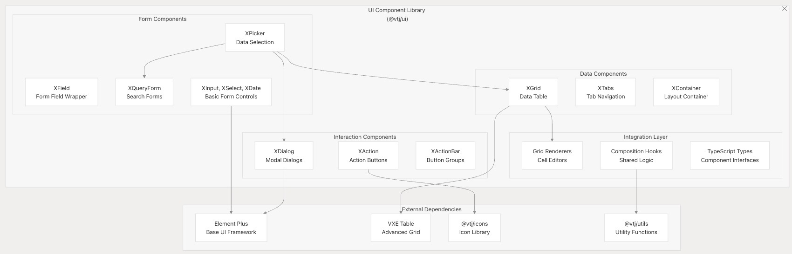
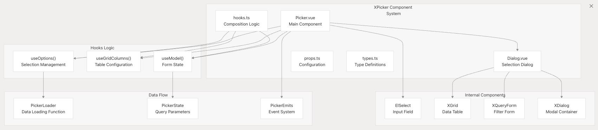
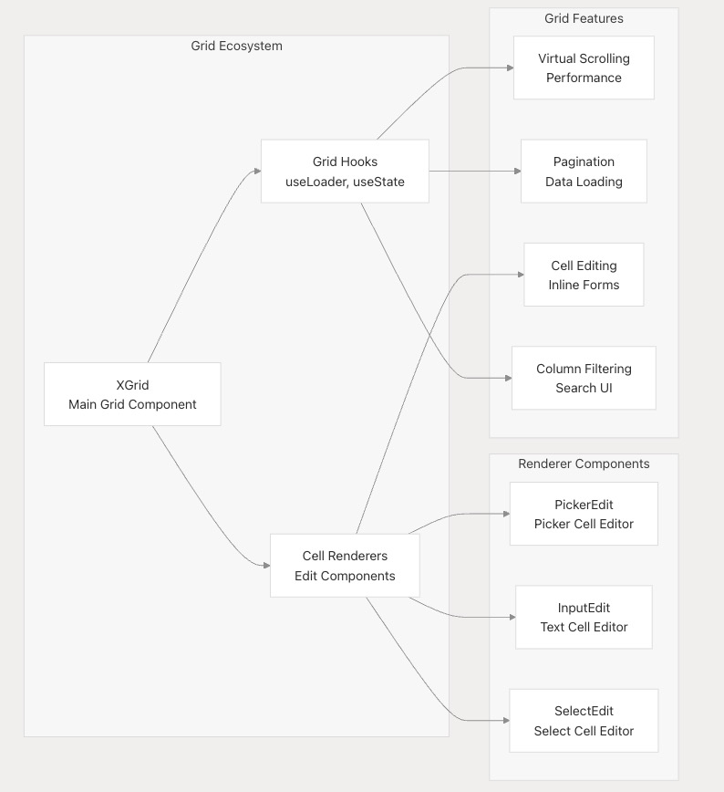
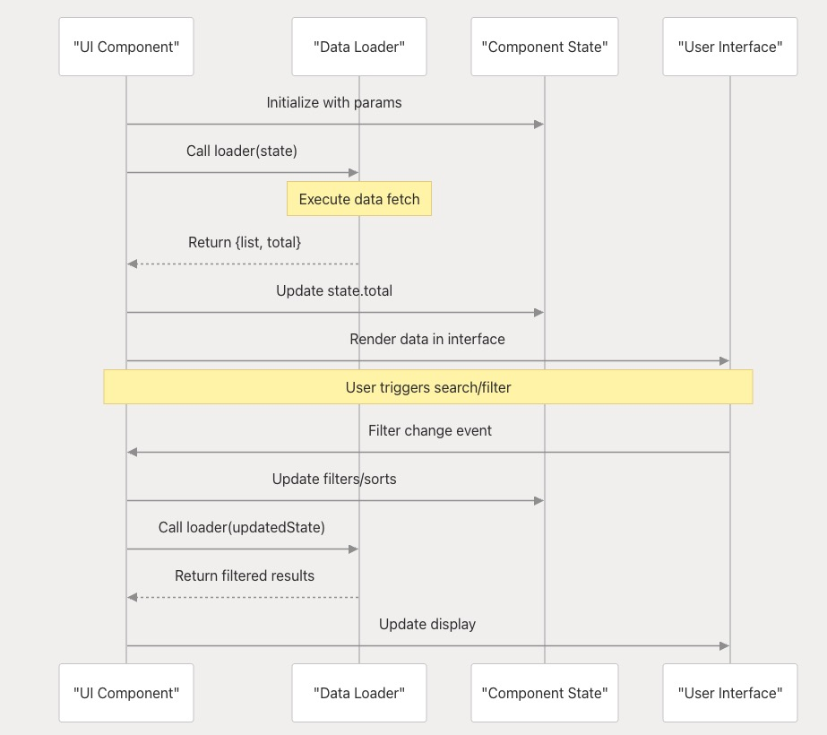
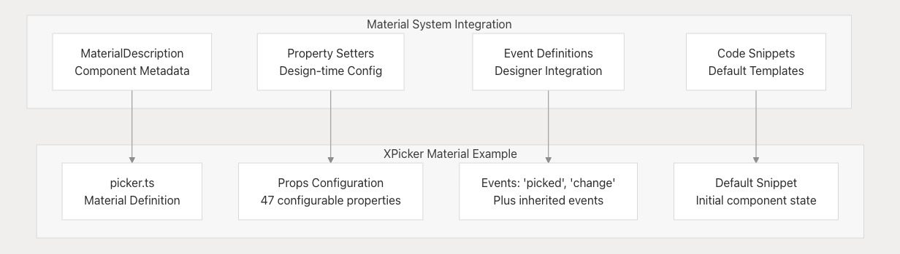

# UI 组件库

`vtj/ui` 包提供了 Vue 3 组件的全面集合，这些组件构成了 VTJ 低代码平台用户界面的基础。该库包括表单控件、数据网格、对话框、布局组件和专用交互式元素，旨在在 VTJ 生态系统中无缝工作。

关于如何将这些组件集成到可视化设计器中的信息，请参阅**设计器和渲染器**文档。关于图表特定组件的详细信息，请参阅**图表和可视化**文档。

## 包架构

UI 组件库组织为一个模块化系统，其中组件可以独立工作或相互集成以创建复杂的用户界面。该包遵循 Vue 3 组合式 API 模式，并提供全面的 TypeScript 支持。

**UI 组件包结构**



## 核心组件类别

### 表单和输入组件

该库提供了一组丰富的表单组件，这些组件使用 VTJ 特定功能扩展了 Element Plus。`XPicker` 组件通过将多个 UI 元素组合到复杂的数据选择界面中，展示了这种方法的典型实现。

**XPicker 组件架构**



`XPicker` 展示了 UI 库的关键设计模式：

| 模式       | 实现方式                                       | 位置                                       |
| ---------- | ---------------------------------------------- | ------------------------------------------ |
| 组合式 API | 使用 useOptions、useGridColumns、useModel 钩子 | packages/ui/src/components/picker/hooks.ts |
| 类型安全   | 全面的 TypeScript 接口                         | packages/ui/src/components/picker/types.ts |
| 事件系统   | 具有有效负载类型的结构化事件定义               | packages/ui/src/components/picker/types.ts |
| 属性验证   | 详细的类型化属性定义                           | packages/ui/src/components/picker/props.ts |

### 数据显示组件

`XGrid` 组件作为主要数据显示组件，与 VXE 表格集成以提供高级网格功能，包括虚拟滚动、编辑、筛选和分页。

**与 UI 组件的网格集成**



### 对话框和模态组件

`XDialog` 组件提供了整个 UI 库中使用的模态基础，确保一致的样式和行为模式。

## 组件集成模式

### 数据加载模式

`XPicker` 和 `XGrid` 等组件使用加载器函数实现标准化的数据加载模式：

```ts
// 来自类型的加载器函数接口
type PickerLoader = (params: PickerState) => Promise<{
  list: any[];
  total: number;
}>;
```

**数据加载流程**



### 事件系统模式

组件使用具有类型化有效负载的一致事件模式：

| 组件       | 关键事件              | 有效负载类型            |
| ---------- | --------------------- | ----------------------- |
| XPicker    | change, picked        | [value: any, data: any] |
| XGrid      | loaded, cell-dblclick | 特定于网格的事件类型    |
| XQueryForm | submit                | 表单模型数据            |

### 样式与主题

组件使用 SCSS 结合 BEM 方法和 CSS 自定义属性实现主题化：

```css
@include b(picker) {
  .el-select__popper {
    display: none !important;
  }
  .x-picker__tigger {
    background: var(--el-fill-color);
    border-radius: 4px;
    /* ... 响应式尺寸 */
  }
}
```

## 物料系统集成

UI 组件与 VTJ 物料系统集成，支持在可视化设计器中使用。每个组件都有相应的物料描述，定义其属性、事件和配置选项。

**组件物料结构**



物料系统允许从组件面板拖放组件，并在设计器中直观配置。

## 使用示例

### 基础 XPicker 实现

```vue
<XPicker
  v-model="selectedValue"
  :columns="gridColumns"
  :fields="searchFields"
  :loader="dataLoader"
  value-key="id"
  label-key="name"
  query-key="name"
  @picked="onDataPicked"
  @change="onValueChange" />
```

### 带格式化的高级多选实现

```vue
<XPicker
  v-model="multipleValues"
  multiple
  append
  raw
  :formatter="valueParser"
  :value-formatter="valueSerializer"
  :columns="columns"
  :fields="fields"
  :loader="asyncLoader" />
```

UI 组件库为在 VTJ 生态系统中构建复杂的用户界面提供了强大基础，并为数据处理、事件管理和可视化集成提供了一致的模式。
