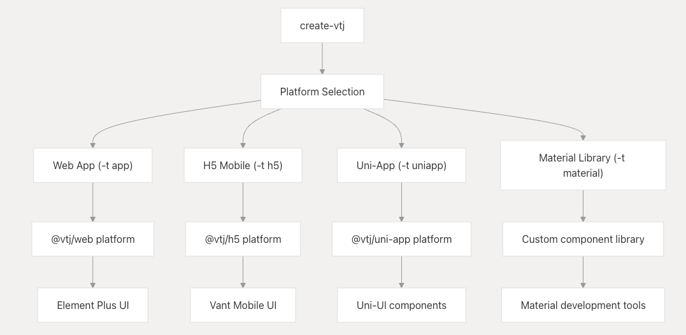
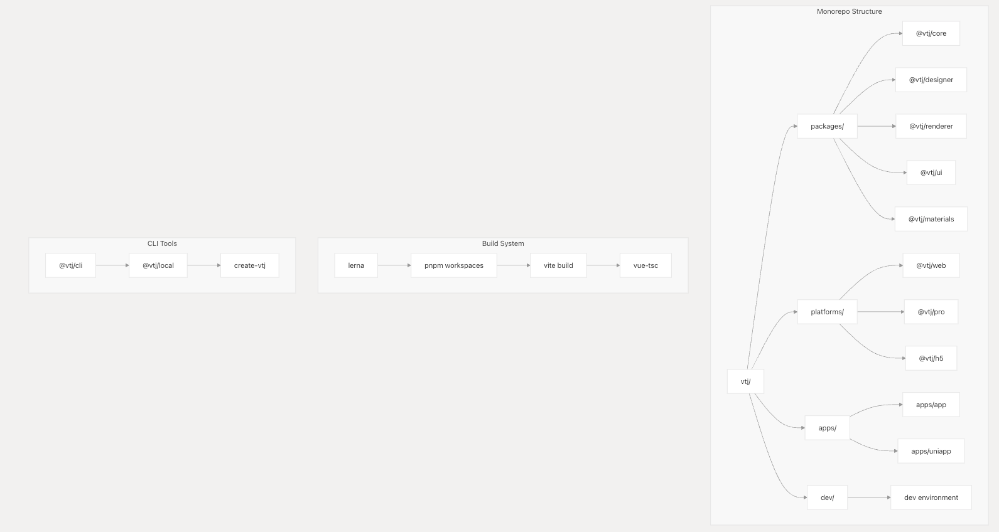
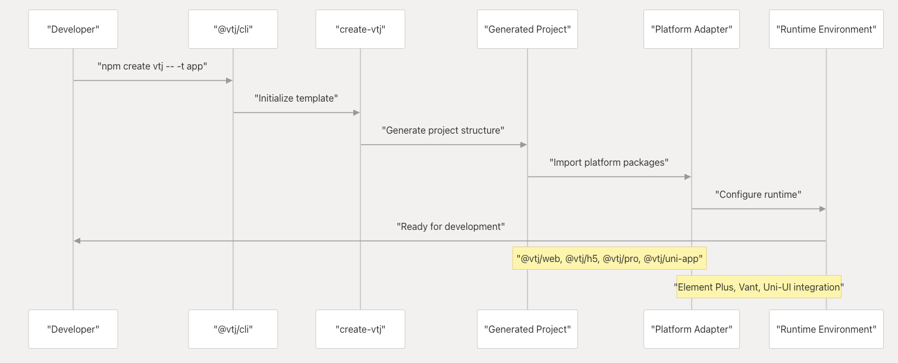

# 开始使用 VTJ

本文档提供了在开发工作流程中设置、配置和使用 VTJ 的实用指南，涵盖了使用脚手架工具创建初始项目、环境设置和基本集成模式。

关于核心架构和引擎组件的详细信息，请参阅**核心架构**文档。关于特定平台的部署指南，请参阅**平台实现**文档。关于高级开发和插件创建的信息，请参阅**开发者工具和可扩展性**文档。

## 先决条件与系统要求

VTJ 需要特定的开发环境配置才能正常运行：

- **Node.js**：版本 20.0.0 或更高（推荐使用以确保最佳兼容性）
- **包管理器**：pnpm（推荐）和 lerna，用于 monorepo 开发
- **Vue.js**：支持 TypeScript 的 3.5.5+ 版本
- **构建工具**：Vite（用于构建过程）

```shell
# 安装所需的全局依赖
npm install -g lerna@latest pnpm@latest --registry=https://registry.npmmirror.com
```

## 使用脚手架创建项目

VTJ 通过 create-vtj 提供全面的脚手架系统，可生成特定于平台的项目模板：

### 脚手架命令结构



### 可用模板

| 模板类型    | 命令参数    | 目标平台    | UI 框架      |
| ----------- | ----------- | ----------- | ------------ |
| Web 应用    | -t app      | 桌面/PC Web | Element Plus |
| H5 移动应用 | -t h5       | 移动 Web    | Vant         |
| UniApp      | -t uniapp   | 跨平台      | Uni-UI       |
| 物料库      | -t material | 组件开发    | 可配置       |

### 创建项目命令

```shell
# Web 应用（PC 桌面）
npm create vtj@latest --registry=https://registry.npmmirror.com -- -t app

# H5 移动应用
npm create vtj@latest --registry=https://registry.npmmirror.com -- -t h5

# 跨平台 UniApp
npm create vtj@latest --registry=https://registry.npmmirror.com -- -t uniapp

# 物料/组件库
npm create vtj@latest --registry=https://registry.npmmirror.com -- -t material
```

## 开发环境设置

### 本地开发设置

要参与 VTJ 开发或进行深度定制，请设置完整的开发环境：

```shell
# 克隆仓库
git clone https://gitee.com/newgateway/vtj.git
cd vtj

# 初始化并构建
npm run setup && npm run build && npm run app:dev
```

### 开发环境架构



### 开发命令参考

| 命令            | 目的           | 使用场景     |
| --------------- | -------------- | ------------ |
| npm run setup   | 初始化依赖项   | 首次设置     |
| npm run build   | 构建所有包     | 设置或更改后 |
| npm run app:dev | 启动开发服务器 | 开发工作流程 |
| npm run clean   | 清理构建产物   | 重置环境     |

## 集成模式

### 平台集成架构



### 基本项目结构

生成的 VTJ 项目遵循以下结构：

```
project-root/
├── src/
│   ├── main.ts              # 应用入口点
│   ├── App.vue              # 根组件
│   └── components/          # 自定义组件
├── public/                  # 静态资源
├── package.json             # 依赖项和脚本
├── vite.config.ts           # 构建配置
└── vtj.config.js            # VTJ 特定配置
```

### 生成项目中的核心依赖项

| 包            | 目的           | 集成点   |
| ------------- | -------------- | -------- |
| @vtj/web      | Web 平台运行时 | 主应用   |
| @vtj/renderer | 组件渲染       | 模板引擎 |
| @vtj/ui       | UI 组件库      | 设计系统 |
| @vtj/icons    | 图标库         | 视觉元素 |
| @vtj/utils    | 实用函数       | 辅助方法 |

## 配置与定制

VTJ 平台支持通过 `package.json` 中的 `vtj` 字段进行配置：

```json
{
  "vtj": {
    "name": "VTJ.PRO",
    "platform": "web",
    "remote": "https://lcdp.vtj.pro"
  }
}
```

### 环境变量

| 变量       | 目的         | 默认值 |
| ---------- | ------------ | ------ |
| ENV_TYPE   | 环境类型     | local  |
| UMD        | UMD 构建标志 | false  |
| BUILD_TYPE | 构建目标     | -      |

### 开发工作流程

1. **项目创建**：使用 create-vtj 配合合适的模板
2. **开发**：运行 npm run dev 启动本地开发服务器
3. **构建**：使用 npm run build 进行生产构建
4. **集成**：导入 VTJ 组件并使用设计器/渲染器

## 后续步骤

设置 VTJ 项目后：

1. **探索设计器**：访问可视化设计器界面进行拖放式开发
2. **组件库**：浏览可用的 UI 组件和物料
3. **AI 功能**：利用 AI 驱动的代码生成功能
4. **平台部署**：为目标部署平台进行配置

关于项目设置和脚手架的详细指南，请参阅**项目设置与脚手架**文档。关于与现有项目的集成，请参阅**集成指南**文档。
