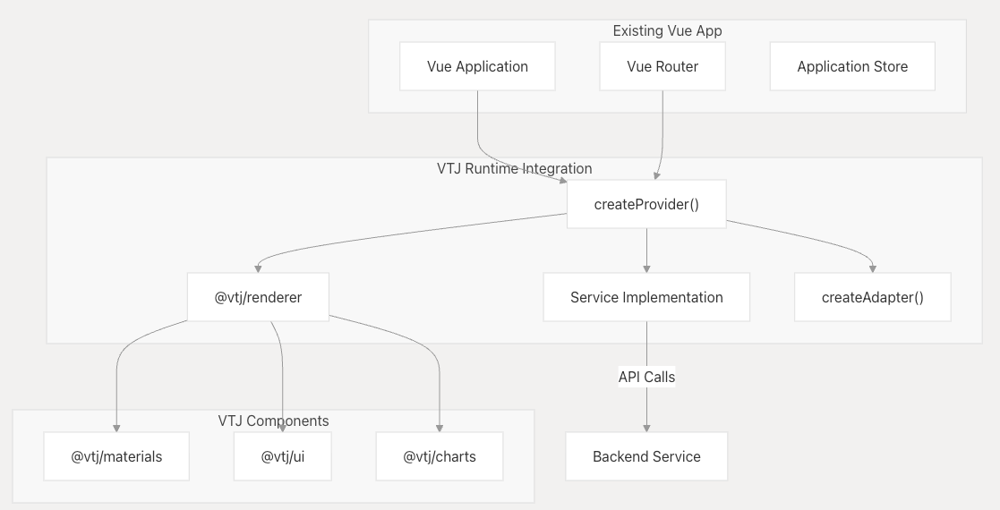
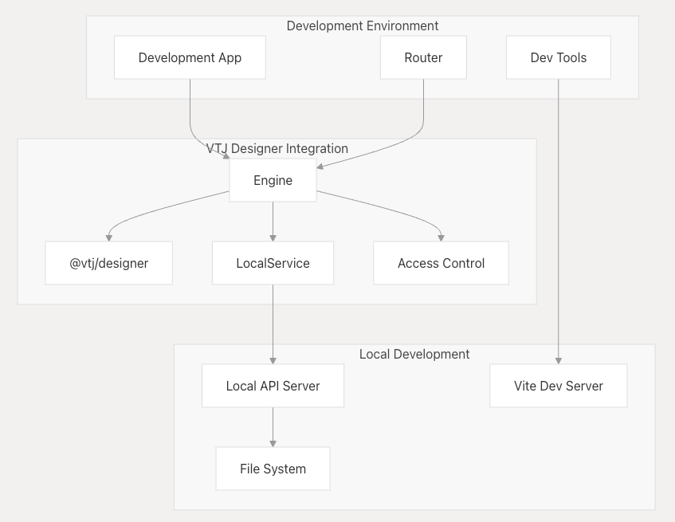
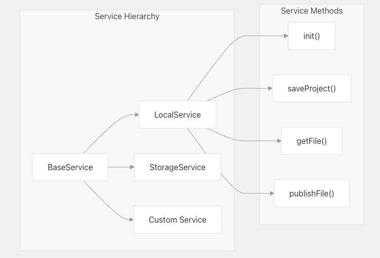
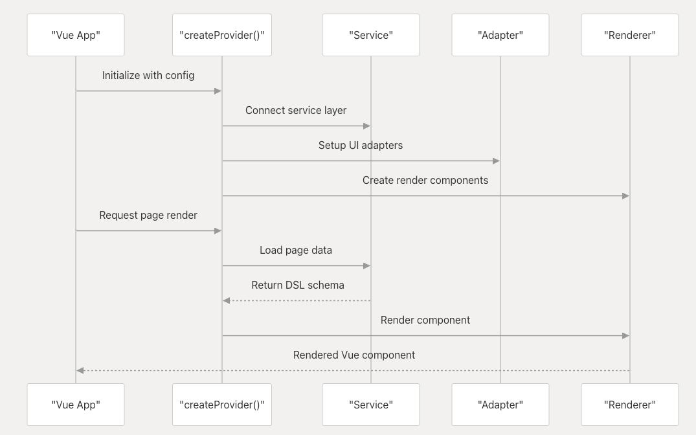
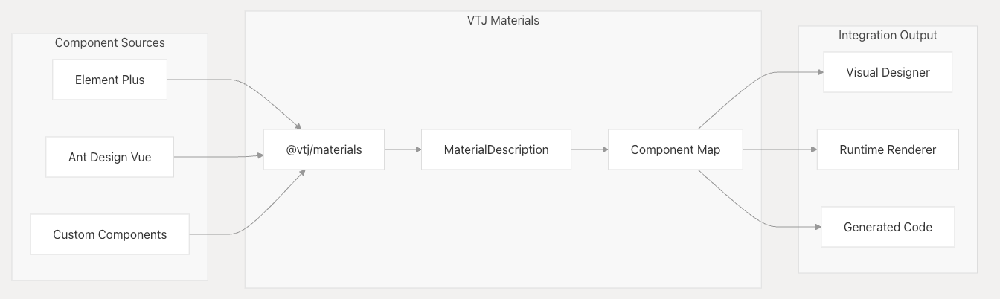

# 集成指南

本文档介绍如何将 VTJ 组件和工具集成到现有的 Vue.js 项目和开发工作流程中，涵盖嵌入 VTJ 低代码功能的不同集成方法、服务配置、身份验证设置和特定于平台的注意事项。

关于项目设置的完整指南，请参阅 **项目设置与脚手架**文档。关于集成过程中的 AI 增强功能，请参阅 **AI 集成**文档。

## 集成方法

VTJ 提供两种主要集成模式：**运行时集成**（用于在生产应用程序中呈现低代码内容）和**设计时集成**（用于将可视化设计器嵌入到开发工具中）。

### 运行时集成架构



**运行时集成**允许现有的 Vue 应用程序渲染使用 VTJ 低代码设计器创建的页面和组件。该集成使用 `createProvider()` 建立运行时上下文，并使用 `@vtj/renderer` 来显示低代码内容。

### 设计时集成架构



**设计时集成**将 VTJ 可视化设计器嵌入到开发环境中，允许开发人员在其现有开发工作流程中创建和编辑低代码内容。

## 服务层集成

服务层提供 VTJ 组件和后端系统之间的接口。VTJ 包含多个可扩展或替换的服务实现。

### 基础服务配置



`BaseService` 类为所有服务实现提供了基础。要与现有后端集成，请实现以下方法：

| 服务方法       | 目的           | 需要实现的功能      |
| -------------- | -------------- | ------------------- |
| getExtension() | 加载平台配置   | 返回 VTJConfig 对象 |
| init()         | 初始化项目数据 | 从存储加载项目架构  |
| saveProject()  | 保存项目更改   | 保存到后端/文件系统 |
| publishFile()  | 生成产品代码   | 部署生成的 Vue 文件 |

### 自定义服务实现

要与现有后端集成，请扩展 `BaseService` 类：

```ts
// 自定义服务集成示例
export class MyBackendService extends BaseService {
  async init(project: ProjectSchema): Promise<ProjectSchema> {
    // 从数据库加载项目
    return await this.api('myBackend/projects', project);
  }

  async saveProject(project: ProjectSchema): Promise<boolean> {
    // 保存到存储系统
    return await this.api('myBackend/save', project);
  }
}
```

该服务通过 `packages/local/src/shared.ts` 中定义的标准化 API 格式进行通信。

## 提供者与适配器配置

提供者/适配器模式允许 VTJ 与不同的 Vue 应用程序架构和 UI 框架集成。

### 提供者设置流程



### 适配器配置

适配器系统将 VTJ 与现有的 UI 组件和实用程序连接起来：

| 适配器属性 | 目的            | 示例实现                    |
| ---------- | --------------- | --------------------------- |
| request    | HTTP 客户端集成 | Axios、fetch 包装器         |
| loading    | 加载指示器      | Element Plus ElLoading      |
| notify     | 通知系统        | Element Plus ElNotification |
| useTitle   | 页面标题管理    | Vue 的 useTitle 钩子        |
| access     | 认证系统        | 自定义访问类                |

```ts
const adapter = createAdapter({
  loading: () => ElLoading.service(),
  notify: (msg: string) => ElNotification.error(msg),
  useTitle,
  alert: (msg: string) => ElMessageBox.alert(msg),
  access: {
    authKey: 'Authorization',
    storageKey: 'MY_APP_ACCESS'
  }
});
```

## 访问控制集成

VTJ 包含一个可与现有认证机制集成的综合访问控制系统。

### 访问控制架构


### 访问配置

`Access` 类提供认证和授权功能：

| 配置项       | 目的               | 默认值           |
| ------------ | ------------------ | ---------------- |
| authKey      | 认证头名称         | 'Authorization'  |
| storageKey   | 本地存储键名       | "ACCESS_STORAGE" |
| session      | 基于会话的认证     | false            |
| whiteList    | 无需认证的路由列表 | 已定义           |
| unauthorized | 未授权重定向路径   | 已定义           |

```ts
const access = createAccess({
  authKey: 'Bearer',
  storageKey: 'MY_APP_TOKEN',
  session: true,
  auth: '/login',
  unauthorized: '/403',
  alert: (msg) => ElMessage.error(msg)
});
```

### 权限集成

VTJ 支持对页面和组件进行基于角色的访问控制：

```ts
// 在组件中检查权限
const access = useAccess();
const canEdit = access?.can('page.edit');
const canPublish = access?.some(['admin', 'publisher']);

// 路由级权限检查
router.beforeEach((to, from, next) => {
  if (access?.can(to.params.id)) {
    next();
  } else {
    next('/unauthorized');
  }
});
```

## 特定平台集成

VTJ 支持具有特定集成要求的多个部署平台。

### 平台集成矩阵

| 平台    | 包           | 主要特性      | 集成说明            |
| ------- | ------------ | ------------- | ------------------- |
| Web     | @vtj/web     | 桌面应用      | 标准 Vue.js 集成    |
| 移动 H5 | @vtj/h5      | 移动 Web 应用 | 触摸优化组件        |
| UniApp  | @vtj/uni-app | 跨平台应用    | 小程序兼容性        |
| 专业版  | @vtj/pro     | 企业级功能    | 设计器 + 运行时组合 |

### Web 平台集成

```ts
import { createApp } from 'vue';
import VTJWeb from '@vtj/web';
import { createProvider } from '@vtj/renderer';

const app = createApp(App);
app.use(VTJWeb);

const provider = createProvider({
  mode: ContextMode.Runtime,
  service: new MyService(),
  adapter: createAdapter(adapterOptions)
});

app.use(provider);
```

### UniApp 平台集成

对于跨平台应用，VTJ 提供了专门的 UniApp 集成：

```ts
import VTJUni from '@vtj/uni-app';
import { createProvider } from '@vtj/renderer';

// UniApp 特定配置
const provider = createProvider({
  mode: ContextMode.Runtime,
  service: new UniService(),
  dependencies: {
    Vue: () => import('vue'),
    VueRouter: () => import('vue-router')
  }
});
```

## 物料与组件集成

VTJ 的物料系统允许集成现有组件库和自定义组件。

### 物料集成流程



### 物料配置

物料描述定义了组件在设计器中的显示方式及其渲染行为：

```ts
// 物料集成示例
const materials = new Map([
  [
    'MyButton',
    {
      title: '自定义按钮',
      component: 'MyButton',
      props: {
        type: { type: 'String', default: 'primary' },
        size: { type: 'String', default: 'default' }
      },
      slots: ['default'],
      events: ['click']
    }
  ]
]);

await service.saveMaterials(project, materials);
```

### 组件库集成

VTJ 为流行的组件库提供预构建的物料集：

| 库           | 构建目标           | 包含的组件       |
| ------------ | ------------------ | ---------------- |
| Element Plus | BUILD_TYPE=element | 表单、表格、导航 |
| Ant Design   | BUILD_TYPE=antdv   | 企业级组件       |
| Vant         | BUILD_TYPE=vant    | 移动组件         |
| Uni-UI       | BUILD_TYPE=uniUI   | 跨平台组件       |

## 配置示例

### 完整集成示例

```ts
// main.ts - 完整的 VTJ 集成示例
import { createApp } from 'vue';
import { createRouter, createWebHistory } from 'vue-router';
import { createProvider, ContextMode } from '@vtj/renderer';
import { createAdapter, createAccess } from '@vtj/pro';
import MyCustomService from './services/MyCustomService';

const app = createApp(App);
const router = createRouter({
  history: createWebHistory(),
  routes: [{ path: '/page/:id', component: VTJPage, name: 'page' }]
});

// 配置 VTJ 集成
const service = new MyCustomService();
const access = createAccess({
  authKey: 'Authorization',
  auth: '/login',
  unauthorized: '/403'
});

const adapter = createAdapter({
  loading: () => ElLoading.service(),
  notify: (msg) => ElNotification.error(msg),
  access: { session: true }
});

const provider = createProvider({
  mode: ContextMode.Runtime,
  service,
  adapter,
  dependencies: {
    Vue: () => import('vue'),
    VueRouter: () => import('vue-router')
  }
});

app.use(router);
app.use(provider);
app.mount('#app');
```
