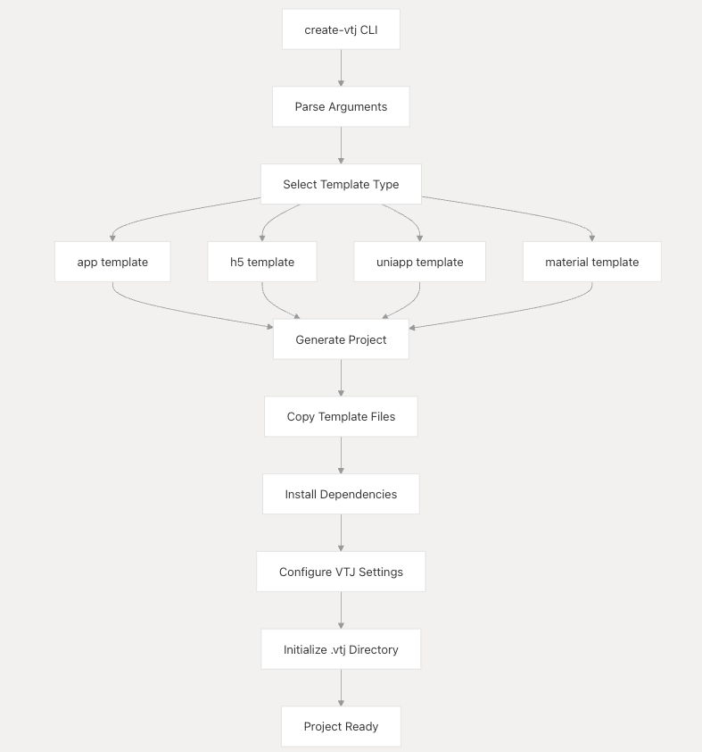
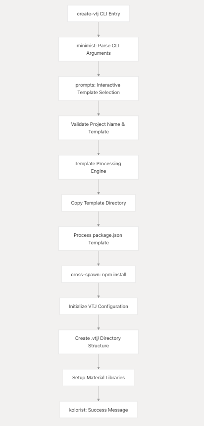
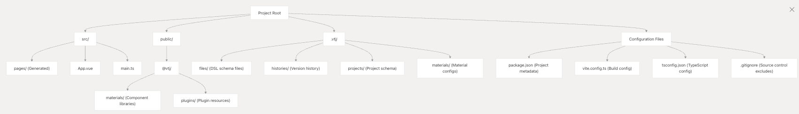
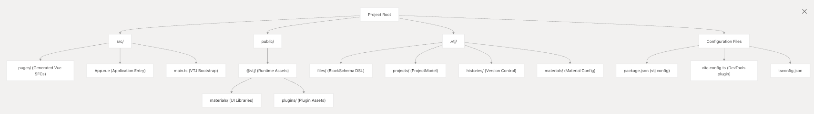
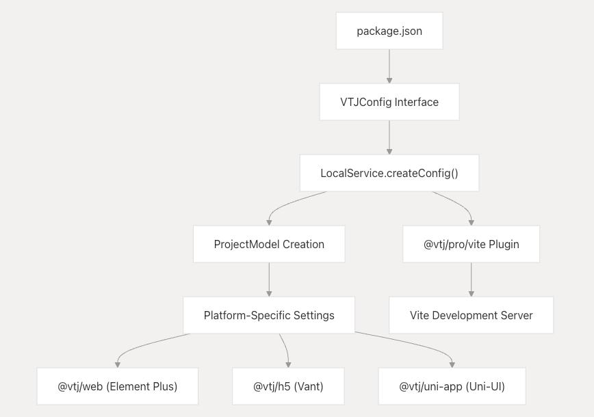
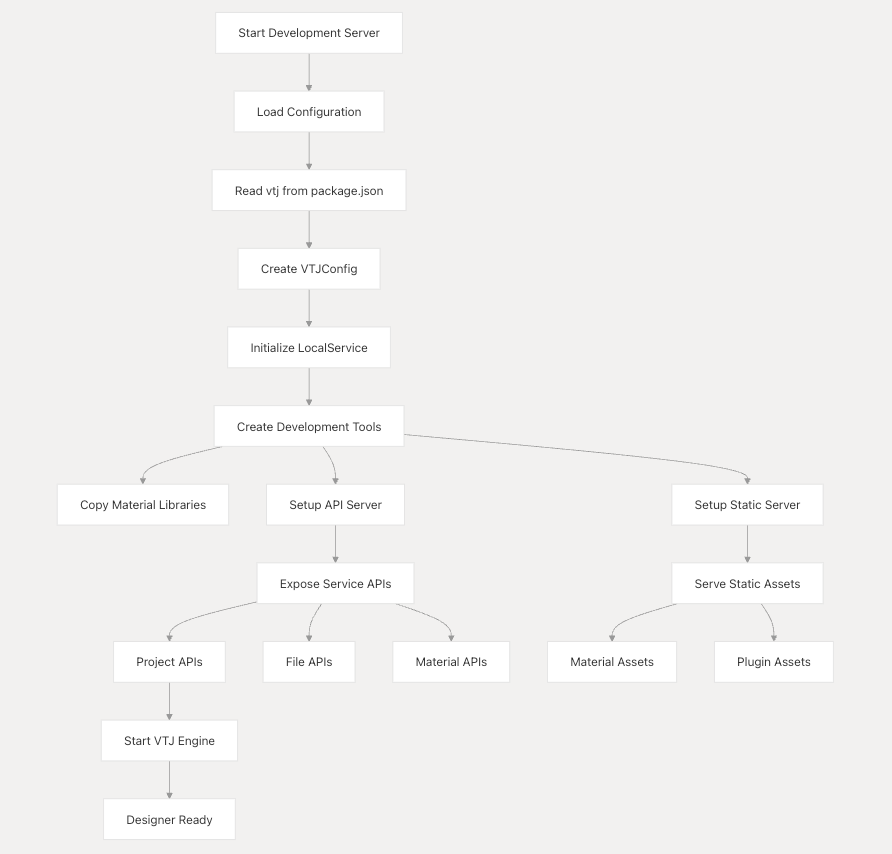
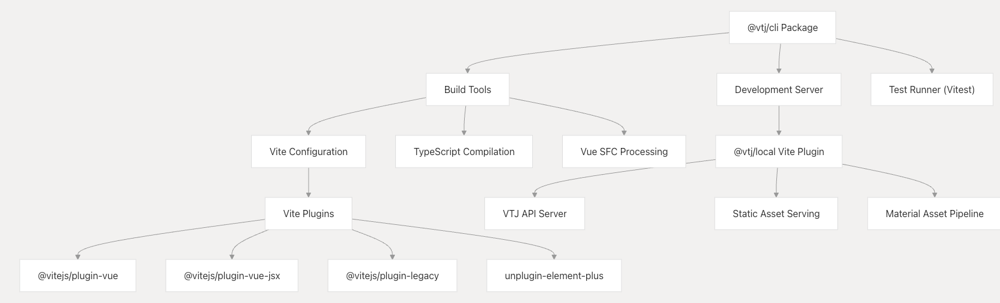
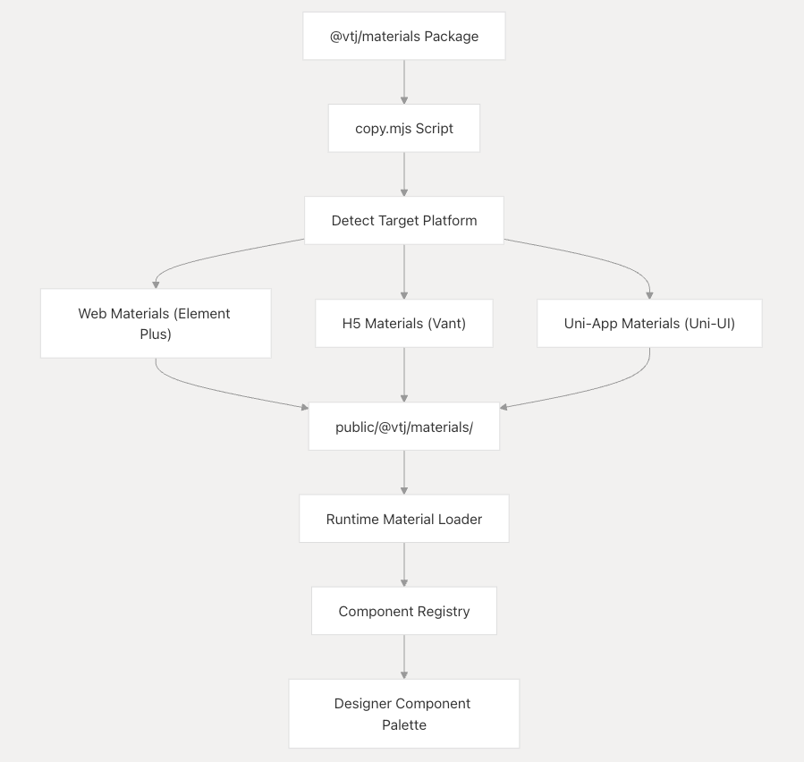
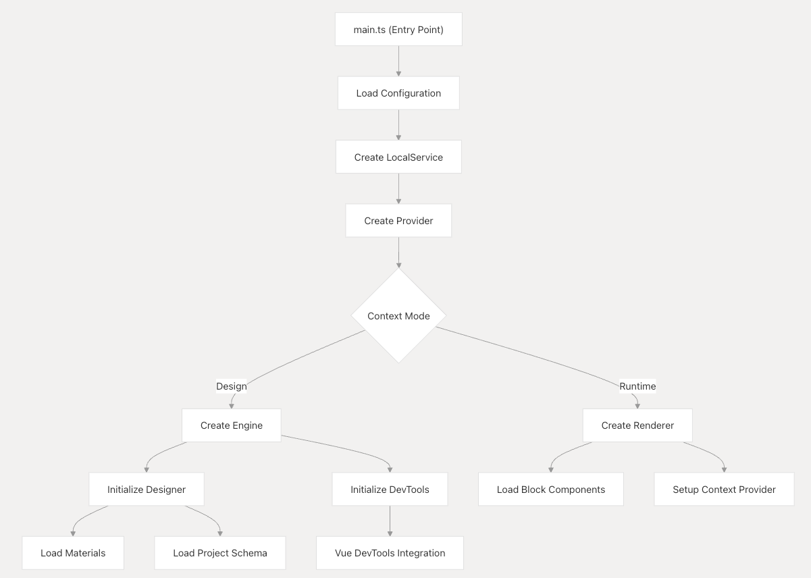
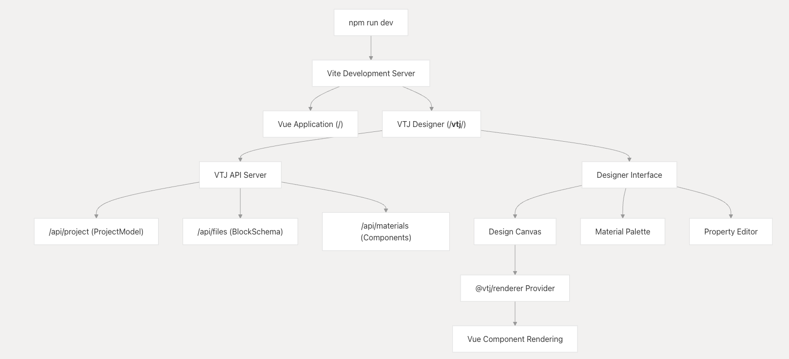

# 项目设置和基架

本文档提供了使用内置基架系统创建新的 VTJ 项目的详细说明。它涵盖了 `create-vtj` 脚手架工具、项目模板、开发环境设置和生成的项目结构。有关将 VTJ 集成到现有 Vue 项目中的信息，请参见第 6.2 页。

## 开发环境要求

VTJ 使用最新的 Vue 3 生态，对您的开发环境有特定的要求：

```
Node.js v20+ (recommended to use nvm for Node version management)
lerna and pnpm package managers

```

使用以下方法安装所需的全局软件包：

```shell
npm install -g lerna@latest pnpm@latest --registry=https://registry.npmmirror.com
```

## create-vtj 脚手架系统

VTJ 提供了 `create-vtj` 基架工具，该工具可从预定义的模板生成新项目。该工具作为独立包实现，用于处理项目初始化、依赖项管理和模板处理。

### 可用的项目模板

| 模板类型        | 命令                                 | 目标平台                     | 描述                  |
| --------------- | ------------------------------------ | ---------------------------- | --------------------- |
| Web 应用程序    | npm create vtj@latest -- -t app      | PC 桌面 Vue 3 + Element Plus |
| H5 移动应用程序 | npm create vtj@latest -- -t h5       | 移动网页                     | Vue 3 + Vant 用户界面 |
| Uni-App 跨平台  | npm create vtj@latest -- -t uniapp   | iOS/Android/小程序           | Uni-App 框架          |
| 材料库          | npm create vtj@latest -- -t material | 组件开发                     | 自定义组件库          |

### 脚手架工具架构



create-vtj 包使用 cross-spawn、kolorist、minimist 和 prompts 进行交互式项目创建和进程管理。

## 脚手架流程及模板系统

### reate-vtj CLI 实现

`create-vtj` 包实现了一个交互式 CLI，可指导用户完成项目创建：



### 模板到应用程序的映射

脚手架系统将模板映射到 monorepo 中的实际应用程序示例：

| 模板     | 源应用程序    | 关键依赖项                         |
| -------- | ------------- | ---------------------------------- |
| app      | apps/app      | @vtj/web、element-plus、vue-router |
| h5       | apps/h5       | @vtj/h5、vant、vue-router          |
| uniapp   | apps/uniapp   | @vtj/uni-app、@dcloudio/uni-app    |
| material | apps/material | @vtj/core, element-plus            |

### 脚手架后初始化

复制模板后，VTJ 系统执行运行时初始化：

- **LocalService**：从 @vtj/local 包创建 LocalService 实例
- **ProjectModel**：使用 @vtj/核心数据结构初始化项目架构
- **MaterialManager**：从 Fabric/Materials 加载组件库 @vtj
- **DevTools** 集成 ：从 @vtj/pro/vite 设置 Vite 插件
- **Asset Pipeline**：将材质复制到 public/@vtj/ 目录

## 项目结构

### 标准项目结构



### VTJ 项目目录结构



### 主要目录功能

- **src/pages/**： 包含使用 @vtj/coder 包从 DSL 生成的 Vue SFC
- **public/@vtj/materials/**：@vtj/materials 包中的运行时资源
- **.vtj/files/**：表示低代码组件的 BlockSchema JSON 文件
- **.vtj/projects/**：由 @vtj/core 管理的 ProjectModel 配置
- **.vtj/histories/**：由 Designer 维护的版本历史记录

### .gitignore 配置

建议从版本控制中排除某些 VTJ 目录，以避免使存储库膨胀：

```
# VTJ
.vtj/histories
```

## 配置

### package.json 中的基本配置

package.json 中的 vtj 部分提供了 VTJ 项目的基本配置：

```json
{
  "vtj": {
    "id": "your-project-id",
    "name": "Your Project Name",
    "description": "Project description",
    "platform": "web", // or "h5", "uniapp"
    "history": "hash", // or "web"
    "base": "/",
    "pageRouteName": "page", // or "pages" for uniapp
    "plugins": [] // Additional plugins
  }
}
```

### VTJ 配置架构

脚手架系统在 package.json 中生成具有 vtj 配置的项目：

```json
{
  "vtj": {
    "id": "project-id",
    "name": "Project Name",
    "description": "Project description",
    "platform": "web", // "h5" | "uniapp"
    "history": "hash", // "web"
    "base": "/",
    "pageRouteName": "page", // "pages" for uniapp
    "remote": "https://lcdp.vtj.pro",
    "checkVersion": true
  }
}
```

### 配置处理管道



LocalService 类处理配置并根据平台设置创建适当的平台适配器。

### 配置流程



## VTJ CLI 和构建系统

### @vtj/cli 包体系结构

@vtj/cli 包提供了核心构建工具和开发工具：



### 生成的 Vite 配置

基架使用 VTJ DevTools 插件创建 vite.config.ts：

```ts
import { defineConfig } from 'vite';
import vue from '@vitejs/plugin-vue';
import { createDevTools } from '@vtj/pro/vite';

export default defineConfig({
  plugins: [
    vue(),
    createDevTools() // VTJ Development Tools
  ]
});
```

### CLI 包依赖项

@vtj/cli 包包括全面的构建工具

| 依赖项类别   | 关键包                                      |
| ------------ | ------------------------------------------- |
| 构建工具     | vite、typescript、vue-tsc、sass             |
| Vue 生态系统 | @vitejs/plugin-vue， @vitejs/plugin-vue-jsx |
| 测试         | vitest、@vitest/coverage-v8、jsdom          |
| 代码处理     | @babel/core、terser、rollup                 |
| VTJ 集成     | @vtj/节点 、serve-static、body-parser       |

## 依赖项管理

## 依赖管理和 Material System

### 特定于平台的依赖项矩阵

基架系统根据目标平台配置不同的依赖项集：

| 平台         | 核心 VTJ 软件包                       | UI 框架          | 其他依赖项                      |
| ------------ | ------------------------------------- | ---------------- | ------------------------------- |
| Web 应用程序 | @vtj/web、@vtj/core、@vtj/renderer    | element-plus     | @vtj/图表 、@vtj/图标 、@vtj/UI |
| H5 移动版    | @vtj/h5、@vtj/核心 、@vtj/渲染器      | vant             | @vtj/utils                      |
| 宇航 App     | @vtj/uni-app、@vtj/renderer、@vtj/uni | @dcloudio/uni-ui | @dcloudio/uni-\* 平台           |
| 材料         | @vtj/核心 、@vtj/专业版 、@vtj/Web    | element-plus     | @vueuse/core                    |

### Material Asset Pipeline



### Monorepo 包依赖项

基架项目使用 pnpm-lock.yaml 中的 workspace：~ 协议引用工作区包：

```yaml
dependencies:
  '@vtj/web':
    specifier: workspace:~
    version: link:../../platforms/web
  '@vtj/renderer':
    specifier: workspace:~
    version: link:../../packages/renderer
```

这支持本地开发，并在整个 monorepo 中立即更新软件包。

### 添加自定义依赖项

您可以通过 Designer 界面添加自定义依赖项，这将更新项目架构。依赖项在运行时从 materials 目录加载。

## 运行时配置

## 引擎和提供程序配置

VTJ 系统初始化两个主要组件：

- **引擎 **：支持设计时体验（可视化编辑器）
- **Provider**：管理运行时组件和依赖项



## 静态资产管理

VTJ 管理 public/@vtj 目录中的静态资产：

- **materials/**：包含组件库和 UI 材质资源
- **plugins/**：包含从 node_modules 加载的插件资源
- **extension/**：包含自定义扩展

系统会自动从以下位置复制资产：

1. @vtj/材料包
1. 自定义材质目录
1. 与配置的前缀匹配的插件包

## 开发工作流程

### 启动基架项目

使用 create-vtj 创建项目后，典型的开发工作流程：

```shell
cd your-project-name
npm install
npm run dev
```

### TJ Development Server 架构



### 代码生成工作流程

VTJ 设计器使用 @vtj/coder 包来生成 Vue SFC：

1. **设计阶段** ：使用 /**vtj**/ 的可视化设计器创建组件
2. **Schema 存储**：将 BlockSchema DSL 保存到 .vtj/files/
3. **代码生成** ：使用 “Publish” 通过 @vtj/coder 生成 Vue SFC
4. **集成** ：在 src/pages/ 中生成的组件会自动路由

### 开发工具集成

基架项目包括 Vue DevTools 集成和通过 @vtj/pro 平台包提供的调试支持。

## 故障 排除

### 常见问题

- **缺少 materials**：确保已安装 @vtj/materials，并且开发服务器配置正确
- **插件加载错误** ：检查插件是否遵循所需的格式并正确安装
- **未找到静态资源** ：验证 staticBase 配置以及资源是否已正确复制
- **Designer 未加载** ：检查浏览器控制台是否有错误并验证 API 服务器是否正常运行

您可以检查 .vtj/logs 目录中的日志以获取详细的错误信息。

## 后续步骤

成功设置 VTJ 项目后，您可以：

1. 探索设计器界面以创建 UI 组件
1. 了解如何创建自定组件的 Material Development
1. 了解用于高级自定义的 DSL 架构格式
1. 将 VTJ 与现有项目集成（请参阅与现有项目集成 ）
